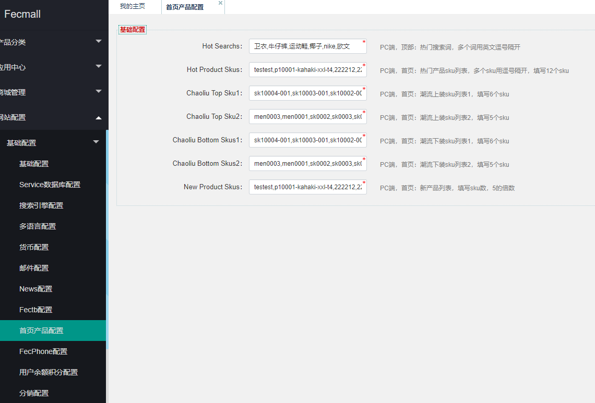

FecMall Fecyo 首页Banner以及静态块配置
=========================

> Fecyo在初始安装，需要对首页以及一些静态块，进行配置

### Fecyo 首页Banner以及静态块配置

首先，fecyo pc入口的产品页面，需要开启面包屑导航才能版面正常

后台：`网站配置` --> `Appfront配置`  --> `分类产品配置 ` 

将 `产品页面-显示面包屑导航` 设置成 `Yes`即可

1.参数配置

在这里配置页面顶部的搜索词，以及首页各个板块的sku（在下面截图的右侧有注释）

您可以按照下面的内容先填写上去,安装完成后，根据自己的需要更改

Hot Search: `卫衣,牛仔裤,运动鞋,椰子,nike,欧文`

Hot Product Skus：`testest,p10001-kahaki-xxl-t4,222212,22221,p10001-kahaki-xxl,p10001-black-m,op0002-33,men0003,men0001,sk0002,sk0003,sk0008`

Chaoliu Top Sku1：`sk10004-001,sk10003-001,sk10002-002,sk10002,sk1000-blue,sk2001-blue-zo`

Chaoliu Top Sku2：`men0003,men0001,sk0002,sk0003,sk0008`

Chaoliu Bottom Skus1：`sk10004-001,sk10003-001,sk10002-002,sk10002,sk1000-blue,sk2001-blue-zo`

Chaoliu Bottom Skus2：`men0003,men0001,sk0002,sk0003,sk0008`

New Product Skus：`testest,p10001-kahaki-xxl-t4,222212,22221,p10001-kahaki-xxl,p10001-black-m,op0002-33,men0003,men0001,sk0002,sk0003,sk0008,sk0002,sk0003,sk0008,sk1000-blue,sk0004,sk1000-khak`

2.首页的板块配置

fecyo-1.8.4版本+, 在安装fecyo的时候，直接进行初始化。

您可以在后台`cms`-->`static block(静态块)` 里面查看这些`静态块`

