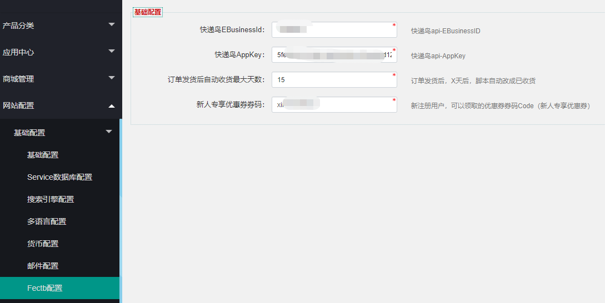

Fecmall Fecyo 用户订单自动收货
=============

> 订单产品自动收货操作

### 用户订单自动收货


用户订单发货，`用户收货`后，但用户没有进行订单收货操作，超过`x天`未进行订单`收货操作`的订单，
系统计划任务cron脚本，将会执行`订单收货`操作

1.脚本:

```
cd  ./addons/fecmall/fecyo/shell
sh customerOrderReceive.sh

```


您可以将其添加到计划任务中执行

2.可以在后台设置X天数：`订单发货后自动收货最大天数`





