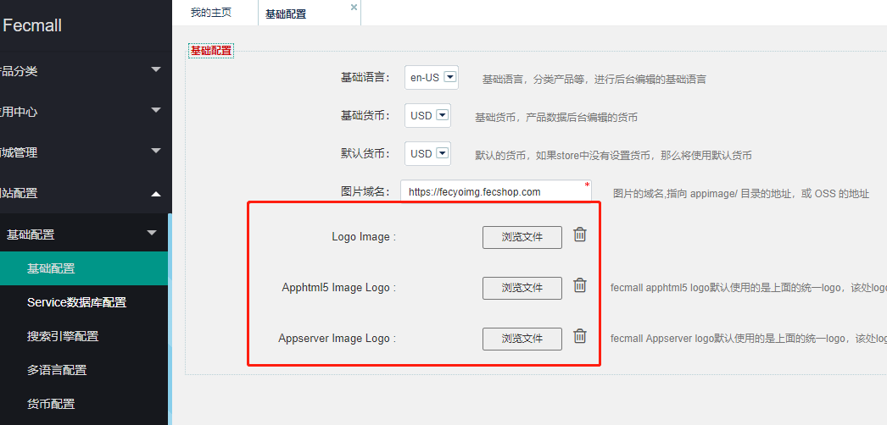
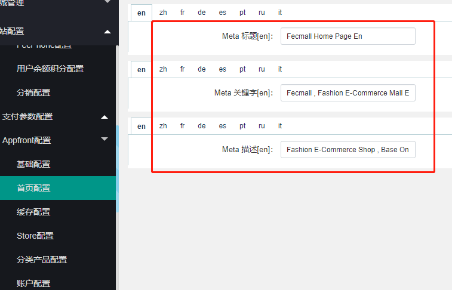
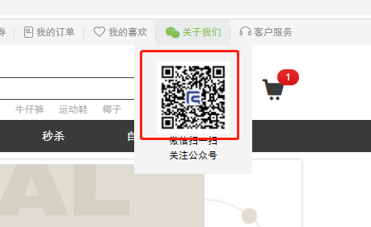
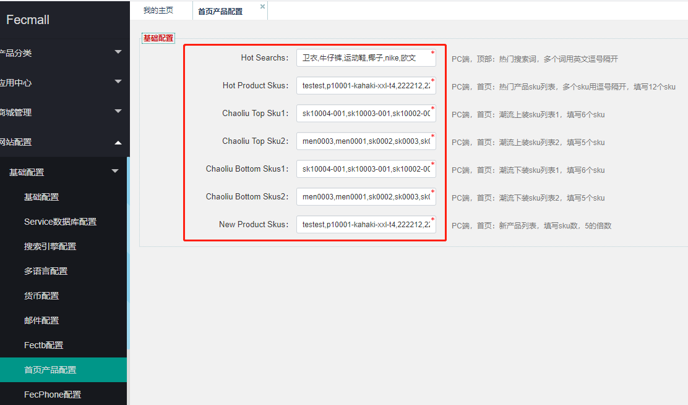
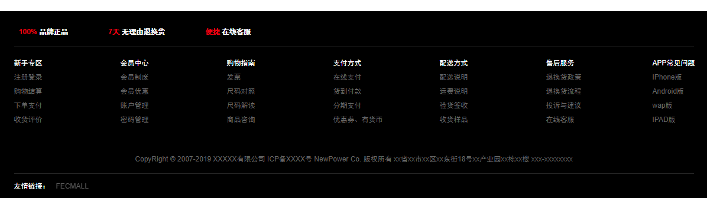
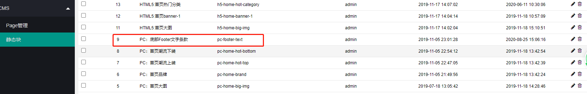
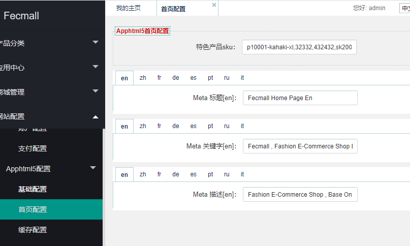

Fecyo 首页配置
=======

> Fecyo首页的一些自定义的配置

### pc端首页设置

1.Logo配置

1.2首页Meta信息配置

2.二维码图片配置:

该微信二维码，一般是微信公众号的二维码，可以在后台进行配置，如图：

3.热门搜索词以及首页产品

在顶部的热门搜索词

以及首页的各个板块的产品，可以在后台设置：

4.pc页面底部配置

这个在后台`cms` --> `static block` 部分配置

另外，在上图可以看到，首页中间的一些部分，也是在这里配置。

### H5入口配置

1.h5入口的logo可以和pc公用，也可以单独配置

2.热门搜索词和pc入口公共

3.首页产品以及首页meta信息配置

