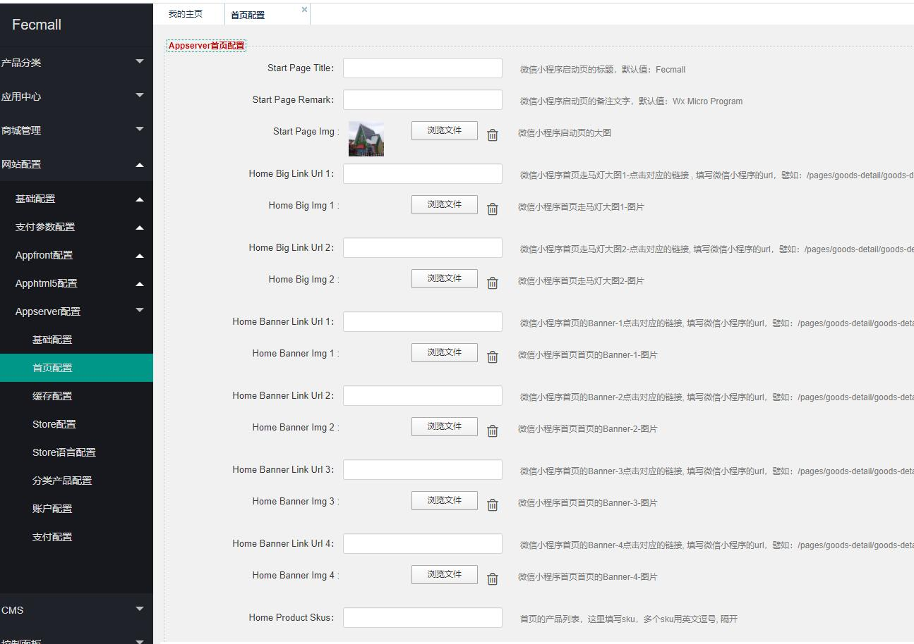
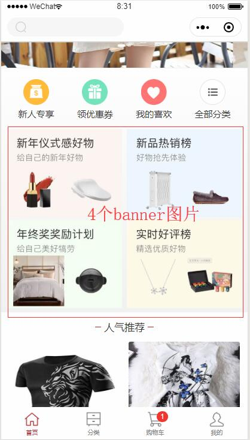
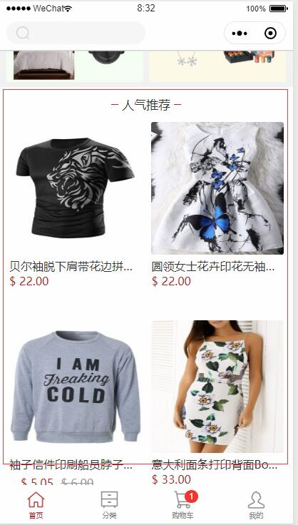

Fecyo微信小程序初始安装配置
================

> fecyo微信小程序配置

### Fecyo微信小程序后台配置

> 当微信小程序安装完成后，我们可以在后台设置微信小程序的启动页和首页的内容

进入fecmall后台 appserver配置部分，如图:

1.参数`start page`配置部分，对应的是微信小程序`启动页`(入口进入微信小程序的启动页)的内容，分别是标题，备注，和图片

您可以在广告里面填写您的活动宣传图

2.首页走马灯大图

启动页经过5秒关闭后，就进入首页，可以在后台配置走马灯的大图以及链接

`Home Big Link Url 1` ：走马灯大图图1，点击后跳转的微信小程序链接

`Home Big Img 1`：走马灯大图图片1，您可以上传自己的图片，参考尺寸：`640 * 854`

`Home Big Link Url 1 `：走马灯大图图2，点击后跳转的微信小程序链接

`Home Big Img 1`：走马灯大图图片2，您可以上传自己的图片，参考尺寸：`640 * 854`

3.banner图片部分

`Home Banner Link Url`：banner点击后对应的微信小程序链接

`Home Banner Img`：banner图片

4.首页sku列表：

`Home Product Skus`: 多个sku用逗号隔开（同一个spu下的不同sku，只会显示一个）

