Fecyo微信小程序截图展示
===============

> 微信小程序，目前还没有微信的线上演示，需要用户搭建起来自行查看，
为了更好的展示，进行了一部分截图演示

### 购物流程主页面

1.star页

2.首页

3.分类页

4.分类产品列表页

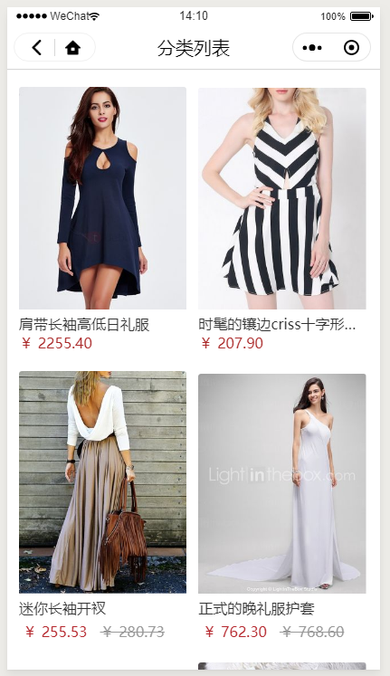

5.产品详情页

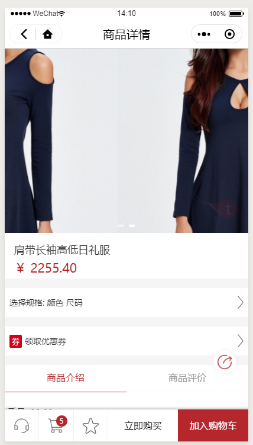

5.1产品详情页-规格属性

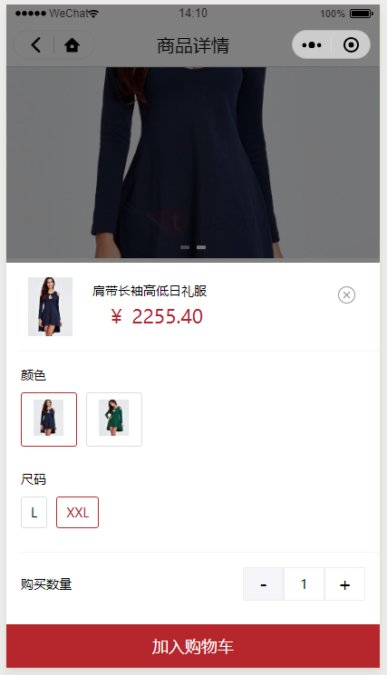

5.2产品详情页-查看该产品可用的优惠券

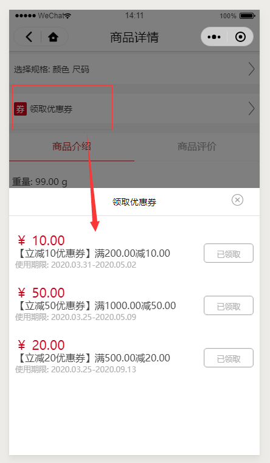

6.购物车页面

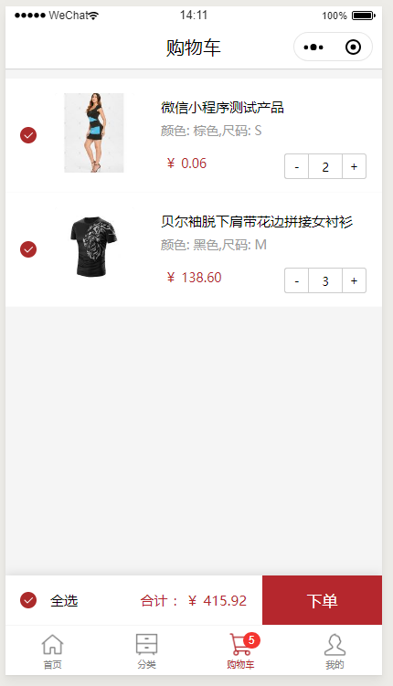

7.下单页面

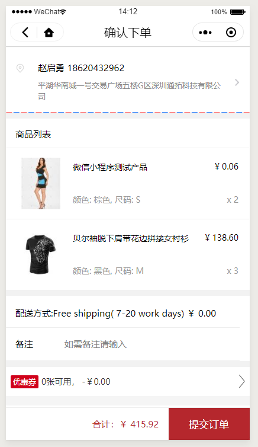

7.1货运地址列表

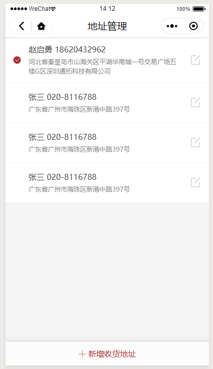

7.2新建货运地址列表

8.支付页面

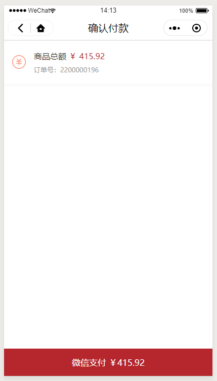

### 优惠券

优惠券有两种领取方式

1.在首页点击优惠券图标

进入所有的优惠券领取列表，这里查看商城所有的可以领取的优惠券

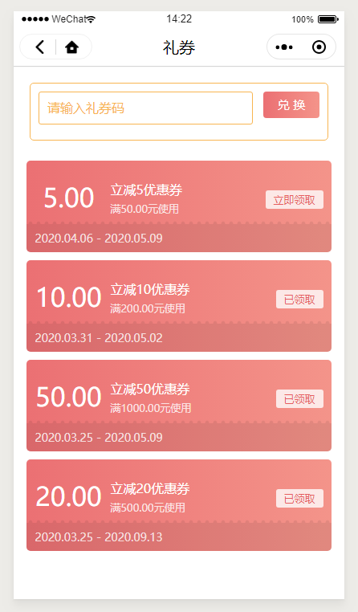

2.在产品页面，查看当前产品可用的优惠券

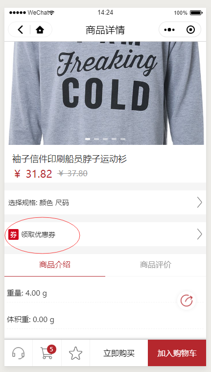

可以在弹出的列表中领取可用的优惠券

### 账户中心

1.点击账户中心图标，进入账户中心

2.点击`我的订单`，进入订单列表

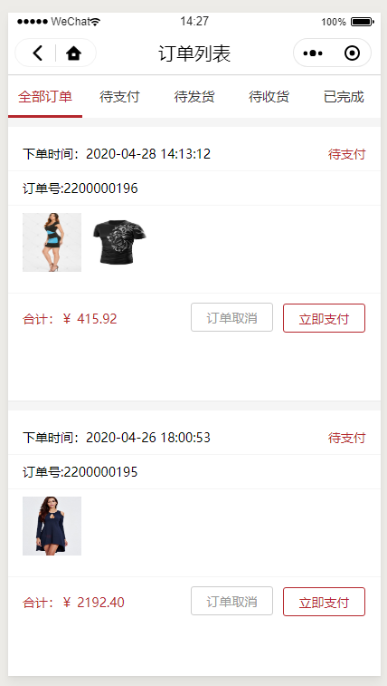

3.对于已经发货的订单，可以查看物流追踪信息

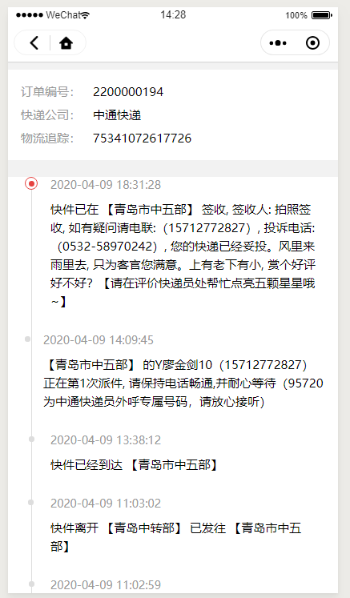

4.点击重新下单，可以将订单产品加入购物车

5.未支付订单，可以点击，进行支付

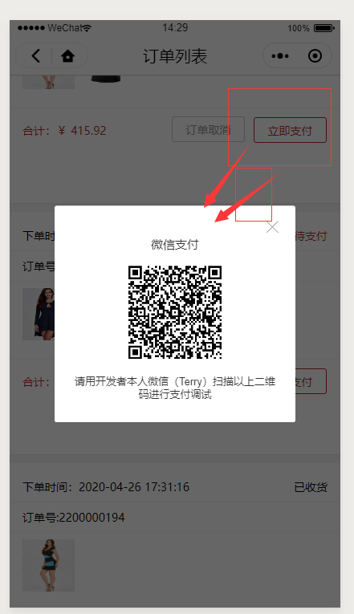

6.已收货订单产品评论

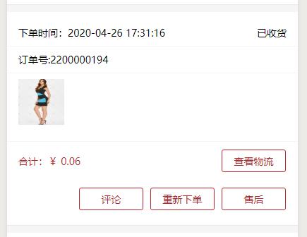

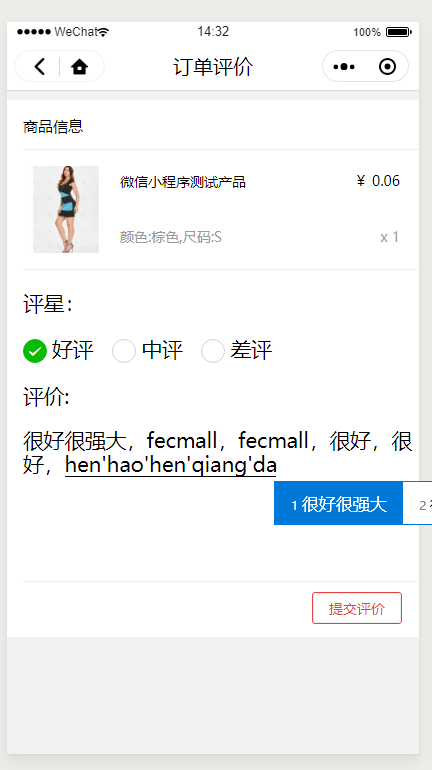

7.我的优惠券

8.我的地址

9.我的收藏

10.微信小程序-在线聊天客服

