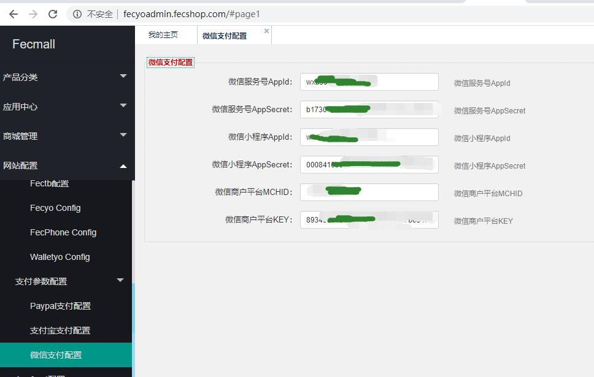
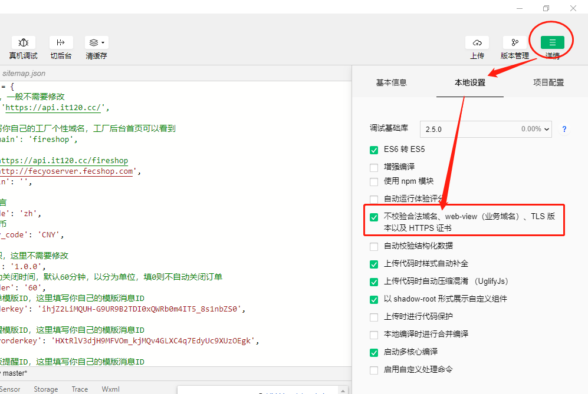

Fecyo微信小程序初始安装
================

> 初始化安装fecyo微信小程序，进行的安装配置介绍


### Fecyo微信小程序开源版本

1.下载地址：https://github.com/fecshop/fecyo_wx_micro_program/releases


### 微信小程序申请和工具

1.微信小程序部分，需要申请才能使用，需要企业或者个体户才能申请，年费：300

2.微信小程序的官方文档地址：https://developers.weixin.qq.com/miniprogram/dev/framework/

微信小程序的申请和介绍，这里不一一陈述


微信的配置详细，参看文档：[Fecmall 微信小程序配置](http://www.fecmall.com/doc/fecshop-guide/instructions/cn-2.0/guide-fecmall_wx_micro.html)

因为微信小程序的支付，使用了微信商户平台，因此需要开通微信支付。

3.微信小程序开发工具

3.1微信开发者工具下载：https://developers.weixin.qq.com/miniprogram/dev/devtools/download.html

3.2微信开发者工具文档介绍：https://developers.weixin.qq.com/miniprogram/dev/devtools/devtools.html

具体的使用，这里不一一阐述


4.安装微信小程序，启动，选择小程序，导入现有项目（文件路径选择github下载下来的微信小程序）

在启动的时候需要填写appid，这个就是微信小程序的appID


### Fecyo微信小程序和Fecyo系统的数据对接


1.您需要安装fecyo，关于fecyo的文档参看：[FecMall Fecyo 中文单商户B2C商城](http://www.fecmall.com/doc/fecmall-guide/fecyo/cn-1.0/guide-fecmall-fecyo-about.html)

自行安装，配置好pc和h5入口即可代表配置完成


2.fecyo后台配置appserver入口

2.1appserver store配置


`Store Key`: 填写您的域名

其他的选项参看上图即可


2.2设置语言，中文只保留中文就可以了


2.3访问appserver的域名，验证是否配置好，api是否返回json数据，譬如访问：http://fecyoserver.fecshop.com/


代表appserver api入口配置成功

2.4后台配置微信信息



填写您的微信小程序以及支付信息等


3.微信小程序设置

3.1配置微信小程序对应的fecyo appserver的域名地址


打开`config.js` 配置`url`

```
 'url': 'https://fecshop.appserver.fancyecommerce.com',
```

改成您自己的域名即可


3.2打开`project.config.json`文件，将`appid`改成您自己的`微信小程序appid`


3.3微信开发者工具关掉https

如果是线上环境必须用https，微信小程序不支持http的后端数据api

如果是开发测试环境，可以在微信开发者工具中关掉https验证，如图：




3.4重启微信开发者工具编辑器，查看是否出来微信小程序


这就说明配置微信小程序成功了。


4.关于fecmall https免费证书安装，可以参看文档：[阿里云 安装免费https证书](http://www.fecmall.com/topic/4085)


