Fecyo微信小程序直播
==========

> 微信小程序直播，是微信小程序新开通的功能，作为开发者，可以很方便的接入微信小程序

### 微信小程序直播逻辑


首先，先写一下微信小程序的逻辑

1.微信小程序的开通，开通后就有了资质，进行直播

2.微信小程序发版，发的版本中包含微信小程序插件（Fecyo微信小程序已经集成），您需要将微信小程序发版。

3.微信小程序官方管理后台，创建直播间，详细步骤参看下面，这些操作都是微信小程序后台操作完成

4.用户进入直播间，您可以通过 `开播码`发给用户，或者用户直接通过微信小程序直播列表点击进入

5.直播过程中，直播大咖可以加入产品，让用户直接下单购买，以及抽奖拉人气。

下面是详细的步骤


### 微信小程序开通 - 类目要求

微信小程序的开通需要一定的资质审核

详细查看：https://res.wx.qq.com/mmbizwxampnodelogicsvr_node/dist/images/access_47d0ce.pdf

```
一、类目要求：
1. 小程序开发者为国内非个人主体开发者；
2. 小程序开发者为下述类目品类，类目具体信息可参考《微信小程序开放的服务类目》：
1）电商平台：电商平台
2）商家自营：百货、食品、初级食用农产品、酒/盐、图书报刊/音像/影视/游戏/动漫、汽车/其他交通
工具的配件、服装/鞋/箱包、玩具/母婴用品(不含食品)、家电/数码/手机、美妆/洗护、珠宝/饰品/眼镜
/钟表、运动/户外/乐器、鲜花/园艺/工艺品、家居/家饰/家纺、汽车内饰/外饰、办公/文具、机械/电子
器件、电话卡销售、预付卡销售、宠物/农资、五金/建材/化工/矿产品；
3）教育：培训机构、教育信息服务、学历教育（学校）、驾校培训、教育平台、素质教育、婴幼儿教
育、在线教育、教育装备、出国移民、出国留学、特殊人群教育、在线视频课程；
4）金融业：证券/期货投资咨询、保险；
5）出行与交通：航空、地铁、水运、城市交通卡、打车（网约车）、顺风车（拼车）、出租车、路况、
路桥收费、加油/充电桩、城市共享交通、高速服务、火车、公交、长途客运、停车、代驾、租车；
6）房地产：房地产、物业管理、房地产经营、装修/建材；
7）生活服务：丽人、宠物（非医药类）、宠物医院/兽医、环保回收/废品回收、摄影/扩印、婚庆服务、
搬家公司、百货/超市/便利店、家政、营业性演出票务、生活缴费；
8）IT科技：硬件与设备、基础电信运营商、电信业务代理商、软件服务提供商、多方通信；
9）餐饮：餐饮服务场所/餐饮服务管理企业、点餐平台、外卖平台、点评与推荐、菜谱、餐厅排队；
10）旅游：旅游线路、旅游攻略、旅游退税、酒店服务、公寓/民宿、门票、签证、出境WiFi、景区服
务；
11）汽车：养车/修车、汽车资讯、汽车报价/比价、车展服务、汽车经销商/4S店、汽车厂商、汽车预售
服务；
12）体育：体育场馆服务、体育赛事、体育培训、在线健身
二、运营要求：
1、主体下小程序近半年没有严重违规
2、小程序近90天存在支付行为
以上2个运营条件和类目同时满足的前提下，下面3个条件满足其一即可
3、主体下公众号累计粉丝数大于100
4、主体下小程序近7日dau大于100
5、主体在微信生态内近一年广告投放实际消耗金额大于1w
以上准入要求于 2020 年 02 月 24 日进行公示生效。为营造良好健康的微信生态，腾讯公司有权对《微信
小程序直播功能准入要求》不时予以调整并公布，请予以关注。
```

### 微信小程序开通 - 资质


1.微信小程序需要是企业开通的，才有资质申请

2.微信小程序类目，必须在上面的类目中，微信小程序菜单设置类目

设置--> 基本设置    `服务类目`点击右侧的`详情`, 点击`添加服务类目`,有一些服务类目是需要相关国家文件的，
有的不需要，我选择的是`商家自营  >  服装/鞋/箱包`，这个类目不需要一些认证文件


通过后即可

3.主体下小程序近半年没有严重违规

4.小程序近90天存在支付行为 ，这个您把小程序发版审核通过后，在线上微信小程序，进行支付一个订单即可

**注意**：支付后，需要等`2天`才可以，相当于微信的支付行为检测`延迟2天`。

5. 最后的门槛验证

`主体下公众号累计粉丝数大于100` , `主体下小程序近7日dau大于100` , `主体在微信生态内近一年广告投放实际消耗金额大于1w`

最经济的，就是微信小程序关联的公众号的粉丝大于`100`


条件满足后，就可以开通微信小程序了


### 微信小程序开通

登陆微信小程序，点击直播，进行开通直播功能

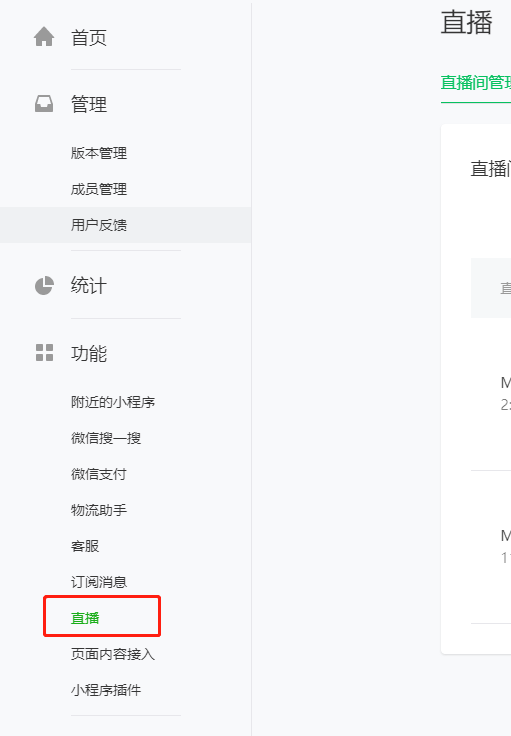


微信直播开通完成后，如图：

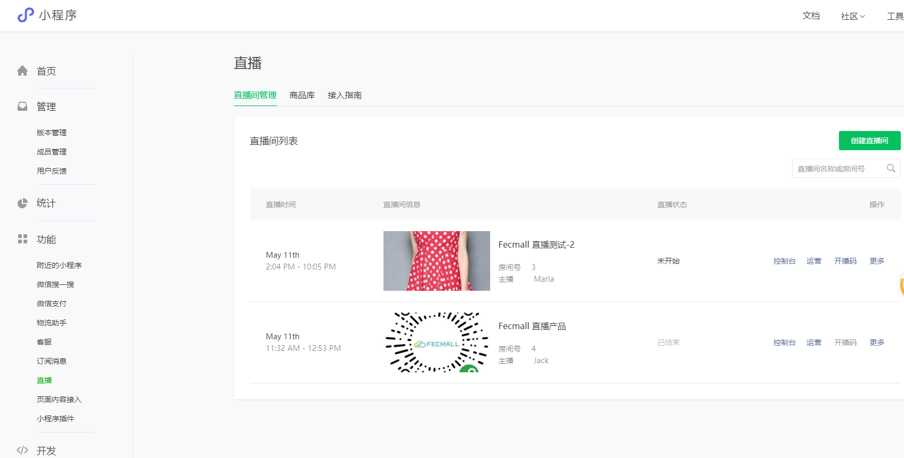


您可以在这里看到`小程序直播`详情


### 微信小程序创建直播间


1.点击直播菜单，进入后，点击`创建直播间`


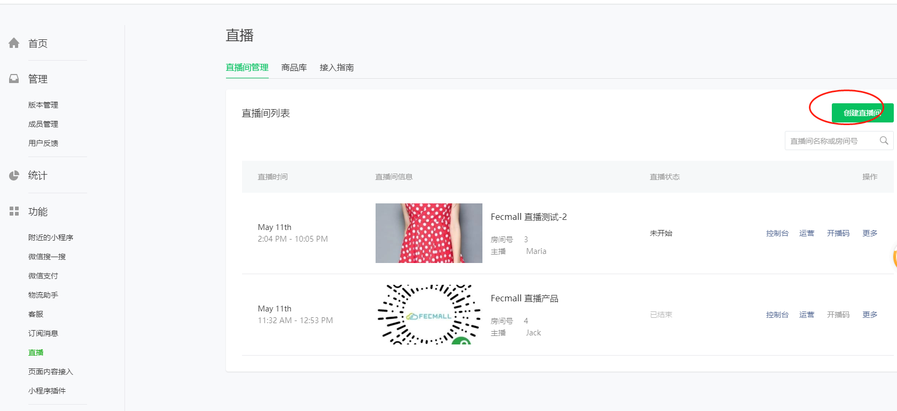

选择直播类型

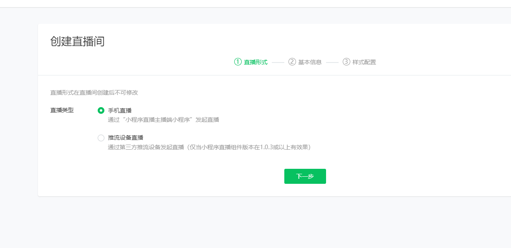

填写直播信息

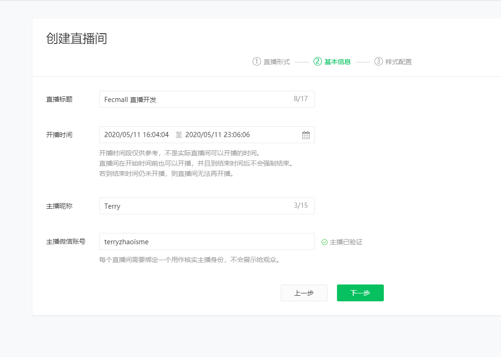

上传图片，创建直播间


2.直播设置

创建完成后可以看到直播列表

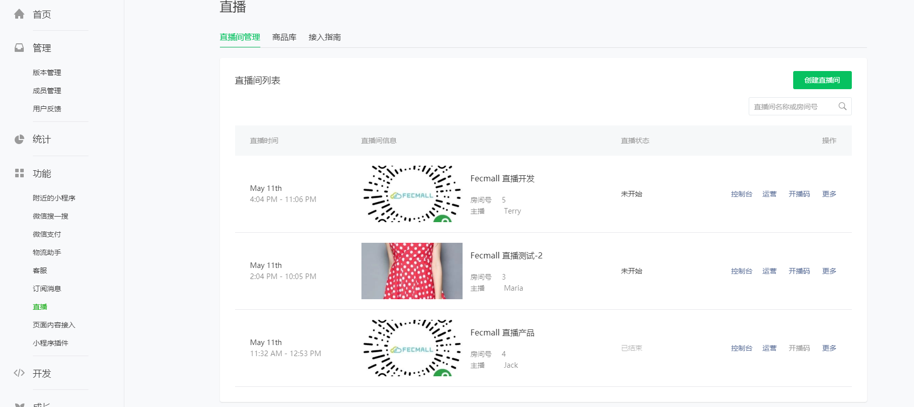

2.1添加直播产品

`直播`  --> `商品库`


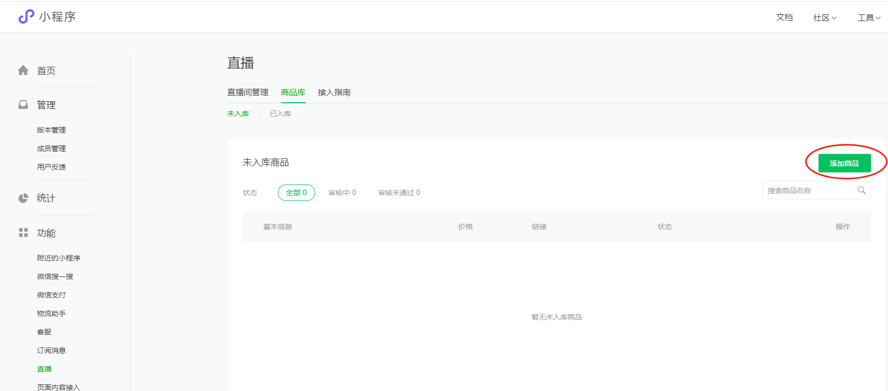


填写信息


信息填写完成后提交，需要微信官方审核，需要1-7天时间


审核通过，您可以将这个产品加入到直播

2.2

点击控制台


点击`添加运营资源`

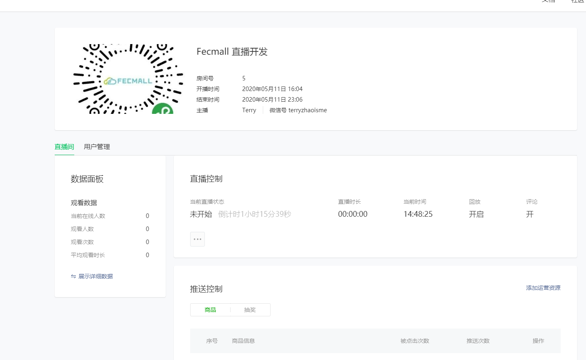

进入后，您可以添加产品，以及添加抽奖池

2.2.1添加产品， 点击 `从商品库中导入商品`


2.2.2添加抽奖

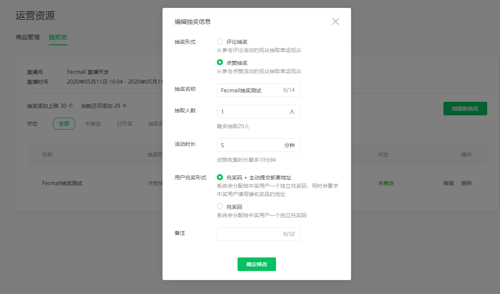


到这里就完成了

3.分享直播


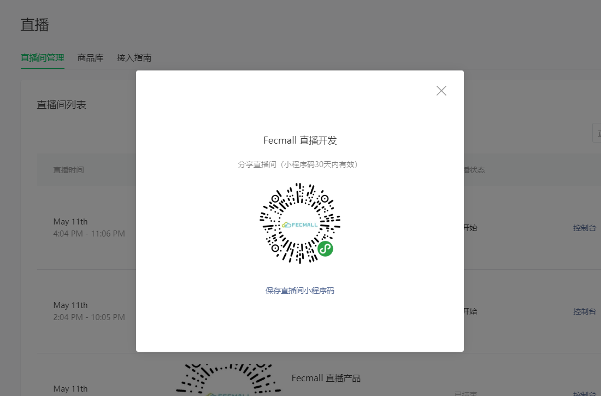


4.管理员发起直播


注意，创建直播间的时候，填写了微信帐号，您必须使用该微信发起直播

4.1点击开通 `开播码`

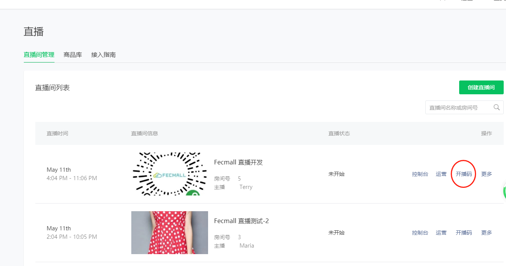


4.2填出来小程序码，使用微信扫描该码，即可开始直播

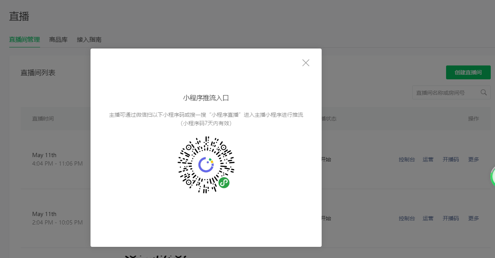


5.用户进入直播间

用户可以通过 `开播码` 或者通过微信小程序入口进入

5.1用户通过扫描 `开播码`，`开播码` 就是上面`4.1部分`获取的


5.2通过微信小程序进入，访问fecyo小程序，点击直播


查看直播列表，点击选择的直播。进入直播房间

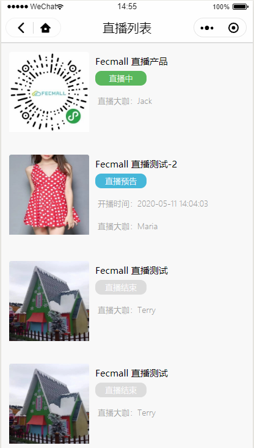


5.3进入直播间后，可以看到直播


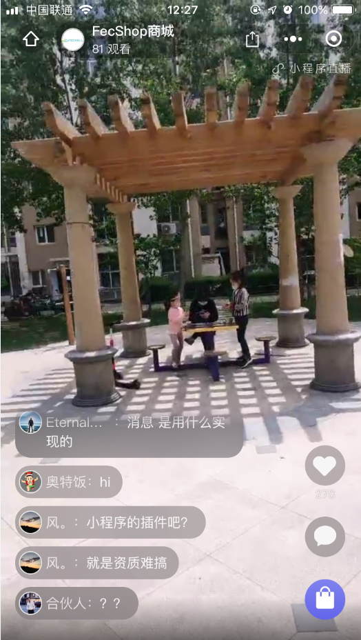


### 微信直播的相关资料

通过上面可以看到，大部分的工作都是微信小程序官方服务完成的，开发者不需要做太多的事情

1.微信小程序接入文档：https://developers.weixin.qq.com/miniprogram/dev/framework/liveplayer/live-player-plugin.html

2.微信小程序运营手册：https://res.wx.qq.com/mmbizwxampnodelogicsvr_node/dist/images/help_0f7865.pdf


