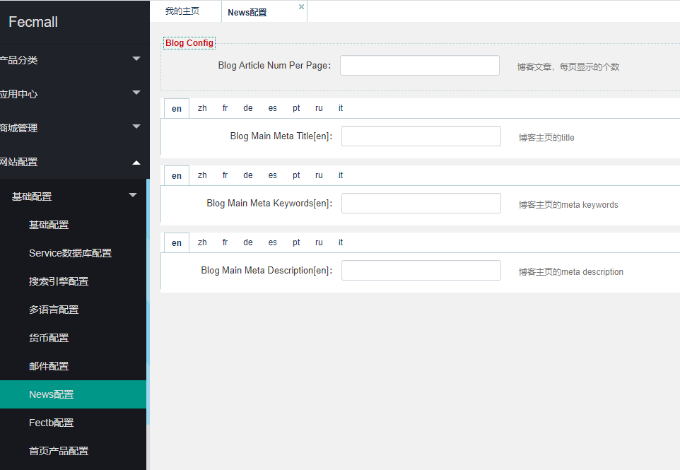
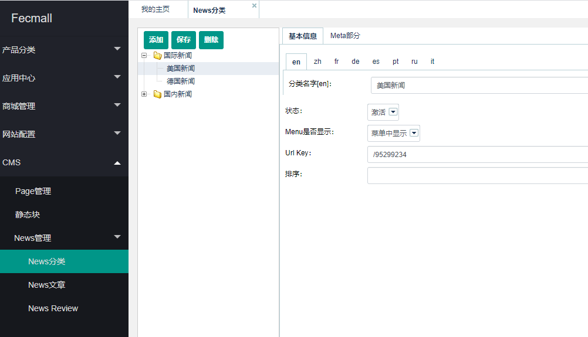
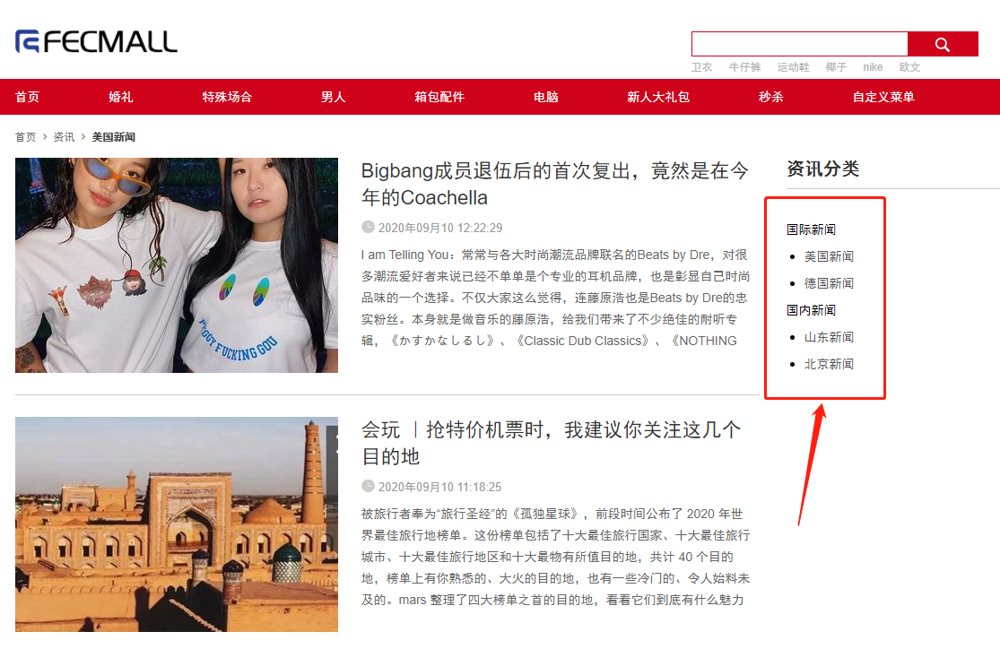
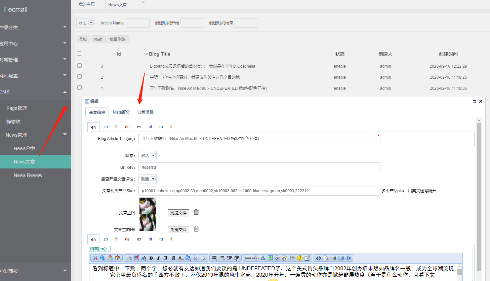
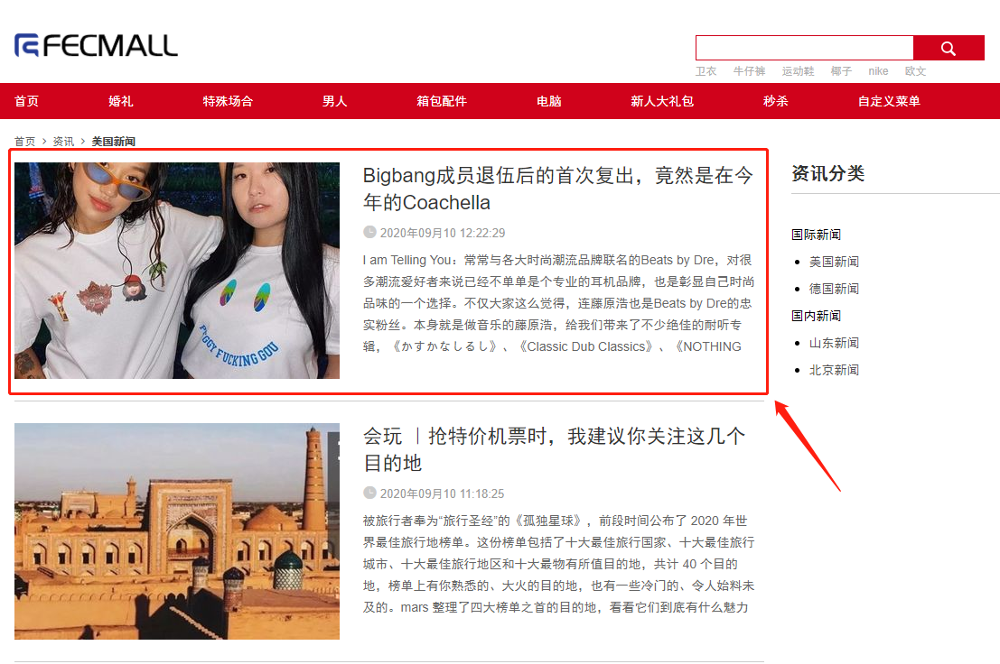
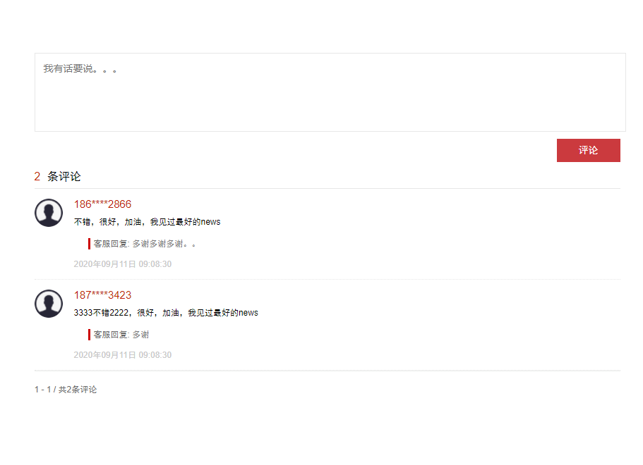
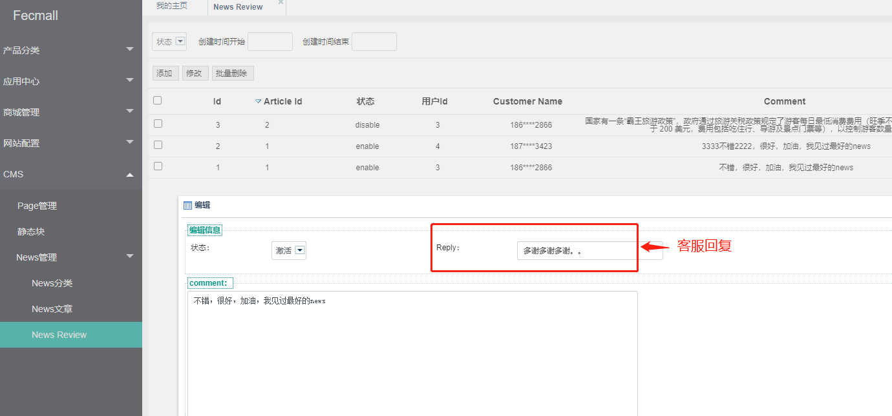

Fecyo News扩展-使用说明
================

> News扩展使用的详细说明

### News主页Meta设置

对于News主页，譬如：http://fecyo.fecshop.com/cn/cms/news
，我们可以自定义meta信息

### News分类

1.管理员可以在后台编辑New的分类信息

2.编辑完成后，商城可以看到

3.虽然后台可以无限级添加new分类，但是前端商城默认只显示`1级`和`2级`分类.

### News文章

1.管理员可以在后台编辑New文章

您可以设置`文章标题`，自定义`url_key`, 文章`状态`，是否开启该`文章评论`，设置文章的相关`sku列表`（多个sku用英文逗号隔开）
，设置`pc文章主图`，以及`h5文章主图`，以及`new文章内容`等等

2.编辑发布后，就可以在商城news中看到文章

在news列表中，点击，即可进入news文章详细页面

如果设置了文章相关产品，在文章的底部会显示相关产品

### News评论

news文章被评论后，您可以在后台看到评论列表

管理员可以对评论进行回复，回复后，商城即可看到评论的回复

