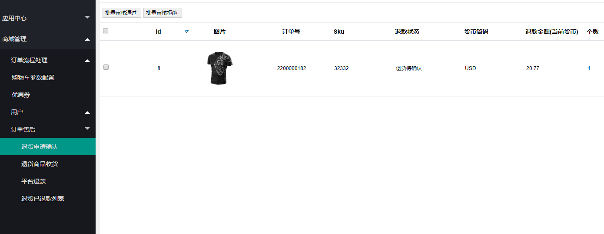

Fecmall Fecyo用户退货-审核
=============

> 用户提交退货申请后，管理员进行退货请求审核操作

### 管理员审核用户订单商品退货请求

1.管理员可以在后台查看用户发起的订单商品退货请求

2.管理员可以进行退货请求，`审核通过` 和 `审核拒绝`操作

2.1`审核拒绝`操作

管理员执行该操作后，用户可以继续重新发起退货申请

2.2`审核通过`操作

审核通过后，用户可以进行`退货商品发货`操作

