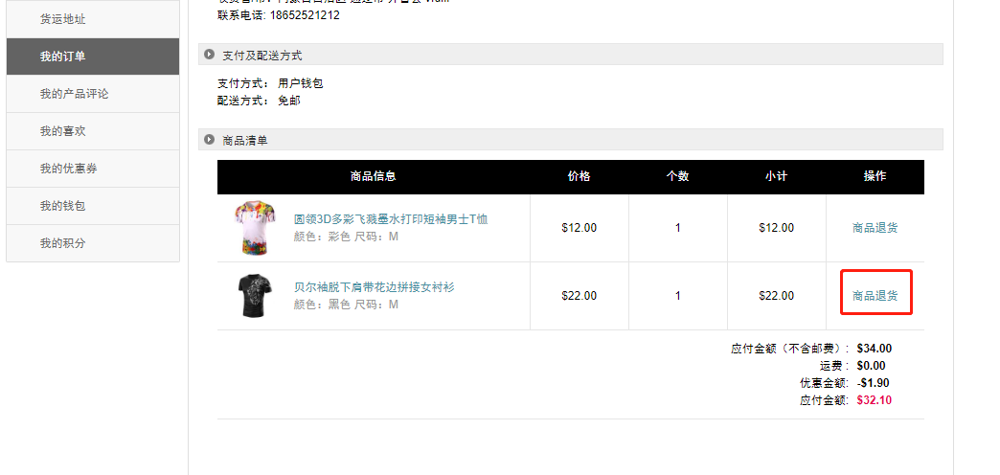

Fecmall Fecyo用户退货-商品发货
=============

> 商品退货请求，管理员审核通过后，用户进行退货商品的发货操作

### 用户退货商品发货操作

1.管理员审核通过后，用户可以在账户中心订单管理，售后部分，点击，查看退货状态

2.点击进入后，如果管理员审核通过，那么页面将会变成发货页面

2.1用户在此过程，仍然可以进行`撤销退货`操作

2.2用户选择快递方式，填写物流追踪号，进行退货商品`发货`操作

3.操作完成后，退货状态变更为：`退货商品已发货`。

