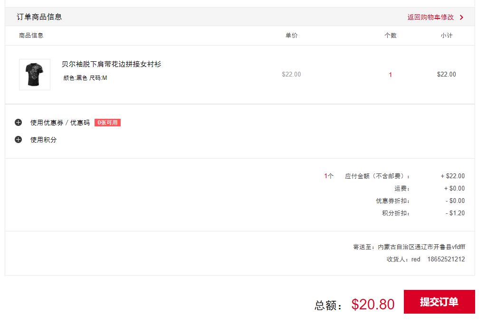
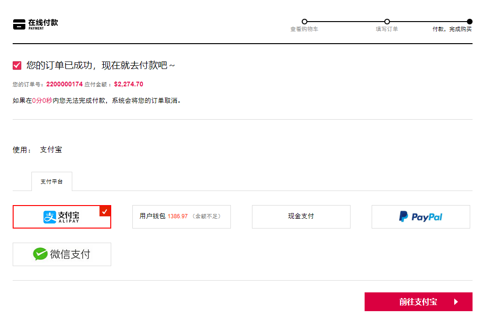

Fecmall Fecyo订单创建和支付
============

> 商城用户创建订单，以及进行支付的详细过程

Fecyo下单流程

1.商城用户选择产品加入购物车后，然后进行下订单操作， 填写货运地址，选择物流，使用优惠券等操作，进行下单

2.用户下单成功后，则进入订单支付页面，这个过程表示订单创建完成，但是还未支付

2.1用户在支付页面，可以选择其他的支付方式，进行订单支付。

2.2如果用户回到首页，或者其他页面，可以进入账户中心的订单部分，点击支付按钮，进行支付

3.订单支付：选择支付方式，进行订单的支付

选择支付提交后，则进入`第三方在线支付`页面，支付完成后，跳转回网站`完成`订单的支付 ，进入订单`完成页面`。

