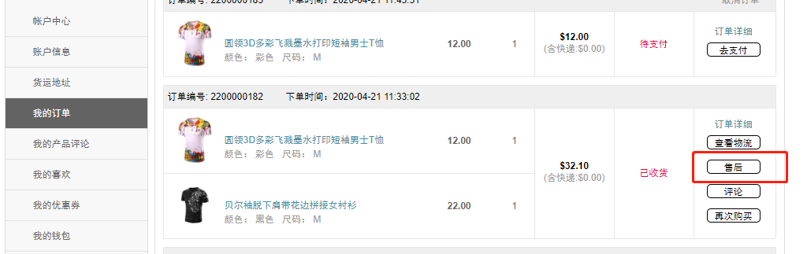

Fecmall Fecyo用户订单收货
=========

> 商家发货后，用户收货后，进行订单收货操作

### 用户订单收货操作

1.用户订单，商家发货后，用户收到快递的包裹后，进行订单收货操作的过程

2.用户可以在账户中心，订单管理，进行订单收货操作

3.系统cron计划任务，自动处理超过X天未进行订单收货操作的订单。

详细参看： [Fecyo 用户订单自动收货](fecmall-fecyo-customer-order-auto-received.md)

4.订单收货后，代表订单发货流程完成，如果存在产品质量问题，可以点击售后，进行退货处理

