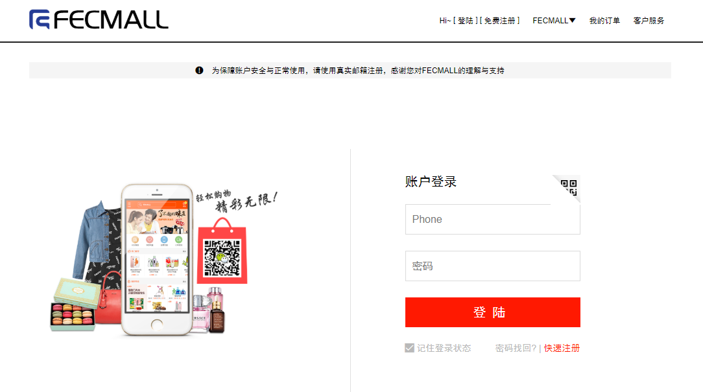

Fecmall Fecyo 手机短信注册登陆
===============

> 针对中文商城，扩展的手机号账户体系

### Fecyo 手机短信注册登陆

1.注册手机账户，通过阿里短信服务发送短信验证码，进行手机注册

2.手机账户登陆

3.通过手机短信验证码，进行密码找回

4.用户下单成功后，进行手机短信发送订单信息到用户的手机

5.在使用前，需要进行阿里短信服务配置，详细参看：[Fecmall Fecyo 微信登陆,微信分享,手机帐号](fecmall-fecyo-phone-weixin-account.md)

