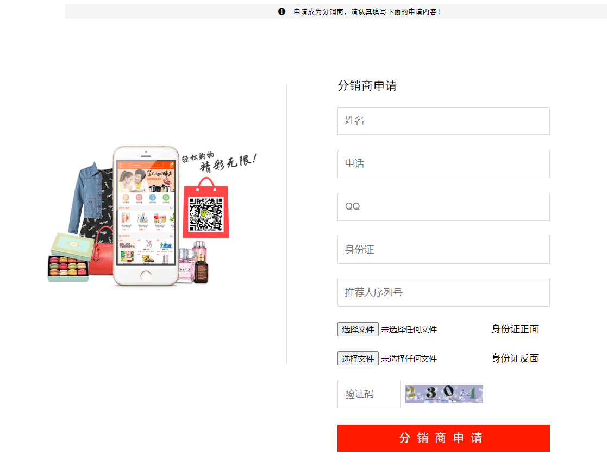
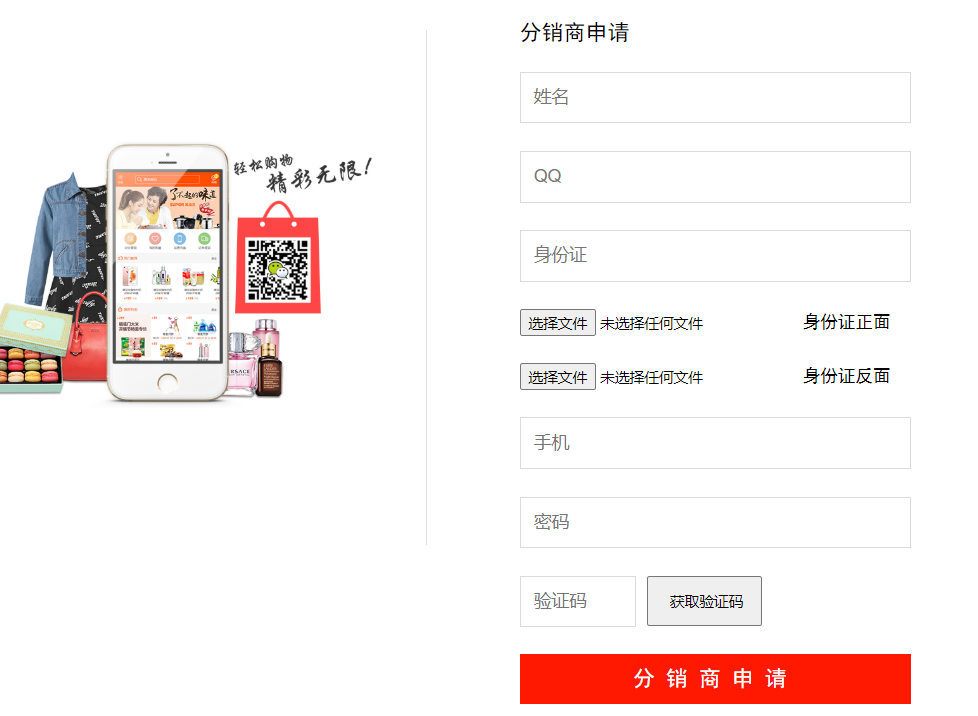
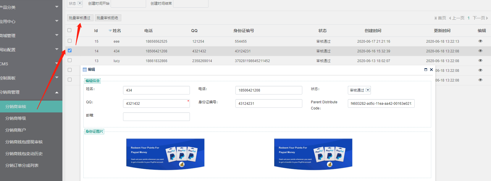
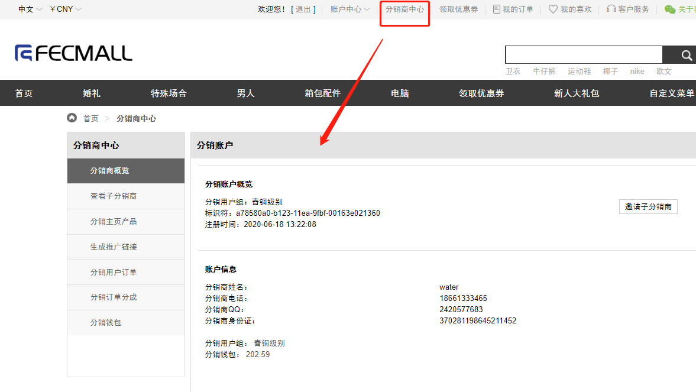
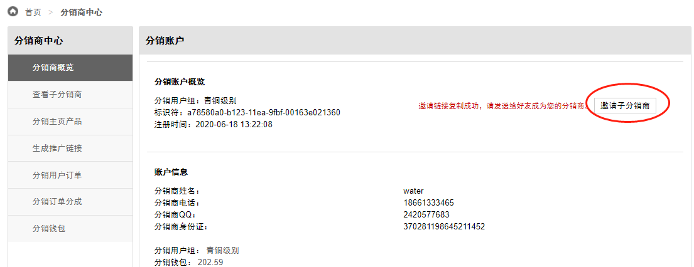
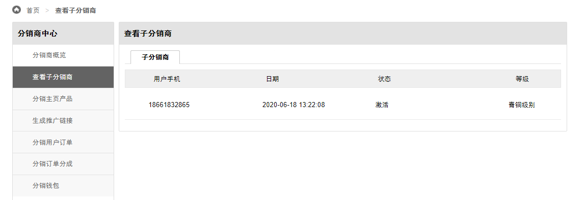
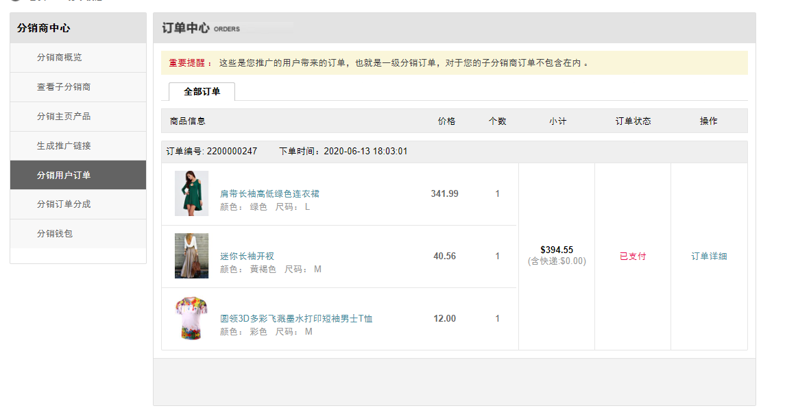
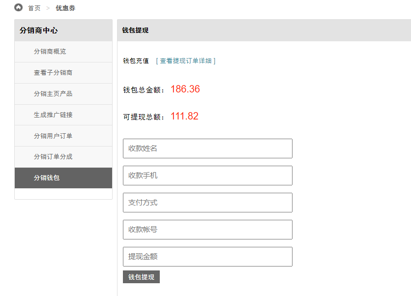
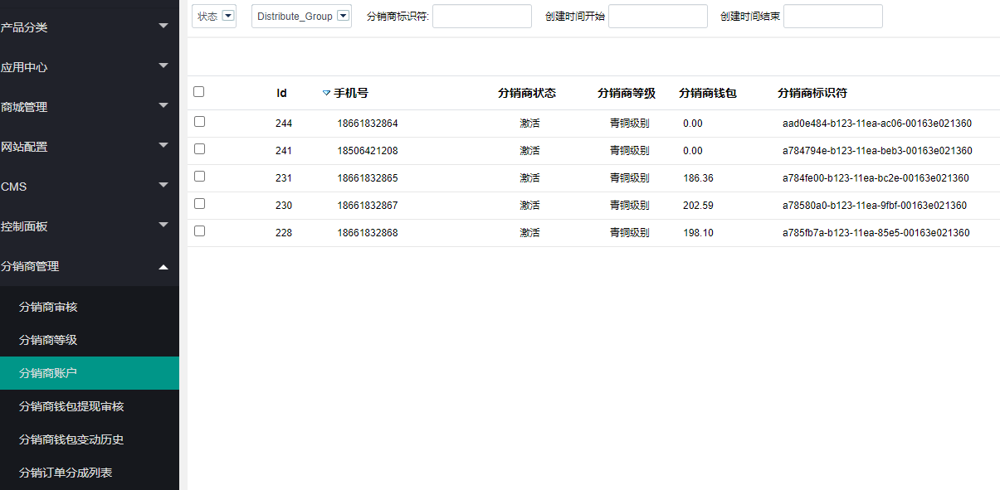
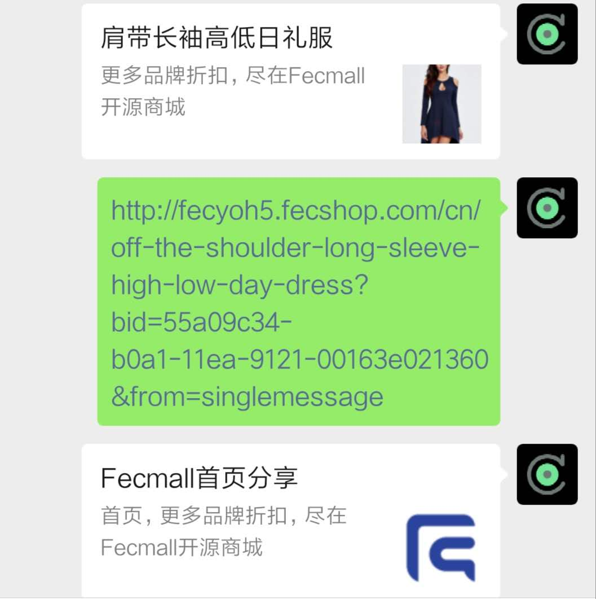

Walletyo-分销功能系统-配置说明
============

>  对分销部分的配置以及使用进行说明

### 分销功能简介

1.分销合作共赢的模式，分销商分享推广链接获取收益的商业模式

2.支持多层级分销，最高三级，可以后台设置最大层级数，

3.支持分销商等级，不同等级的分销商获得不同的收益，分销商订单和销售额增加即可进行等级的提升

4.分销商可以邀请注册分销商，发展线下分销商，获取层级收益，分销商层级关系为永久关系

5.分销商可以自定义首页的产品，将某些产品加入首页，方便列表页推广

6.分销商可以查看带来的用户订单，订单分成收益，分销钱包历史，钱包变动历史，钱包取现，取现历史等等

7.在微信端，支持微信分享，分销商登陆账户后，微信分享链接自动带有分销商推广尾巴参数

8.用户访问分享商的链接后，会写入cookie，通过cookie来识别分销商，管理员可以后台设置cookie的有效期

下面是详细的配置以及操作说明，请仔细查看

### Demo:

Pc: http://fecyo.fecshop.com/cn/

H5:http://fecyoh5.fecshop.com/cn/

商城前端测试用户：  `18661832865`    `111111`  ， 您可以使用该测试账户登陆demo查看分销商的功能

### 后台配置

`分销商Bid的url参数名`：【默认为：bid】分销商推广url的尾巴参数，默认为bid（为空则使用默认值），生成的url格式为： ?bid=xxxxxxx 

`分销商BidCookie的name`：【默认为：distributebid】bid信息保存到cookie中，cookie的name，默认为：distributebid（为空则使用默认值） 

`分销商BidCookie的最大过期时间`：【默认7天】Bid Cookie的过期时间，单位为 天，默认为7天 

`分销商最大层级`：3【默认3层】分销商的最大层级，最大为三级分销，如果不设置，默认为三级分销 

`分销商主页Sku最大数`：【默认20】分销商主页显示产品的最大数 

`X天内的订单，生成分销分成`：【默认10天】脚本计算，处理X天内的订单的分销分成，生成分成log记录（但并不进行分销账户充值） 

`支付订单X天后，进行钱包充值`：【默认15天】订单支付X天后，没有发生订单退货，订单取消等操作后，才可以进行分销商钱包充值。 

`分销钱包提现额度最大比例`：【默认60】钱包提现额度比例最大值，譬如：当前钱包总额100，提现额度为60%，那么最高可提现60 

`分销钱包额度的最小值`：【默认50】钱包提现，钱包额度的最小值，只有大于这个值，才能提现，

### 用户申请分销商

1.用户注册账户后，可以点击分销商中心按钮

h5在账户中心页面点击，如图：

pc在页面顶部，如图

2.分销商申请

2.1用户先注册普通用户账户，然后进行分销商申请，可以通过点击，直接进入分销商页面，url: `distribute/account/register`

填写资料，即可，对于 `推荐人序列号`,如果填写后，该用户将会成为推荐人的下级分销商，享受上级分销商收益

2.2分销商可以分享给用户一个邀请连接，用户在这个页面可以将 `账户注册`，`推荐人绑定`，`分销商申请`，一个表单一次完成
,譬如url：
http://fecyo.fecshop.com/cn/distribute/account/marketregister?bid=a78580a0-b123-11ea-9fbf-00163e021360

3.分销商审核

分销商提交申请后，商家可以在后台进行分销商审核

审核通过后，用户成为正式分销商

### 分销商功能

1.邀请子分销商

用户点击邀请按钮，生成邀请url字符串，自动复制，然后分享给邀请者即可

譬如，生成后的邀请子分销商url: `http://fecyo.fecshop.com/cn/distribute/account/marketregister?bid=a78580a0-b123-11ea-9fbf-00163e021360`

2.查看子分销商列表：

3.分销商主页产品：

3.1在产品页面，将产品加入分销商主页产品

3.2加入后，您可以在账户中心查看，也可以去首页查看添加的产品

3.3如果您将所有的分销商主页产品删除，那么主页将会是默认的首页内容

4.分销商生成推广链接

分销商可以把任意的一个url复制到输入框，点击`成链接`，即可生成`推广url`

点击`复制链接`，既可复制url字符串

5.分销用户订单

点击推广链接的用户下单后，该订单将会对应到该分销商，分销商可以在这里查看订单列表

6.分销订单提成

分销用户订单支付后，console离线脚本会计算分成信息，对应分销商的分成收益，但是这个收益并没有立刻进入分销商的分销钱包，
需要等待一段时间才行，因为存在商品退货等问题，如果商品发生退货，那么该分成收益将会关闭

7.分销钱包

7.1您可以查看分销商钱包总额，以及分销余额变动历史信息

7.2点击`钱包取现`按钮，进行钱包取现

7.3管理员在后台审核分销商取现信息，线下打款

7.3查看提现订单详细

8.分销商后台管理

8.1分销商等级编辑

8.2分销商等级列表

等等

### H5分销商微信分享

对于h5部分，分销商在微信内部访问产品页面，可以直接通过微信的分享按钮生成推广url，
url中会自动带上分销商的推广url尾巴，

