Walletyo-分销系统-微信小程序
==================

> 微信小程序分销系统

### 微信小程序分销介绍

1.微信小程序用户，申请分销商,如图：

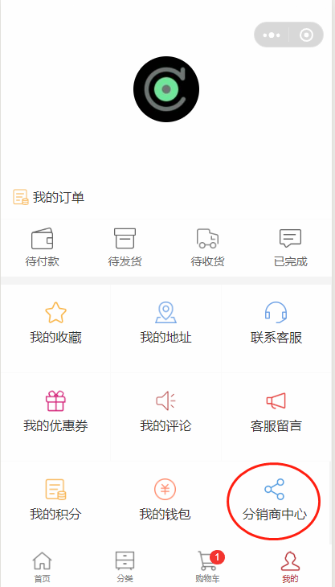

如果当前用户不是分销商，将会进入分销商申请页面，需要提交表单进行审核，管理员后台审核通过后，将会成为
分销商。

2.分销商用户

分销用户，在账户中心，点击分销商中心，即可进入分销商中心页面

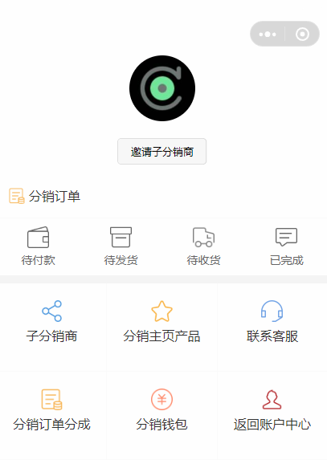

3.分销商分享链接，进行推广

当用户申请分销商通过后，就成为了分销商用户，
分销商登陆用户后，可以直接分享微信小程序页面，发送给好友或者朋友圈，分享链接会自动带上分销商的bid参数

目前可供分销商分享的页面有：首页，分类页，产品详细页

3.1分销商分享推广首页

首页的标题以及图片，可以在后台配置，如图：

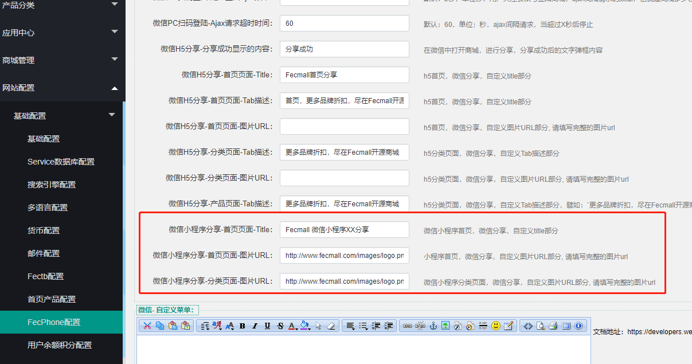

3.2分销商分享推广分类页

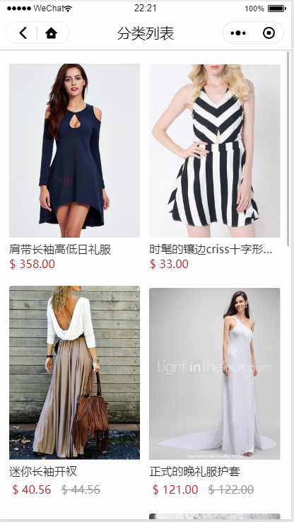

分类页的图片，可以在后台配置

3.3分销商分享产品页面

当用户点击进入分享页面，进行下单，分销商将会得到相应的收益

4.分销商查看分销用户订单

在分销商中心，点击分销订单

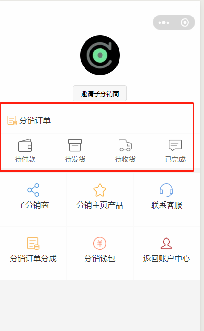

点击，查看分销订单列表

5.邀请子分销商

点击邀请子分销商按钮，进入邀请页面

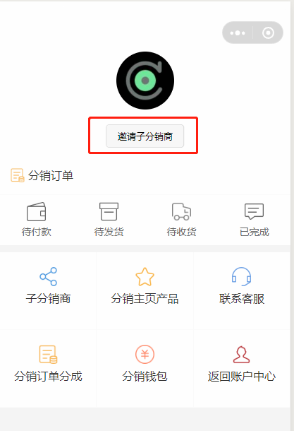

进入邀请页面后，点击分享转发即可，当用户A注册用户，申请分销商后，A将成为您的子分销商

6.查看子分销商列表

在分销商中心，点击子分销商即可

7.分销商自定义首页产品

分销商登陆用户后，将会在产品页面看到将产品加入到首页的按钮，点击后即可将产品加入首页

加入后，可以进入首页查看，也可以在分销商中心，点击 `分销主页产品`查看

8.分销订单分成

当用户订单支付，商家发货到货后X天，脚本会计算分销订单分成，需要注意的是，退货的订单不包含在内，
这么做是为了防止恶意的刷单者

点击下面的按钮，进入分成列表

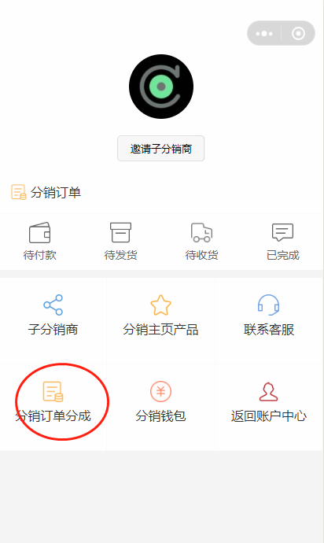

订单分成列表如下，您可以点击该分成，查看分成详细

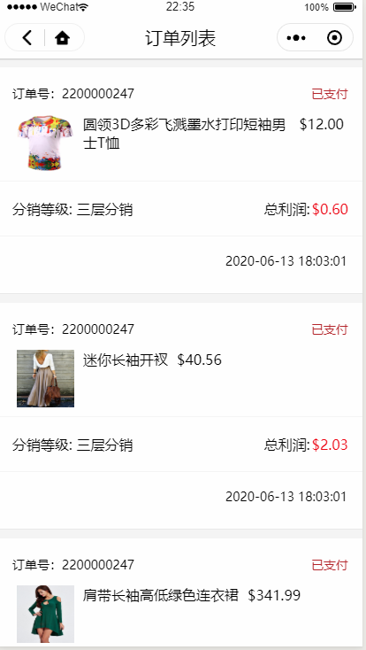

分成详细列表

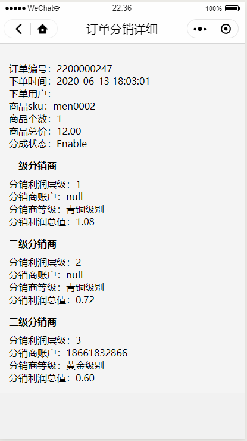

9.分销钱包

当订单分成结算后，将会进入分销钱包，点击，进入分销钱包

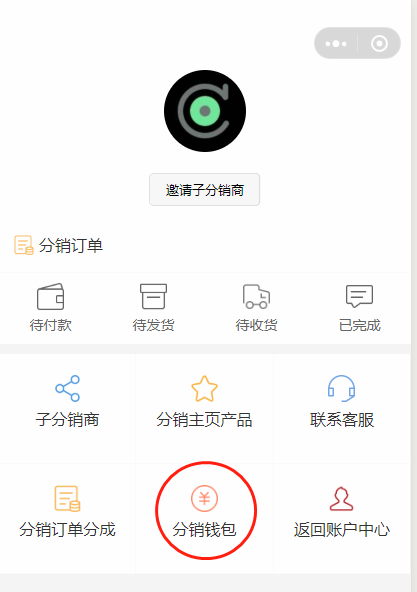

钱包总额，以及详细的分销钱包历史明细

点击钱包提现，进入提现表单提交页面

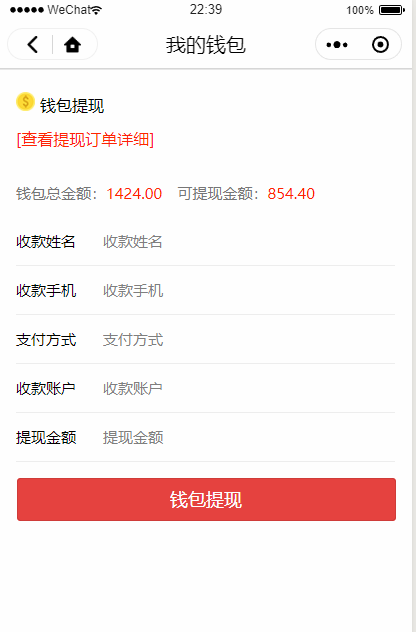

点击查看提现订单明细，查看历史提现明细

