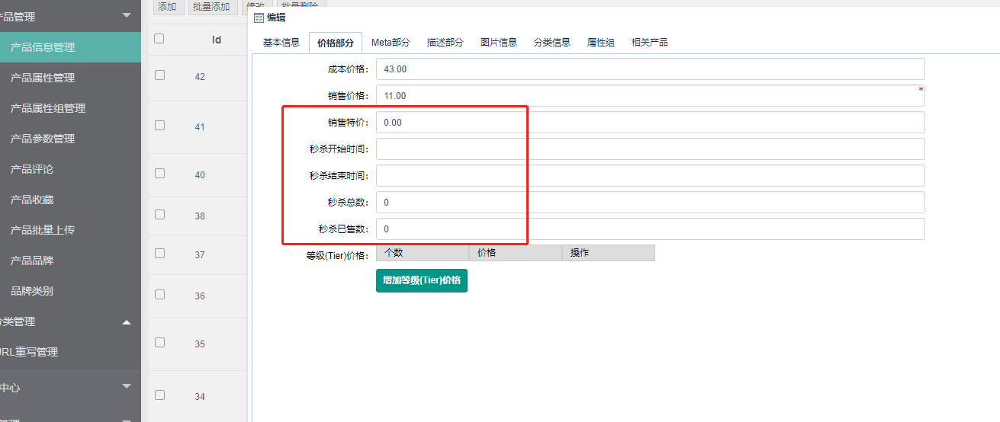
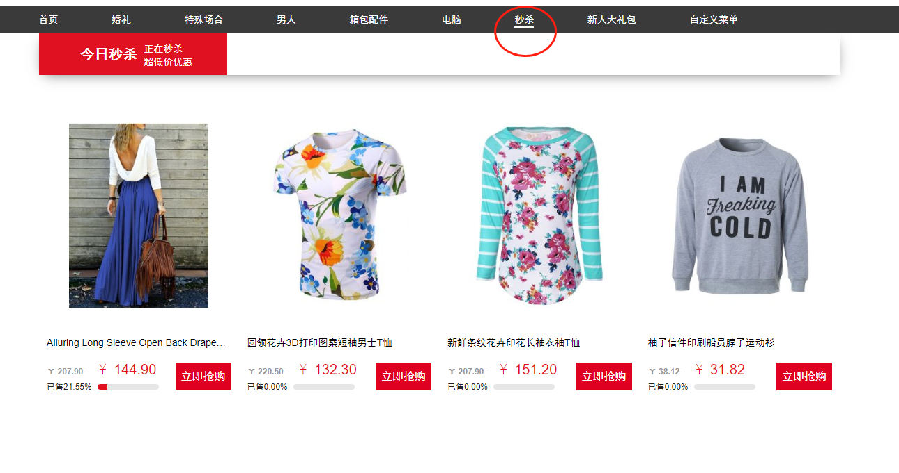

Walletyo-秒杀
===========

> 对产品进行秒杀特价，倒计时，以及数量限制等，进行的促销活动

### 产品秒杀设置

进入后台，进入产品管理，新建或者编辑产品

演示地址：

pc: http://fecyo.fecshop.com/cn/catalog/seckill/index

h5: http://fecyoh5.fecshop.com/cn/catalog/seckill/index

`销售特价`：秒杀价格值

`秒杀开始时间`：秒杀活动开始的时间

`秒杀结束时间`：秒杀结束的时间

`秒杀总数`：秒杀产品订单总数，注意，这里的值是订单总数（而非支付订单），未支付订单也包含在内。

`秒杀已售数`: 已经被下订单的产品总数，注意，这里的值是订单总数（而非支付订单），未支付订单也包含在内。

对于`秒杀已售数`，您可以在设置秒杀部分，给与一个值，这样您的秒杀活动会默认有一个销售值，这样伪造一下会促进您的活动销售量

### 秒杀展示

通过点击`秒杀`菜单，进入秒杀页面

里面是正在秒杀的产品列表，点击产品后，在产品详情页可以看到倒计时

用户点击下单即可。

### 说明

1.产品下单后，产品的`秒杀已售数`将会增加。

2.对于秒杀产品的`秒杀已售数` >= 后台设置 `秒杀总数`， 产品特价活动结束，恢复正常价格。

3.对于不设置秒杀开始时间和秒杀结束时间的特价产品，将不会进入秒杀活动页面

4.秒杀活动页面，只显示    (`秒杀开始时间` < `当前时间`)   && (`秒杀结束时间` > `当前时间`)

