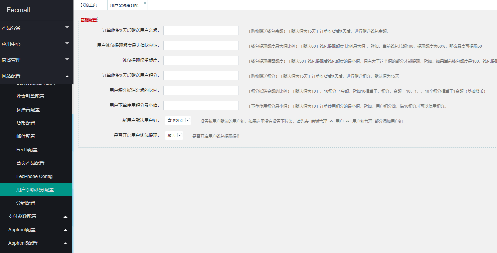
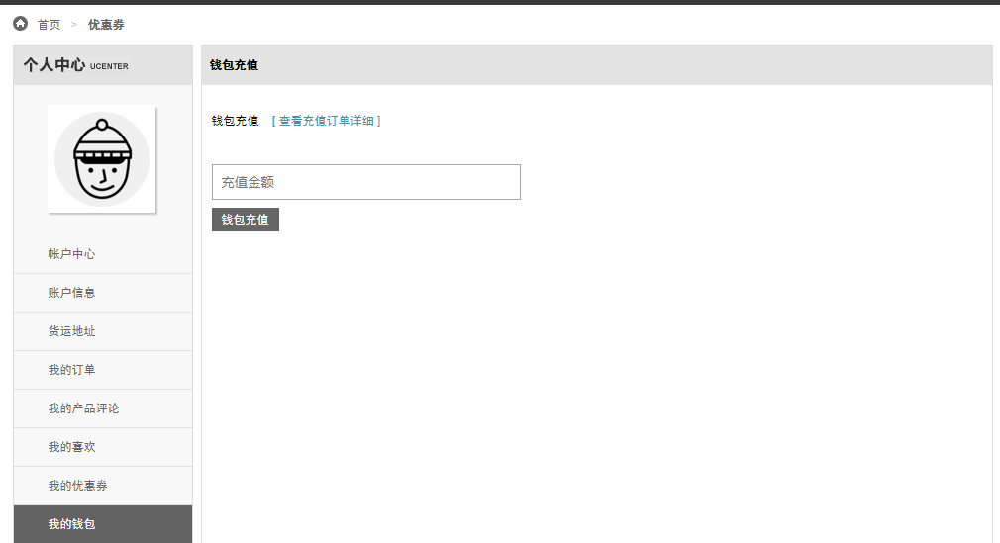
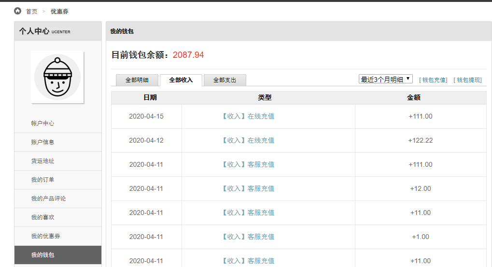
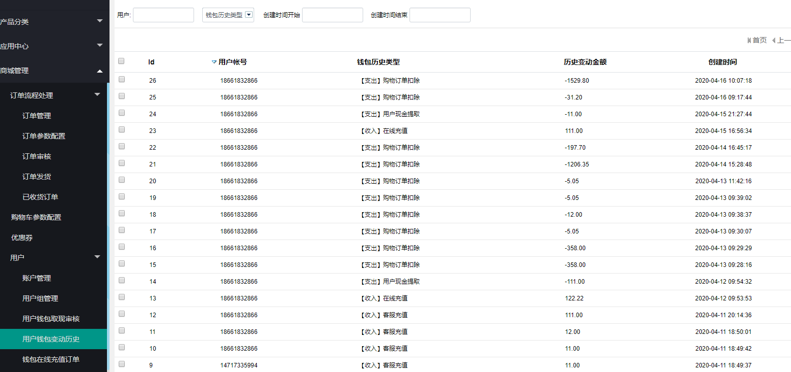
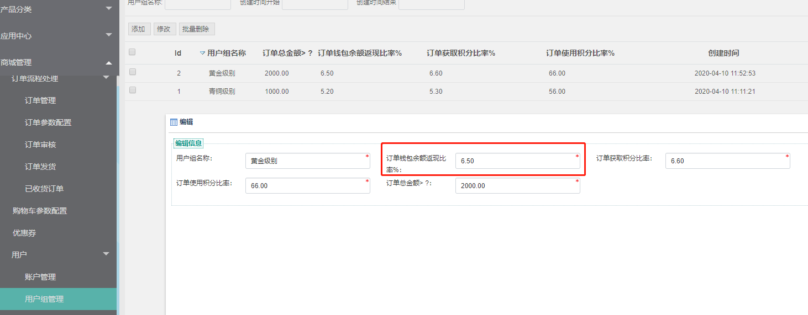
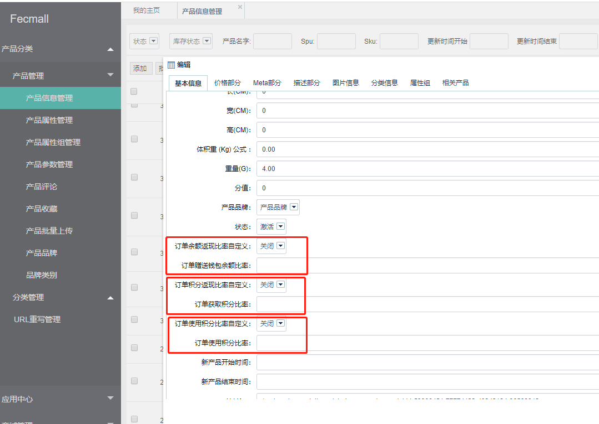
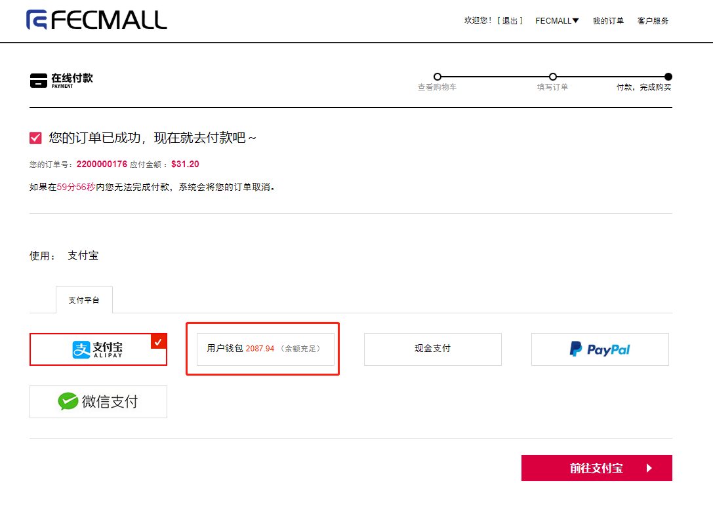

Fecyo扩展 - walletyo - 站内余额和站内积分
===============

> 站内余额 和 站内积分两部分的功能，是fecyo系统上面的扩展

###用户钱包和用户积分

`用户钱包`：就是用户在商城的站内余额，用户可以对账户充值，提现，以及使用站内余额购物，
另外，商家可以设置购物赠送站内余额。

`用户积分`：用户在商城的积分，用户商城购物后，会赠送积分，当满足积分数后，用户可以在下次购物
的时候，使用积分抵消订单金额。

### 配置说明

`【订单收货X天后赠送用户余额】`【默认值为15天】订单收货后X天后，进行赠送钱包余额， Wallet Cash Amount Max Rate%：

`【用户钱包提现额度最大值比例%】`【默认60】钱包提现额度`比例最大值`，譬如：当前钱包总额100，提现额度为60%，那么最高可提现60 Wallet Cash Amount Min Val：

`【钱包提现保留额度】`【默认50】钱包提现后钱包额度的最小值，只有大于这个值的部分才能提现，譬如：如果当前钱包额度是100，钱包提现保留额度是60，那么用户最大只能提现40 Point Order Gift Days：

`【订单收货X天后赠送用户积分】`【默认值为15天】订单收货后X天后，进行赠送积分，默认值为15天 Point Offset Amount Rate：

`【积分抵消金额的比例】`【默认值为10】，10积分=1金额，譬如10相当于：积分：金额 = 10：1，，10个积分相当于1金额（基础货币） Point Use Min Val：

`【用户下单使用积分最小值】`【默认值为10】订单使用积分的最小值，譬如：用户积分数，满10积分才可以使用积分。

`【新用户默认用户组】`设置新用户默认的用户组

`【是否开启余额提现】`激活是否开启用户钱包提现操作

### 账户中心 - 我的钱包

1.钱包金额以及变动历史

用户可以在`账户中心`，查看：

1.1站内余额的`总值`

1.2站内余额的`历史记录`（包含余额的`充值`，余额的`消费`）

2.钱包在线充值

`我的钱包`页面，点击`钱包充值`，即可进入`钱包余额充值`部分

2.1填写`充值`金额，点击钱包充值，即可进入钱包充值支付页面，进行钱包充值，支付后即可完成钱包充值

2.2点击`[ 查看充值订单详细 ]`,进行钱包充值订单的信息查看

进行钱包充值的订单可以在这里查看订单详细

对于充值的积分数历史，您可以在`我的钱包`部分查看

3.钱包在线提现

我的钱包部分，点击` [ 钱包提现]`,即可进入钱包余额提现部分

3.1在线提现

填写信息，提交即可，提交后，需要后台管理员审核，并进行`线下打款`。

3.2点击`[ 查看提现订单详细 ]`,查看钱包提现的审核状态记录

### 账户中心-我的积分

用户可以在账户中心查看我的积分总数，以及积分的详细记录

### 管理员后台钱包余额充值

管理员在fecmall后台，进行手动 `站内余额充值`

后台用户管理部分，进行钱包余额充值。

充值完成后，用户的站内余额总值进行累加，用户可以在`钱包余额历史`记录中查看`充值记录`，充值`订单支付`状

### 后台审核用户钱包提现

用户提交提现申请后，客服在后台可以查看记录，进行审核通过或者拒绝，并且填写`客服回馈`信息，反馈给用户

### 后台其他信息查看

1.后台查看，用户钱包变动历史

2.客服后台查看，钱包在线充值订单

### 后台设置各个用户组的信息

1.订单钱包余额返现比率%：用户组下的用户订单完成后，返还钱包余额的比例%

2.订单获取积分比率：用户组下的用户订单完成后，返还积分的比例%

3.订单使用积分比率：用户组下的用户下单的时候，可以使用积分的比例。

4.订单总金额> ?：用户购物订单金额满X后，才能成为该用户组

### 积分和钱包余额的配置

【购物赠送钱包余额】【默认值为15天】订单收货后X天后，进行赠送钱包余额， Wallet Cash Amount Max Rate%：

【钱包提现额度最大值比例】【默认60】钱包提现额度`比例最大值`，譬如：当前钱包总额100，提现额度为60%，那么最高可提现60 Wallet Cash Amount Min Val：

【钱包提现保留额度】【默认50】钱包提现后钱包额度的最小值，只有大于这个值的部分才能提现，譬如：如果当前钱包额度是100，钱包提现保留额度是60，那么用户最大只能提现40 Point Order Gift Days：

【购物赠送积分】【默认值为15天】订单收货后X天后，进行赠送积分，默认值为15天 Point Offset Amount Rate：

【积分抵消金额的比例】【默认值为10】，10积分=1金额，譬如10相当于：积分：金额 = 10：1，，10个积分相当于1金额（基础货币） Point Use Min Val：

【下单使用积分最小值】【默认值为10】订单使用积分的最小值，譬如：用户积分数，满10积分才可以使用积分。

【默认用户组】设置新用户默认的用户组

【是否开启余额提现】激活是否开启用户钱包提现操作

必须设置参数：

4.1默认用户组，您需要先编辑用户组，然后选其中一个最为默认用户组。

4.2是否开启用户钱包提现操作

### 产品积分和钱包余额编辑

后台产品编辑

产品自定义积分和钱包的比例，默认是关闭状态，开启后，用户组部分设置的将失效，以这里的为准。

### 用户下单使用积分抵扣金额

当用户积分数，在下单页面，满足条件后，就可以使用积分，如图：

用户可以取消掉使用积分

### 用户下单使用钱包支付

1.用户可以在商城内，下单方式选择`站内余额`进行支付,如果金额充足，则进行站内余额的扣除，更改`订单状态`为`已支付`状态

2.如果用户`站内余额`不足，则不能使用`站内余额`进行支付

3.当`站内余额`不足，不能选择订单部分金额使用`站内余额`，其他的金额选用其他的支付方式，也就是说`订单`和`支付方式`是一对一的关系。

用户操作：当`站内余额`不足，用户必须先进行`站内余额`的充值，金额充足后进行支付

4.如果用户进行订单的取消操作，需要进行站内余额的返还。

5.用户订单支付完成后，`站内余额`扣除，添加`站内余额`变动历史（事务操作）

### 用户订单取消返还积分和站内余额

对于fecyo，目前只可以对未支付的订单进行取消

1.用户在账户中心，进行未支付订单的取消

2.系统cron脚本自动取消订单

