Fecyozz 详细操作说明
============

> 操作详细说明

### 主账户创建，审核，登陆

1.主账户注册，用户在页面直接进行注册

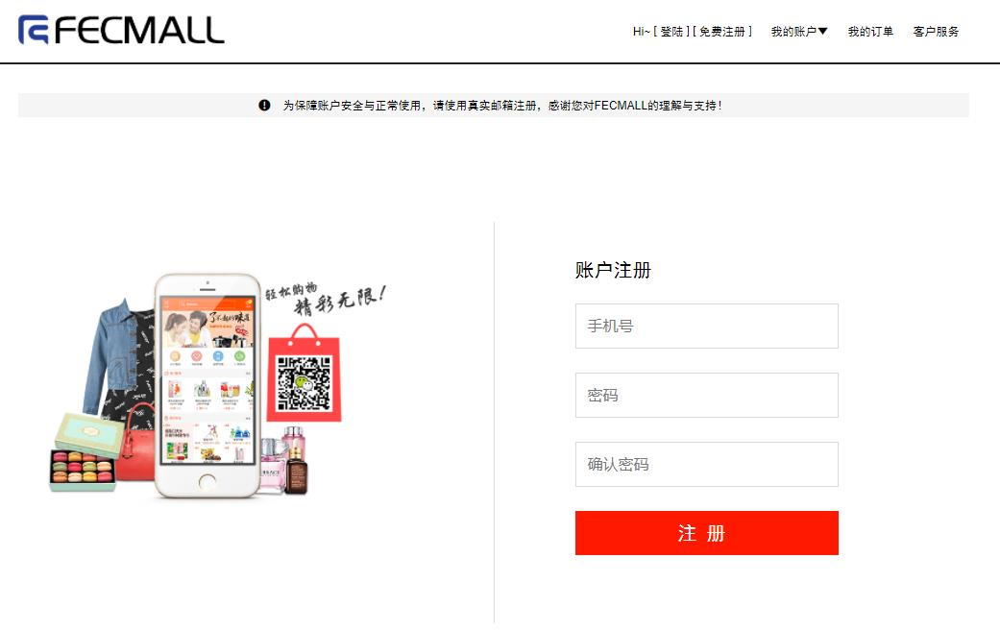

2.主账户注册后，不能立即使用，需要管理员后台审核

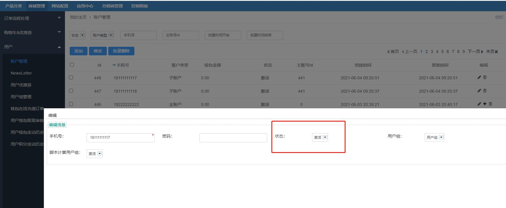

3.审核通过后，主账户可以进行登陆

### 主账户创建子账户

主账户审核通过后，可以登陆账户中心，查看我的子账户

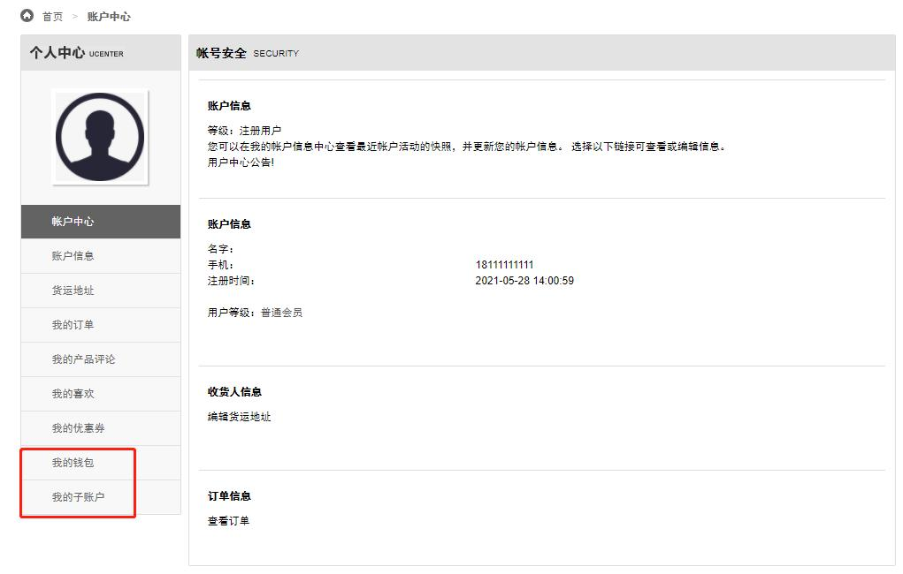

主账户可以查看，新增，修改，删除子账户

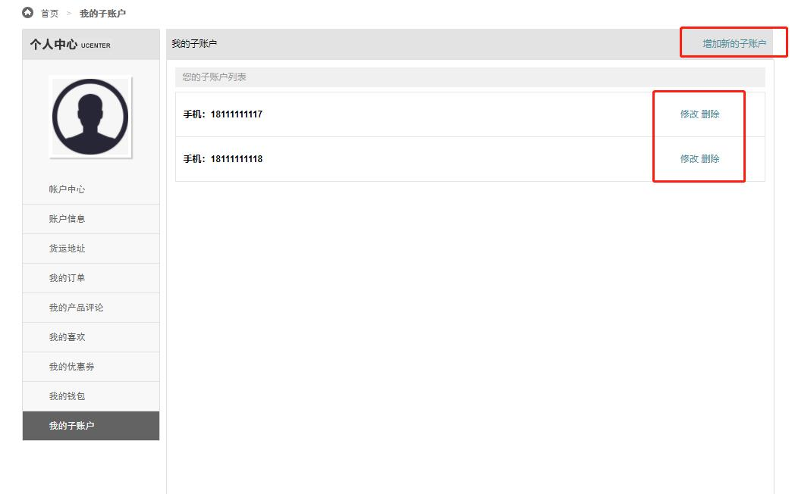

创建后，子账户就可以登陆了

### 主账户充值钱包

1.主账户钱包，主账户登陆后，在账户中心，点击我的钱包，即可查看

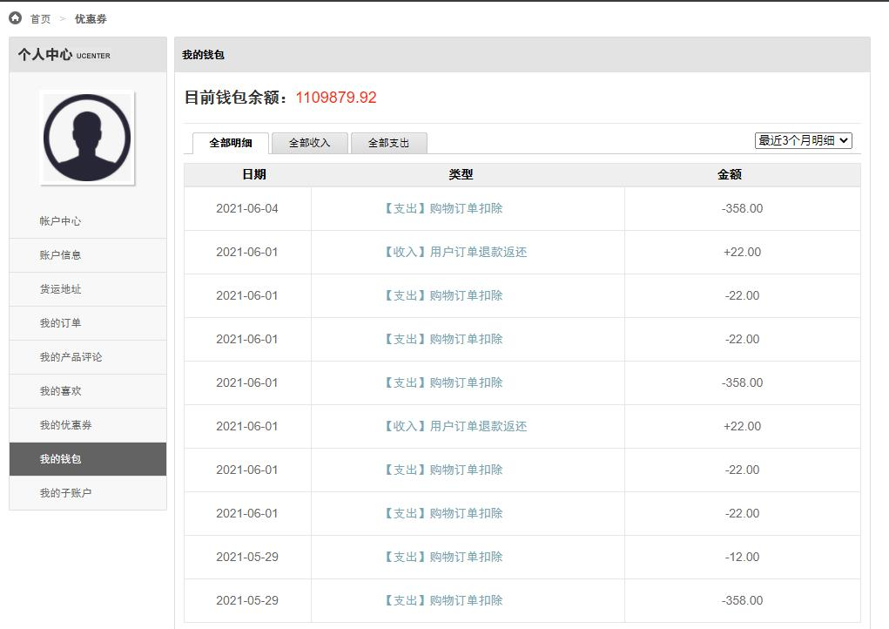

注意：子账户没有钱包机制

2.主账户所有者，联系客服，确认线下支付打款的方式，进行钱包充值

3.客服收到款项后，在后台进行钱包充值

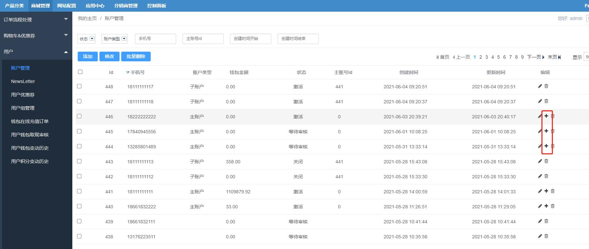

点击`+`图标，在弹框中填写充值的金额，提交即可

4.客服可以在后台，查看用户钱包变动历史

5.充值后，用户可以看到钱包的变动

### 子账户下单

1.用户登陆子账户，进行下单，子账户下单后，会跳转到账户中心-订单列表，查看刚才下的订单

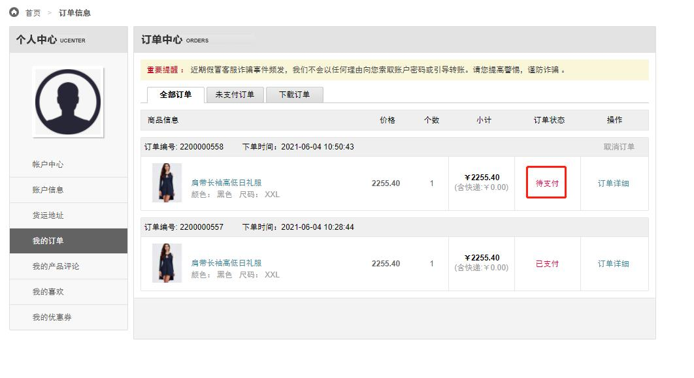

用户下单后，订单状态为未支付

2.用户可以点击订单列表中的订单，进入订单详情页面

在详情页面，用户可以上传zip压缩包

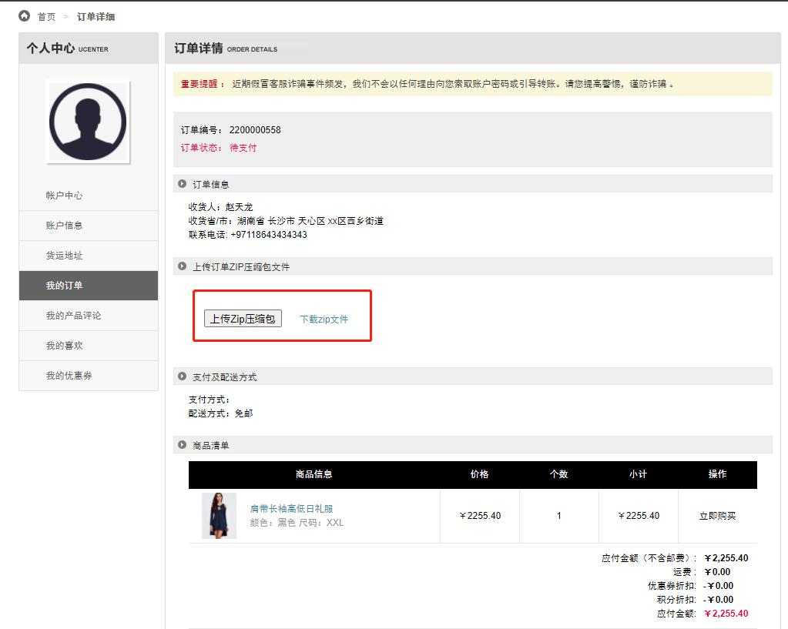

注意：只有未支付订单才可以上传zip文件，已支付的订单不可以进行zip文件上传

3.主账户进行审核子账户的订单

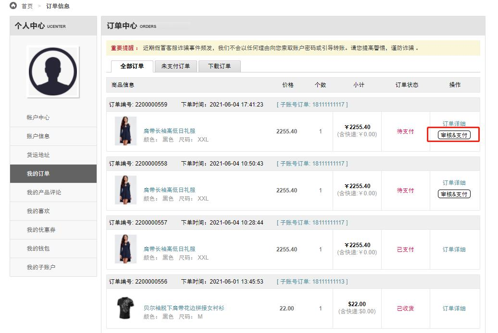

主账户用户，点击`审核&支付`按钮，进行审核，并且进行钱包支付

通过后，订单状态改为`已支付`

4.主账户支付后，可以看到钱包的变动

5.可以进行订单的下载。

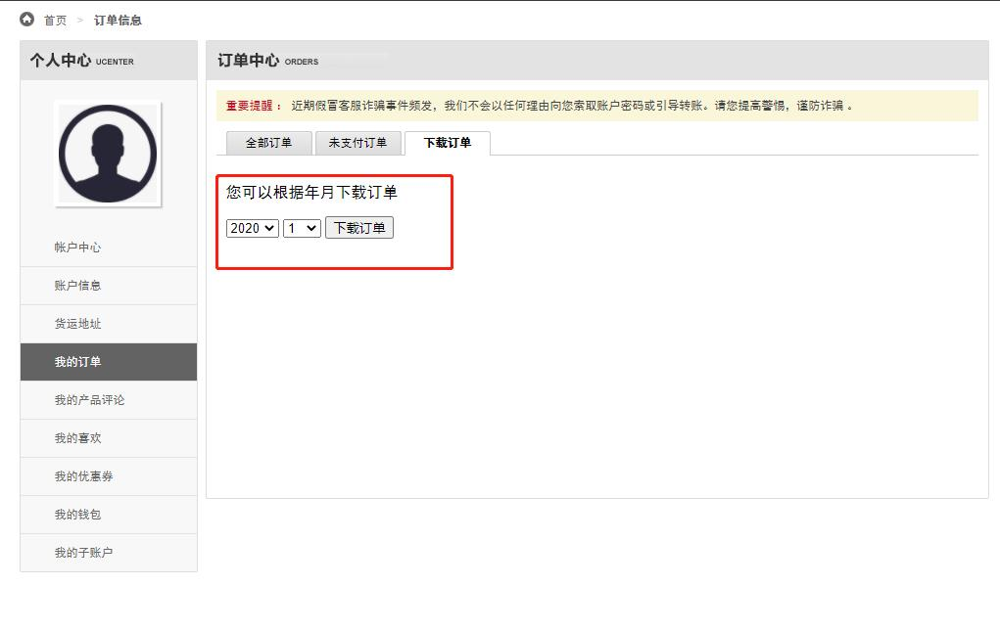

6.客服在后台订单管理，下载用户上传的zip文件

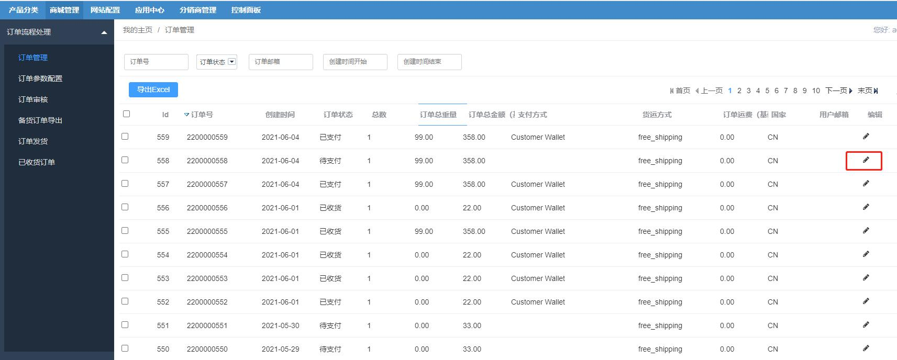

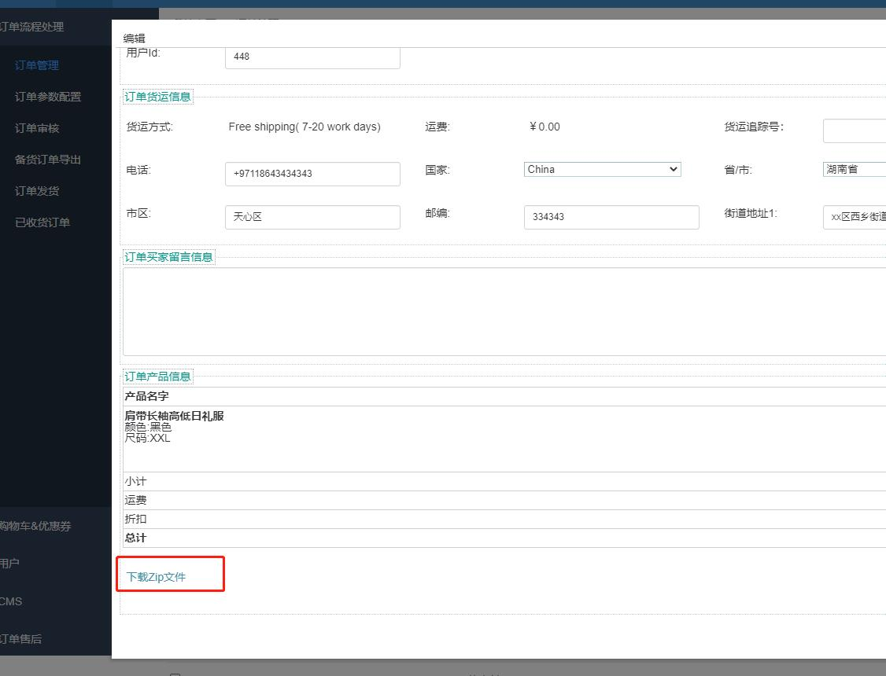

