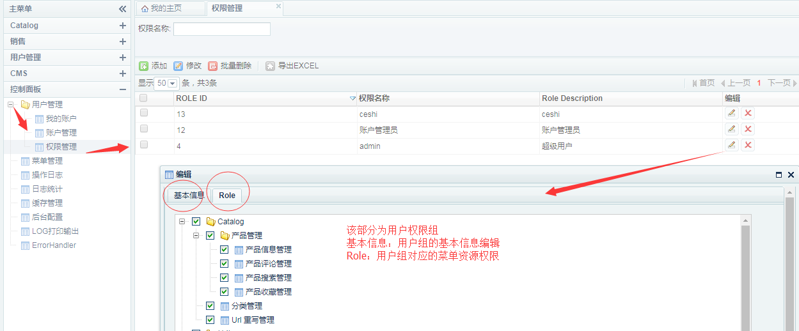
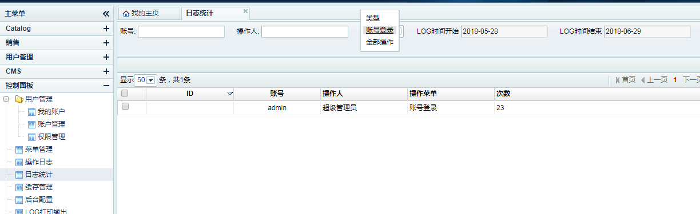

Fecshop后台功能操作
================

> 该部分讲述的是fecshop后台功能部分的操作。

Fecshop的后台，针对的是数据库的编辑部分，而对于fecshop配置部分
都是在大量的配置文件中，您可以参看帮助文档的关键概念中，有详细的介绍

### 控制面板

1.用户管理 -> 我的账户

修改我的密码，第一次登录后，建议立即修改您的密码

2.用户管理 -> 账户管理

这里可以看到您的后台的所有的账户
，您可以增删改查后台的用户信息，以及为用户设置权限

3.用户管理 -> 权限管理

这个部分是为后台用户建立权限组，每个权限组有
相应的菜单执行权限，当用户勾选了相应的权限组，就有了
执行这些菜单的权限

4.菜单管理

后台的菜单管理，您可以在这里编辑添加后台的菜单，不过
这些都是程序员二次开发功能所用到的，
业务用不到这些功能

5.操作日志

这个是用户所有用户访问后台的记录，
你可以参看公司所有业务的访问后台历史记录。

6.日志统计

这个是后台用户的操作日志的一个简单统计，
你可以通过切换上面的操作类型，查看各个用户的
操作次数和登录的次数

7.缓存管理

刷新各个入口的缓存信息，可以全选或者单选某个入口，
然后点击刷新缓存即可

对于后台添加菜单，为用户添加权限等操作，操作完成后，
需要刷新缓存，否则不会生效。

8.后台配置

这里是一个配置部分，不过fecshop并没有使用，
您可以在这里添加一些配置项，然后将fecshop的某些文件中的配置，
转移到这里配置，这个只是做了一个预制，但并目前并没有使用。

9.ErrorHandler

这个是fecshop的一个很重要的功能，详细的介绍可以参看文档：[Fecshop Error Handler](fecshop_error_handler.md)

当您在线上开启prod模式后，您这里可以查阅所有的fecshop的error信息，这里都有记录
，您可以根据这些错误信息解决这些报错

因为项目中会存在一些不明显的报错，如果客户不反馈，作为程序员是不知道的，errorHandler
可以记录所有的程序内部错误信息，帮助解决这个事情，
其他的详细参看上面的文档，这里不一一细说了

