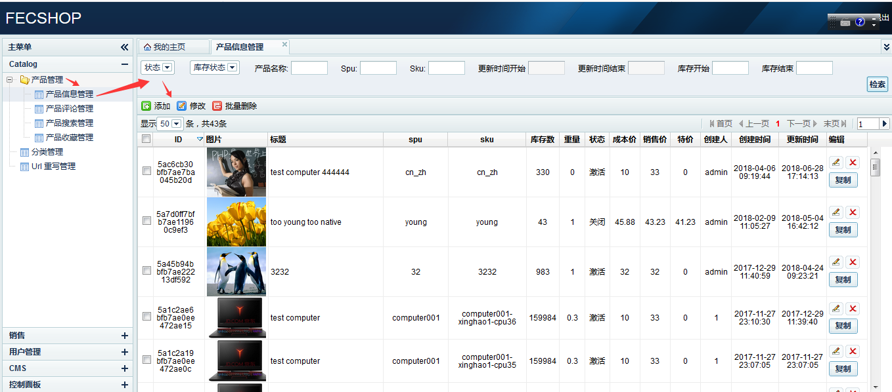
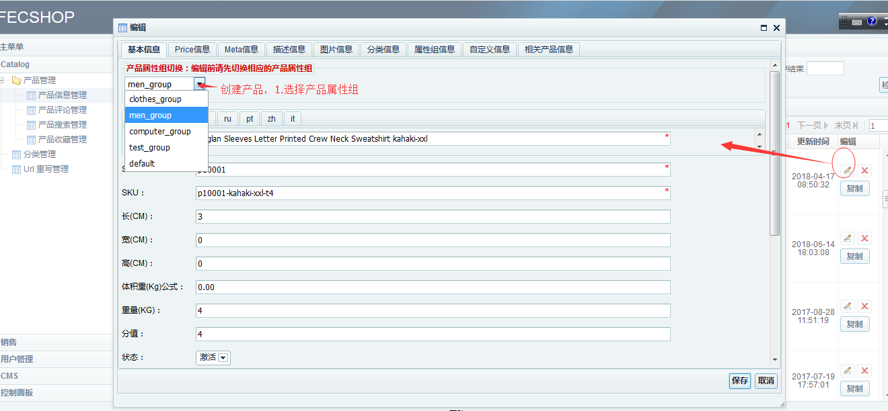
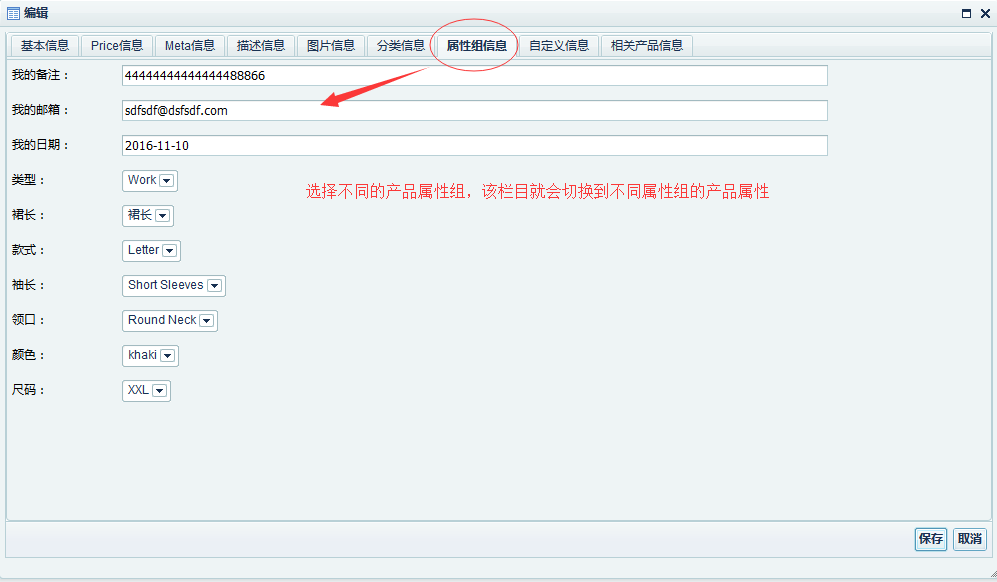
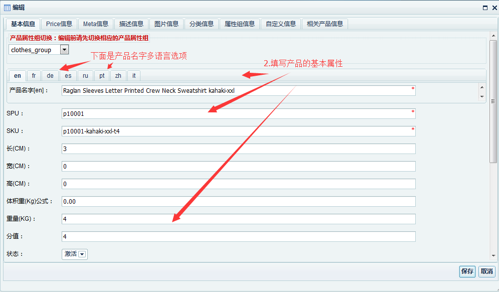
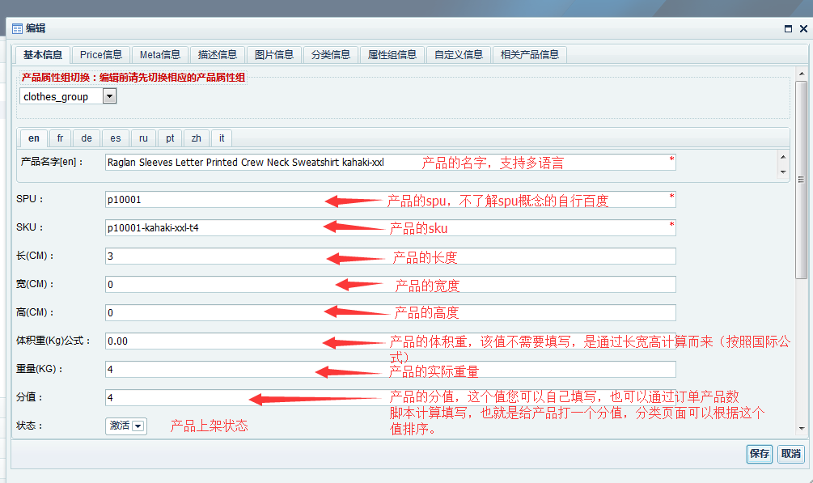
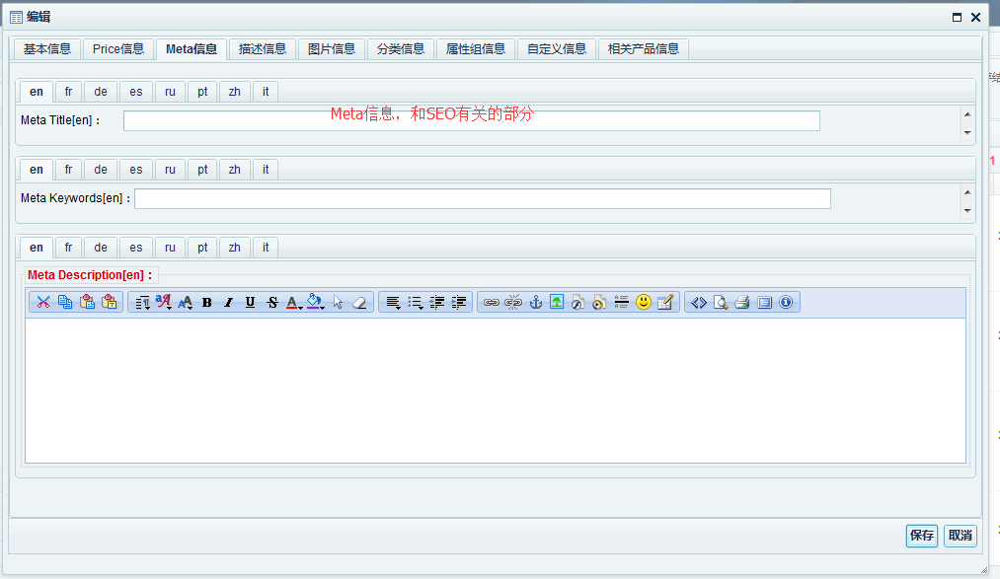
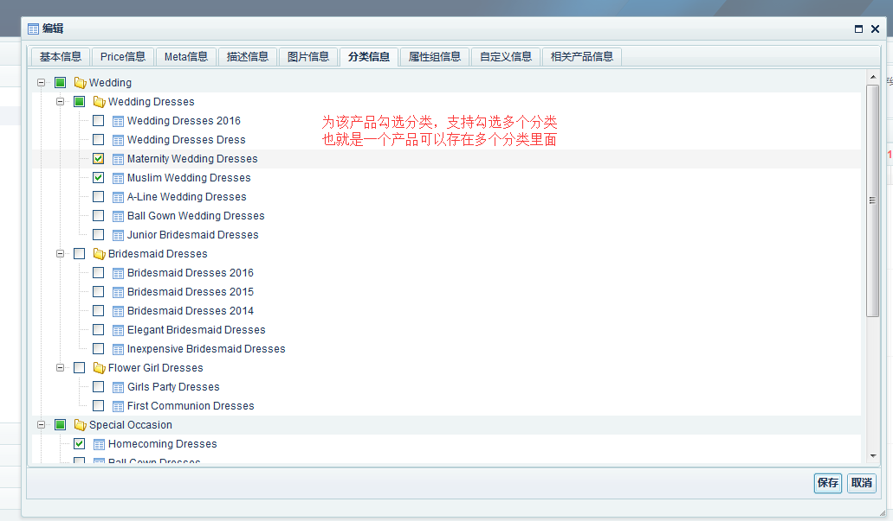

Fecshop后台-产品编辑
=================

### 产品管理

产品数据的编辑，这个部分东西比较多，
下面是截图，每个截图都进行了说明

因为截图比较大，您可以放大浏览器（按住ctrl，滑动鼠标中间滑轮），
图片会更清晰一些

OK,产品数据编辑，大致这些内容

关于产品的更多信息，查看：

[Fecshop 产品](fecshop_product.md)

[Fecshop 产品图片](fecshop_product_image.md)

[Fecshop 库存](fecshop_stock.md)

