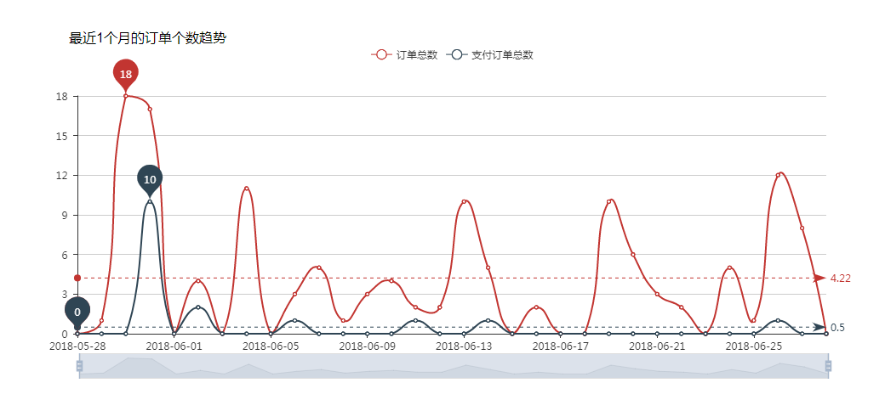
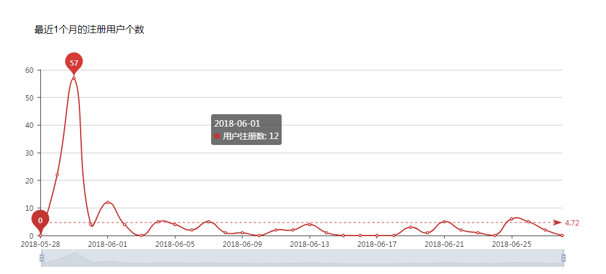
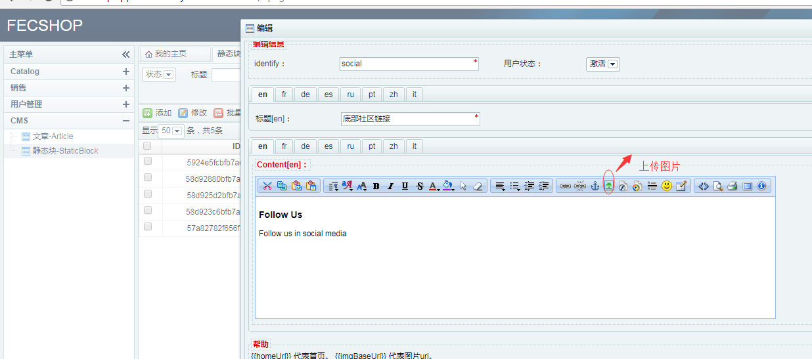

fecshop后台-主页和cms
==================

### fecshop主页

就是登陆账户后的页面, 鼠标下拉一次可以看到的统计如下：

1.最近1个月的订单金额趋势(基础货币)

`订单总额`: 所有的订单的总金额（包括未支付订单）

`支付订单总额`: 支付成功的订单的总金额

2.最近1个月的订单个数趋势

`订单总数`: 所有的订单的总个数（包括未支付订单）

`支付订单总数`: 支付成功的订单的总个数

3.最近1个月的注册用户个数

此部分功能的展示图标，使用的是:`Echart`

### Cms部分

1.文章Article

这个部分是商城的一些文字条款单页的编辑部分，譬如：http://fecshop.appfront.fancyecommerce.com/about-us

url key就是您访问的url key，譬如填写 `/return-policy`,那么页面地址就是：http://fecshop.appfront.fancyecommerce.com/return-policy

更多关于文章的讲解，参看：[Fecshop page页（文章）](fecshop_page.md)

2.静态块 - static block

这个是静态块，譬如首页的大图，一些其他的业务常用修改的部分的静态html块，
可以在这里编辑，编辑后，就可以修改相应的内容

更多关于Fecshop 静态块的讲解，参看：[Fecshop 静态块](fecshop_static_block.md)

