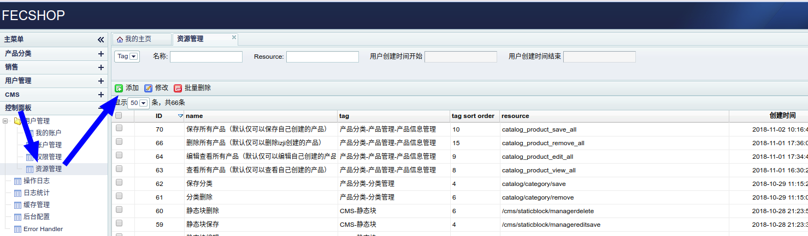
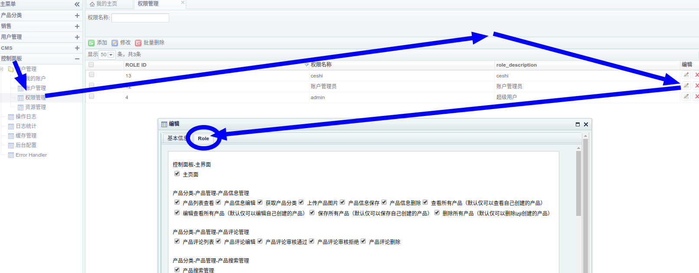
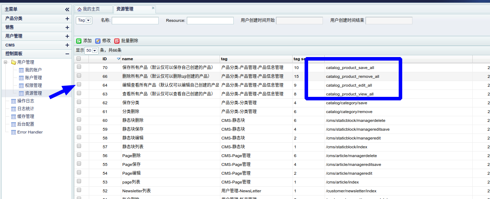

Fecshop 后台菜单RBAC
==============

> fecshop的后台，在版本1.6.0.0之后，
将基于菜单的权限控制改成了RBAC


### 关于权限

1.基于controller action的控制，譬如查看列表，编辑保存，删除，导出excel等
action操作


2.基于数据的权限控制，譬如编辑人员只能看到自己创建的产品，编辑保存，删除自己
创建的产品，而对于其他人创建的产品则没有权限

### 后台菜单

1.添加菜单

@fecshop/config/services/Admin.php 可以看到  menu  admin services的配置

```
'menu' => [
                'class'        => 'fecshop\services\admin\Menu',
                'menuConfig' => [
                    // 一级大类
                    'catalog' => [
                        'label' => 'Category & Prodcut',
                        'child' => [
                            // 二级类
                            'product_manager' => [
                                'label' => 'Manager Product',
                                'child' => [
                                    // 三级类
                                    'product_info_manager' => [
                                        'label' => 'Product Info',
                                        'url_key' => '/catalog/productinfo/index',
                                    ],
                                    // 三级类
                                    'product_review_manager' => [
                                        'label' => 'Product Reveiew',
                                        'url_key' => '/catalog/productreview/index',
                                    ],
                                    // 三级类
                                    'product_search_manager' => [
                                        'label' => 'Product Search',
                                        'url_key' => '/catalog/productsearch/index',
                                    ],

                                    'product_favorite_manager' => [
                                        'label' => 'Product Favorite',
                                        'url_key' => '/catalog/productfavorite/index',
                                    ],
                                ]
                            ],
                            'category_manager' => [
                                'label' => 'Manager Category',
                                'url_key' => '/catalog/category/index',
                            ],
                            'urlrewrite_manager' => [
                                'label' => 'URL Rewrite',
                                'url_key' => '/catalog/urlrewrite/index',
                            ],
                        ]
                    ],
                    'sales' => [
                        'label' => 'Sales',
                        'child' => [
                            'order' => [
                                'label' => 'Order',
                                'child' => [
                                    'order_manager' => [
                                        'label' => 'Manager Order',
                                        'url_key' => '/sales/orderinfo/manager',
                                    ],
                                ],
                            ],
                            'coupon' => [
                                'label' => 'Coupon',
                                'url_key' => '/sales/coupon/manager',
                            ],
                        ],
                    ],
                    'customer' => [
                        'label' => 'Manager User',
                        'child' => [
                            'account' => [
                                'label' => 'Manager Account',
                                'url_key' => '/customer/account/index',
                            ],
                            'newsletter' => [
                                'label' => 'NewsLetter',
                                'url_key' => '/customer/newsletter/index',
                            ],

                        ],
                    ],
                    'cms' => [
                        'label' => 'CMS',
                        'child' => [
                            'page' => [
                                'label' => 'Manager Page',
                                'url_key' => '/cms/article/index',
                            ],
                            'staticblock' => [
                                'label' => 'Static Block',
                                'url_key' => '/cms/staticblock/index',
                            ],
                        ],
                    ],
                    'dashboard' => [
                        'label' => 'Dashboard',
                        'child' => [
                            'adminuser' => [
                                'label' => 'Admin User',
                                'child' => [
                                    'myaccount' => [
                                        'label' => 'My Account',
                                        'url_key' => '/fecadmin/myaccount/index',
                                    ],
                                    'account_manager' => [
                                        'label' => 'Manager Account',
                                        'url_key' => '/fecadmin/account/manager',
                                    ],
                                    'role_manager' => [
                                        'label' => 'Manager Role',
                                        'url_key' => '/fecadmin/role/manager',
                                    ],
                                    'resource_manager' => [
                                        'label' => 'Manager Resource',
                                        'url_key' => '/fecadmin/resource/manager',
                                    ],
                                ],
                            ],
                            //'menu' => [
                            //    'label' => '菜单管理',
                            //    'url_key' => '/fecadmin/menu/manager',
                            //],
                            'log' => [
                                'label' => 'Log Info',
                                'url_key' => '/fecadmin/log/index',
                            ],
                            'logtj' => [
                                'label' => 'Log Statistics',
                                'url_key' => '/fecadmin/logtj/index',
                            ],
                            'cache' => [
                                'label' => 'Manager Cache',
                                'url_key' => '/fecadmin/cache/index',
                            ],
                            'config' => [
                                'label' => 'Admin Config',
                                'url_key' => '/fecadmin/config/manager',
                            ],
                            'error_handler' => [
                                'label' => 'Error Handler',
                                'url_key' => '/system/error/index',
                            ],
                        ],
                    ],
                ],
            ],
									
```

在类属性`menuConfig`处配置，
您可以在本地配置文件：`@appadmin/config/fecshop_local_services/Admin.php`中添加
后台配置(没有这个文件自行创建)

添加后，由于没有添加资源，因此在后台刷新页面后，菜单还是不能完整的显示出来，我们需要到后台添加资源，
设置权限


2.url资源

上面的菜单，是fecshop的菜单，需要添加资源，在您的当前账户对应的权限组中添加资源
（菜单中的很多url以资源的方式加入，然后在权限组中添加资源，然后才有权限访问）

后台添加资源（resources，将url_key作为资源在后台录入系统）




`name`: 自行填写

`resource`:填写您的`url_key`, 譬如 `/catalog/productinfo/index`, 对应您的访问路径
`moduleId/controllerId/actionId`，

`tag`:这个一般和菜单对应，这个在 urlKey admin services中配置，也就是 @fecshop/config/services/Admin.php中配置，您可以在本地配置添加，配置代码如下：

```
'urlKey' => [
	'class' => 'fecshop\services\admin\UrlKey',
	'urlKeyTags' => [
		'dashboard_main' 								=> '控制面板-主界面',
		'catalog_product_info_manager' 			=> '产品分类-产品管理-产品信息管理',
		'catalog_product_review_manager' 		=> '产品分类-产品管理-产品评论管理',
		'catalog_product_search_manager' 		=> '产品分类-产品管理-产品搜索管理',
		'catalog_product_favorite_manager' 	=> '产品分类-产品管理-产品收藏管理',
		'catalog_category_manager' 				=> '产品分类-分类管理',
		'catalog_url_rewrite_manager' 			=> '产品分类-URL重写管理',
		'sales_order_manager' 						=> '销售-订单-订单管理',
		'sales_coupon_manager' 					=> '销售-优惠券',
		'customer_account' 							=> '用户管理-帐号管理',
		'customer_newsletter' 						=> '用户管理-NewsLetter',
		'cms_page' 										=> 'CMS-Page管理',
		'cms_static_block' 								=> 'CMS-静态块',
		'dashboard_user_myaccount' 				=> '控制面板-用户管理-我的账户',
		'dashboard_user_account_manager' 	=> '控制面板-用户管理-账户管理',
		'dashboard_user_role' 						=> '控制面板-用户管理-权限管理',
		'dashboard_user_resource' 				=> '控制面板-用户管理-资源管理',
		'dashboard_log_info' 							=> '控制面板-操作日志',
		'dashboard_log_manager' 					=> '控制面板-日志管理',
		'dashboard_cache' 							=> '控制面板-缓存管理',
		'dashboard_config' 							=> '控制面板-后台配置',
		'dashboard_error_handler'					=> '控制面板-ErrorHandler',

	],
],
```

一般一个菜单对应一个urlKeyTags，也就是一个功能，里面有增删改查等一系列的操作，每一个操作是一个url_key，对应一个资源resource，因此，
tag一般对应一个菜单，里面的增删改查的各个resources（url_key），填写这个菜单对应的tag，在为role添加resources的时候，resource就会根据tag进行归类，方便编辑，如图：


tag的作用仅仅是上图，为role添加resources的时候进行归类，这样易于管理，除了这个没有其他的用处

`tag sort order`， 在上图，根据tag归类后的各个resources的排序

3.权限组添加resources



通过如图，为权限组（role），添加资源（resource），添加后保存即可

4.刷新缓存

更改后，必须刷新缓存后才能生效


**Fecshop添加自定义菜单的完整例子**：http://www.fecshop.com/topic/1620

### 内容权限

有时候需要做一些内容的权限，譬如每个用户只可以编辑，删除自己创建的产品，而不能查看编辑删除其他人创建的产品，那么可以通过本部分操作

fecshop做了产品的内容权限控制，下面讲解：



通过上图可以看到某些资源不是url_key，而是一个普通的字符串，譬如如图

添加资源后，在权限组中添加这个资源，刷新缓存，就有了这个资源的权限，然后我们在代码中判断是否有这个权限，来进行内容权限操作

https://github.com/fecshop/yii2_fecshop/blob/master/app/appadmin/modules/Catalog/controllers/ProductinfoController.php#L32


```
// edit role,通过resource，判断当前用户是否有编辑（此处的编辑相当于查看产品的详细信息）所有产品的权限，默认，用户只有编辑查看自己发布的产品，而不能查看编辑其他用户的产品
        $resources = Yii::$service->admin->role->getCurrentRoleResources();
        $editAllKey = Yii::$service->admin->role->productEditAllRoleKey;
        $primaryKey = Yii::$service->product->getPrimaryKey();
        $product_id = Yii::$app->request->get($primaryKey);
        if ($product_id && (!is_array($resources) || !isset($resources[$editAllKey]) || !$resources[$editAllKey])) {
            $product = Yii::$service->product->getByPrimaryKey($product_id);
            if ($product['sku']) {
                $user = Yii::$app->user->identity;
                $created_user_id = $product['created_user_id'];
                if ($user->Id != $created_user_id) {
                    echo  json_encode([
                        'statusCode' => '300',
                        'message' => 'you donot have role to edit this product',
                    ]);
                    exit;
                }
            }
        }

```

通过`$resources = Yii::$service->admin->role->getCurrentRoleResources();`,来获取有权限的资源，

这个值`$editAllKey = Yii::$service->admin->role->productEditAllRoleKey;`，和后台新建的资源对应（就是resources）

然后通过 `$resources[$editAllKey]` 来判断，是否有资源权限，如果有，则xxxxxx，如果没有，则 xxxxx

因此，对于内容权限的控制，是有代码侵入性的，对于url_key这种url的资源的权限控制，是没有代码侵入性的。


