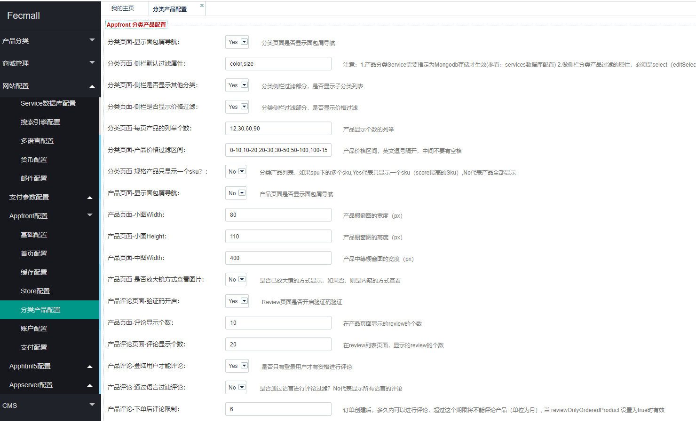
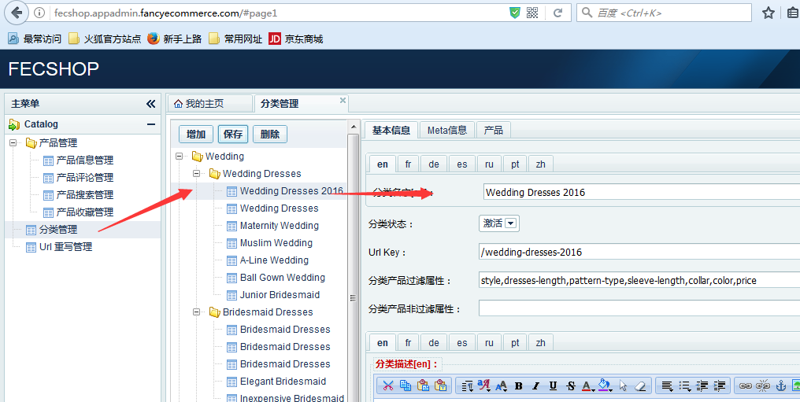
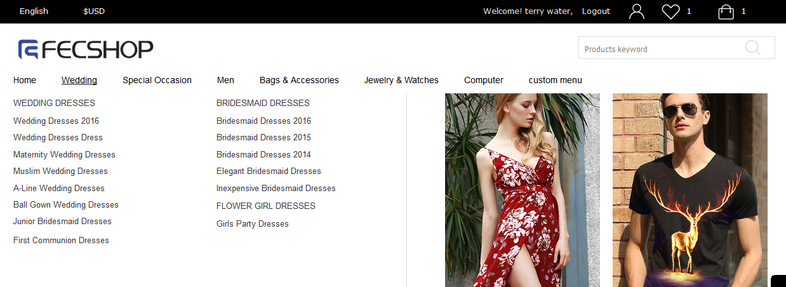
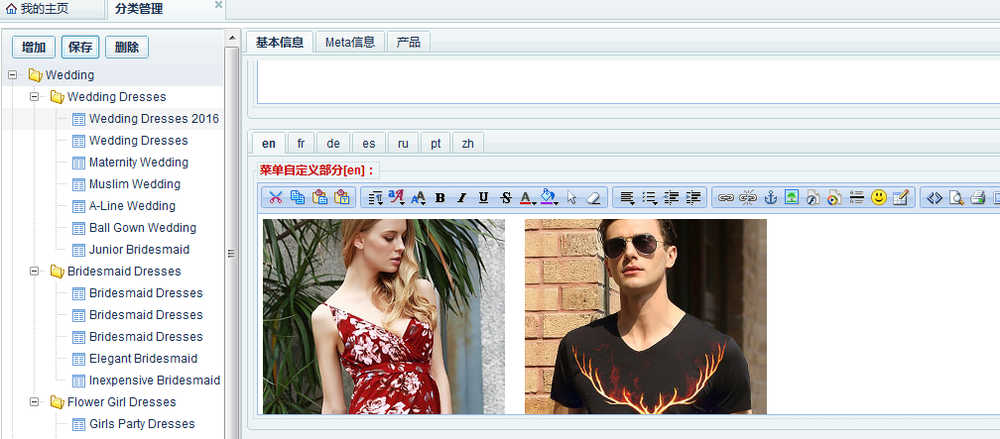
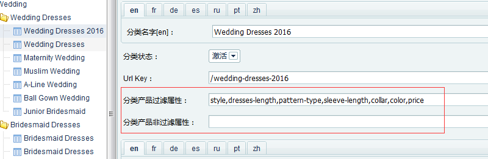

Fecshop 分类
===============

> 这里说的分类，就是在前台菜单导航栏里面的内容，包含home，产品分类，自定义分类等。


Fecshop-2.x更新说明
-------------

2版本更新为后台配置




Fecshop-1.x
-------------

### 分类产品显示

对于spu相同，但是sku不同的产品，默认只显示一个sku产品（score最高的那个），
譬如一款裙子，有多个颜色尺码，那么只会显示一个sku，但是，其他的sku可以通过分类侧栏
的属性过滤，查看到

如果您想要，spu相同sku不同的产品，在分类页面都显示出来，那么可以更改配置

`@common/config/fecshop_local_services/Product.php`

```
<?php
/**
 * FecShop file.
 *
 * @link http://www.fecshop.com/
 *
 * @copyright Copyright (c) 2016 FecShop Software LLC
 * @license http://www.fecshop.com/license/
 */
return [
    'product' => [
        /**
         * 分类页面的最大的产品总数
         * aggregate 的分页，是把全部产品查出来，然后php进去切分，类似于Es。
         * 因此对总数进行了限制。
         */
        'categoryAggregateMaxCount' => 6000,
        /**
          * 分类页面的产品，如果一个spu下面由多个sku同时在这个分类，
          * 那么，是否只显示一个sku（score最高），而不是全部sku
          * true： 代表只显示一个sku
          * false: 代表产品全部显示
          */
        'productSpuShowOnlyOneSku' => true,
```  
        
更改配置`productSpuShowOnlyOneSku`为`false` 即可（如果不存在这个配置项，自行添加配置，进行配置覆盖即可）
        

### 产品分类，自定义分类等


1.您可以通过下面的方式查看分类信息


2.如果您想增加一个子分类，那么首先点击父分类，然后点击增加，在刷新后的右侧，
填写分类的信息，然后保存即可完成。


3.如果您想给分类添加产品可以按照下图所示，勾选产品。


全部产品检索按钮：点击后，列表中可以查看所有的产品（已经勾选过的产品，
上面会有勾选的标志），您可以为这个分类勾选相应的产品

当前分类检索按钮：点击后，只显示当前分类已经勾选了的产品。

4.如果您新建了产品分类，但是没有勾选产品，那么在产品编辑的地方，也可以勾选产品。
勾选后，在分类部分，可以看到对应的产品。

5.新建分类后，在前端展示分类部分会显示新建的分类。

### HOME部分：


HOME部分，也就是在菜单，图片如下：


您可以通过配置的方式来配置是否显示home，配置的文件为：
`@appfront/config/fecshop_local_services/Page.php`

```
'menu' => [
	'displayHome' => [
		'enable' => true,  		# 是否在菜单中显示home
		'display'=> 'Home',		# 显示对应的字符。
	],
```

### 自定义菜单部分

对于fecshop，菜单的主体是产品分类菜单，其他的归结为自定义菜单。

自定义的配置的文件为：
`@appfront/config/fecshop_local_services/Page.php`

```
/**
 *	在菜单前面部分（产品分类菜单的前面部分）的自定义菜单。参考behindCustomMenu里面的格式
 */
 
'frontCustomMenu' => [
	
],

/**
 *	在菜单后面部分（产品分类菜单的前面部分）的自定义菜单
 */
'behindCustomMenu' => [
	[
		'name' 		=> 'custom menu',			# 菜单名字
		'urlPath'	=> '/my-custom-menu.html',	# 菜单对应的url
		'childMenu' => [						# 子菜单
			[
				'name' 		=> 'my custom menu 2',
				'urlPath'	=> '/my-custom-menu-2.html',
			],
			[
				'name' 		=> 'my custom menu 3',
				'urlPath'	=> '/my-custom-menu-2.html',
				'childMenu' => [
					[
						'name' 		=> 'my custom menu 3',
						'urlPath'	=> '/my-custom-menu-2.html',
					],
					[
						'name' 		=> 'my custom menu 3',
						'urlPath'	=> '/my-custom-menu-2.html',
					],
				],	
			],
		],	
	],
],
```

在上面自定义配置了菜单，就会在菜单导航栏中显示出来。



另外，需要说明一下分类编辑里面的内容，对于一级分类弹出部分右侧的图片内容
，是在分类这里进行编辑的：



对于下图中，点击分类进如分类详细页面的图片，如图：


是在这里编辑的，如图：


另外： 



这里是分类中侧栏的产品过滤属性，这个在产品中详细解说。


