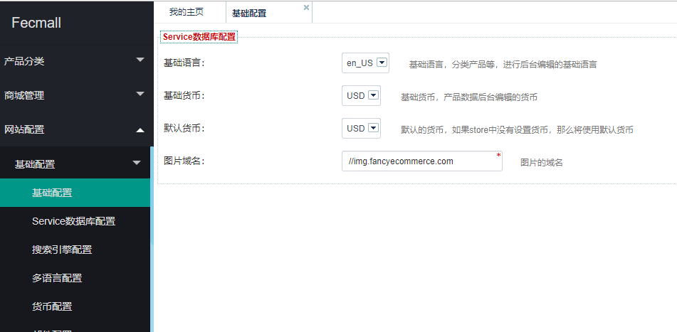

Fecshop 货币  
=============

> fecsop 支持多货币


Fecshop-2.x更新说明
-------------

2版本更新为后台配置




Fecshop-1.x
-------------

### 货币配置


您可以在@common/config/fecshop_local_services/Page.php中进行配置货币。

```
'currency' => [
	'baseCurrecy' => 'USD',  	# 基础货币，后台产品的价格都使用基础货币填写价格值。
	'defaultCurrency' => 'USD', # 默认货币，如果store不设置货币，就使用这个store默认货币
	'currencys' => [
		'USD' => [  			# 货币简码，USD代表美元，这个是国际标准
			'rate' 		=> 1, 	# 汇率  当前货币/基础货币的比值，譬如，人民币/美元 = 7
			'symbol' 	=> '$', #货币符号
		],
		'EUR' => [  			# 欧元
			'rate' 		=> 0.93,# 汇率
			'symbol' 	=> '€',
		],
		//'AUD' => [
		//	'rate' 		=> 1.33,
		//	'symbol' 	=> 'AU$',
		//],
		'GBP' => [  			# 英镑
			'rate' 		=> 0.8,
			'symbol' 	=> '£',
		],
		'CNY' => [  			# 人民币
			'rate' 		=> 6.87,
			'symbol' 	=> '￥',
		],
	],
],
```

设置货币后，在前端的顶部的语言切换选项中，就能看到您添加或者修改的货币配置。


Store设置默认货币
---------------

各个入口，每个入口可以设置多个`store`，每个store可以设置默认货币，您可以打开
`@app/config/fecshop_local_services/Store.php` （只有appfront，apphtml5，appserver三个面向前端的入口有store）


将store配置中的`currency`中的值进行更改，即可设置该store的`默认货币`

另外在store中设置的货币，必须在`货币配置`中存在，否则将会出问题。

设置默认货币后，您访问前端入口页面，会发现货币没有切换过来，原因和原理可以参看文档：
[为什么我在后台store里面设置了默认货币currency，保存后，前台还是原来的货币，并没有切换？](http://www.fecshop.com/topic/819)


