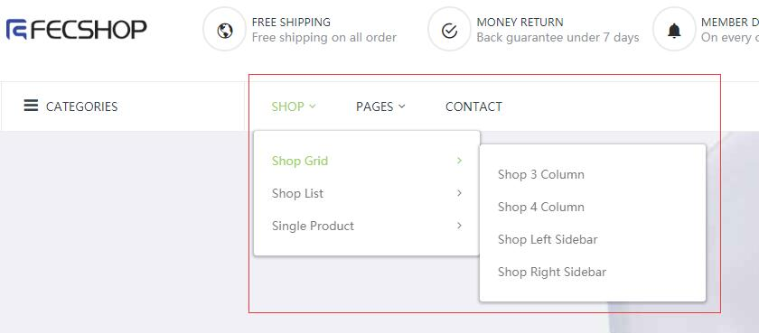
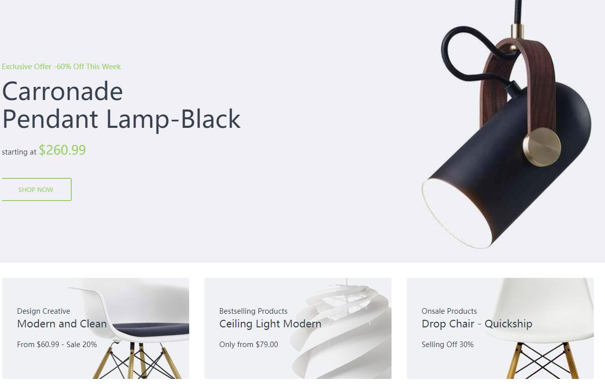
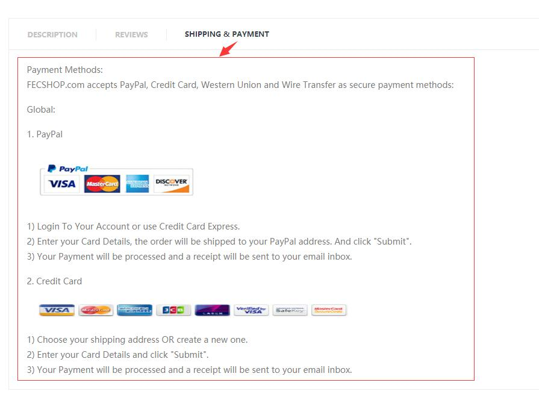
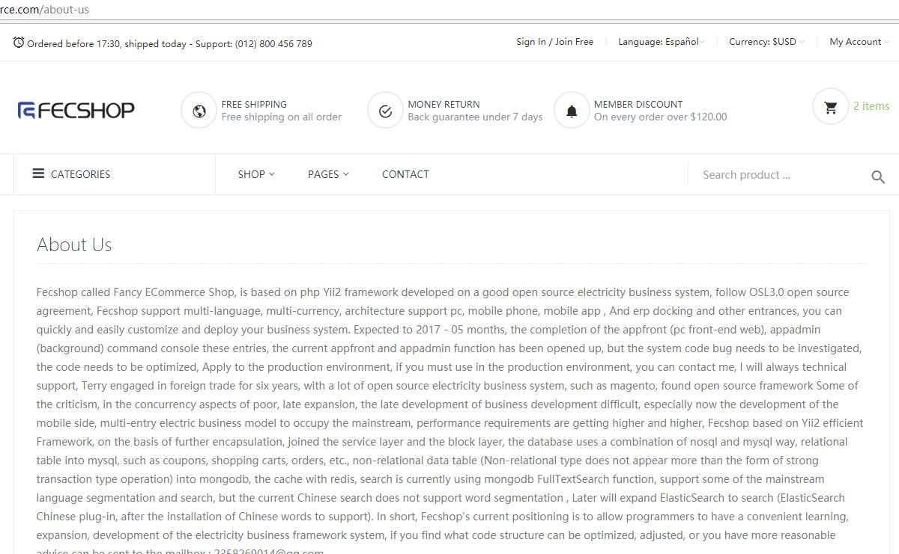

Fecshop 模板- Furnilife
================

> Fecshop 模板- Furnilife，付费出售的模板，下面关于该模板的介绍


### 介绍

`演示地址`：http://fecshop.appfront.es.fancyecommerce.com/

`风格`：简洁风格模板，默认图片用的是`家具`图片，您可以将这些图片替换成其他的图片，
譬如`服装图`，就会变成`服装风格`的模板，

`类型`：该模板比较适合做一个比较大一点的网站

`设备`：基于bootstrap开发的模板，`pc`端模板，自适应`手机`，`平板`等移动设备web

`价格`：￥999.00

`安装，配置`：￥1999.00

`联系`：http://www.fecshop.com/contacts

### 安装

1.首先需要安装Fecshop成功后，再安装模板，
fecshop的安装参看文档：[Fecshop商城安装](http://www.fecshop.com/doc/fecshop-guide/develop/cn-1.0/guide-fecshop-about-hand-install.html)

> Fecshop版本>= 1.7.1.0

2.付费购买模板后，将模板解压到Fecshop根目录，解压后的文件

模板文件路径：`./feepackage/fect/furnilife_theme`

配置文件路径：`./common/config/fecshop_third_extensions/fecshop_theme_fect_furnilife.php`

模板的图片文件路径：`./appimage/appfront/media/fect/furnilife`

3.将`./feepackage/fect/furnilife_theme/app/appfront/config/YiiRewriteMap.php`,里面的内容复制到
@appfront/config/YiiRewriteMap.php中，添加文件重写配置。

4.配置store，设置模板为该模板，store添加模板配置

在@appfront/config/fecshop_local_services/Store.php 文件中的 thirdThemeDir 添加模板路径

'@fectfurnilife/app/appfront/theme/furnilife',

添加完成的样子为：

'thirdThemeDir'    => [
    '@fectfurnilife/app/appfront/theme/furnilife',
],

如果appfront下面所有的store都想使用该模板，
那么，您需要在每一个store配置中的 'thirdThemeDir'添加模板路径配置

5.刷新缓存，访问即可


### 内容修改

为了方便安装和维护，这些内容都是在模板文件里面，如果您想
在后台维护这些cms方面的东西，您可以在后台cms->static block里面添加静态块，将identify设置为
`home-xxxx`, 然后可以使用下面的代码将后台设置的部分调用。

```
<?=  Yii::$service->cms->staticblock->getStoreContentByIdentify('home-xxxx','appfront') ?>
```

### 1.页面顶部


文件位置：`./feepackage/fect/furnilife_theme/app/appfront/theme/furnilife/widgets/header.php` 

24行和134行处

### 2.菜单部分



文件位置：`./feepackage/fect/furnilife_theme/app/appfront/theme/furnilife/widgets/menu.php` 88行处

### 3.首页大图和三个小图的配置



文件位置：`./feepackage/fect/furnilife_theme/app/appfront/theme/furnilife/cms/home/index.php` 33行处

### 4.首页顶部的产品配置


在配置文件中配置

@common/config/fecshop_third_extensions/fecshop_theme_fect_furnilife.php中配置

60行左右配置如下的内容

```
// 首页的Feature Products部分的sku列表
'home_featured_products' => [
    'p10001-kahaki-xxl-t4', 'p10001-black0-xl', 'op0002-33', 'men0003', 'sk0002', 'sk0008'
],
// 首页的New Products部分的sku列表
'home_new_products' => [
    'sk10004-001', 'sk10003-001', 'sk10002-002', 'sk10002', 'sk1000-khak', 'po0001'
],
// 首页的OnSale部分的sku列表
'home_onsale_products' => [
    'p10001-kahaki-l', 'sk10003-001', 'p10001-black0-xl', 'men0003', 'sk10004-001', 'sk10002', 'sk1000-khak', 'po0001',
],
```

通过上面的三个部分设置里面的sku

### 5.首页楼层产品和文字内容配置


在配置文件中配置

@common/config/fecshop_third_extensions/fecshop_theme_fect_furnilife.php中配置

60行左右配置如下的内容

```
home_floor_one
home_floor_two
home_floor_three
```

上面三个部分的对应三个楼层的配置


### 6.配置品牌图片


文件位置：`./feepackage/fect/furnilife_theme/app/appfront/theme/furnilife/cms/home/index.php` 326行左右配置

### 7.页面底部配置


文件位置：`./feepackage/fect/furnilife_theme/app/appfront/theme/furnilife/widgets/footer.php` 33行处

### 8.产品详细页面



文件位置：`./feepackage/fect/furnilife_theme/app/appfront/theme/furnilife/catalog/product/index/payment.php` 326行左右配置


### 9.cms page页



在后台cms->article部分配置各个cms page页的内容。

###  回馈

模板问题在帖子回馈：http://www.fecshop.com/topic/1719


