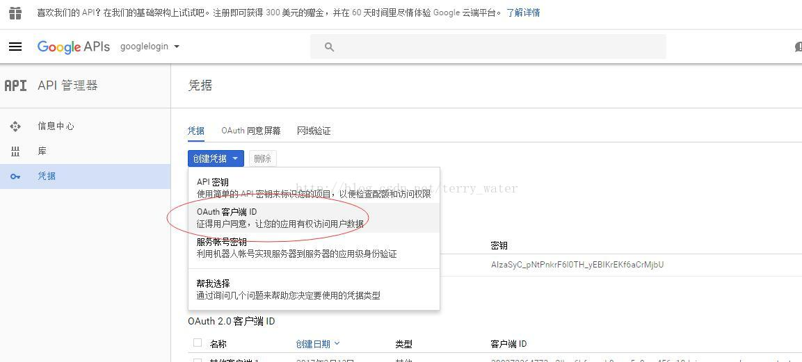
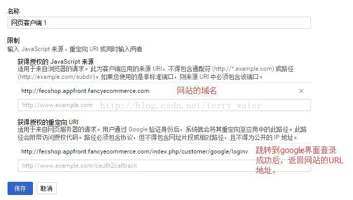

Fecshop google login api 申请 CLIENT_SECRET 和 CLIENT_SECRET
==========================


首先需要注册一个google账号，需要翻墙，可以使用星愿浏览器自动翻墙，下载地址为：http://www.twinkstar.com/

访问地址：https://console.developers.google.com/apis/credentials

界面如下:

点击如图部分



点击`网页应用`


下面填写你的网站的域名和回调地址，下面只是一个例子：




重定向URI，您可以参看下面的方式例子：

```
http://fecshop.appfront.fancyecommerce.com/customer/google/loginv
http://fecshop.apphtml5.fancyecommerce.com/customer/google/loginv
```

`http://fecshop.appfront.fancyecommerce.com`:pc端，appfront的域名

`http://fecshop.apphtml5.fancyecommerce.com`:html5端，apphtml5的域名

您将域名替换成您自己的域名即可，如果您还有其他域名都需要都添加，

如果您使用vue端，那么需要将appserver部分添加上，譬如，您的
appserver端的域名配置为：http://fecshop.appserver.fancyecommerce.com ， 那么
需要加上

```
http://fecshop.appserver.fancyecommerce.com/customer/google/loginv
```


如果有多个域名，都需要填写


保存后，您就得到授权信息了：


通过上面的步骤，就得到google login的 CLIENT_ID 和 CLIENT_SECRET了。


注意：

1.跳转到第三方，返回网站的地址要和程序中的一致。

2.上面填写的域名，和登录成功返回网站的地址可以填写多个，在程序中使用的地址，都需要在这里设置

3.如果是多域名，在上面是可以填写多个域名的，譬如手机web，多语言等。

4.fecshop的google登录，需要在store service中配置。


