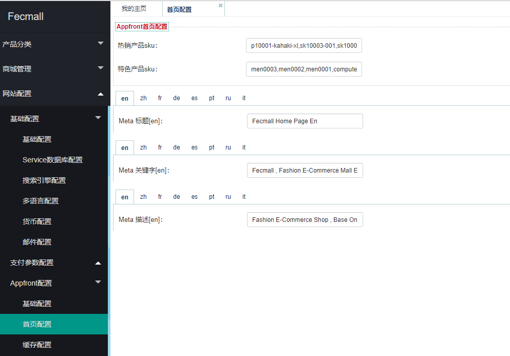

fecshop 首页
=============

> fecshop 首页，也就是home页，属于进入网站的主页面


Fecshop-2.x更新说明
-------------

2版本更新为后台配置




Fecshop-1.x
-------------


### 1.配置

打开配置文件 `@fecshop/app/appfront/config/appfront.php`
，可以看到如下的代码：

```
// 首页对应的url key
        'urlManager' => [
            'rules' => [
                '' => 'cms/home/index',
            ],
        ],
```        
        
这是Yii2的rules配置，配置` '' => 'cms/home/index',`，
这个配置代表的是首页地址对应 `cms/home/index`，
也就是cms模块下面的HomeController里面的actionIndex()方法，
也就是文件 `@fecshop\app\appfront\modules\Cms\controllers\HomeController.php`
里面的actionIndex()方法，


### 2.首页的大图和其他的静态块修改

这个在后台修改

cms-->静态块（static block）部分找到相应的部分修改即可

### 3.修改首页的产品以及Meta Title等meta信息

打开 @appfront/config/fecshop_local_modules/Cms.php 

3.1上面的部分是修改Meta信息


3.2修改2排产品

```
'homeBestSellerSku'        => [
    'p10001-kahaki-xl', 'sk10003-001', 'sk10005', 'sk1000-khak', 'sk0003', 'men0003', 'men0002', 'men0001',
],
'homeFeaturedSku'        => [
    'men0003', 'men0002', 'men0001', 'computer001-xinghao2-cpu3', '22221', 'sk10005', 'sk1000-khak', '222212',
],
```

### 4.二开首页部分

参看文档：http://www.fecshop.com/doc/fecshop-guide/instructions/cn-1.0/guide-fecshop_hand_home.html


### 其他


对于Yii2 controller的知识，可以参看：http://www.yiichina.com/doc/guide/2.0/structure-controllers

对于Yii2模块，可以参看：http://www.yiichina.com/doc/guide/2.0/structure-modules

url routing 可以参看：http://www.yiichina.com/doc/guide/2.0/runtime-routing
 
        
        
        
        
        
        
        
        
        
        
        
        