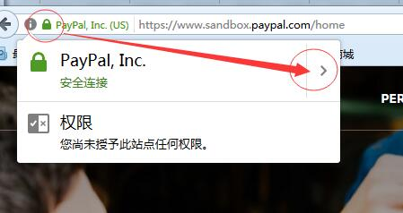
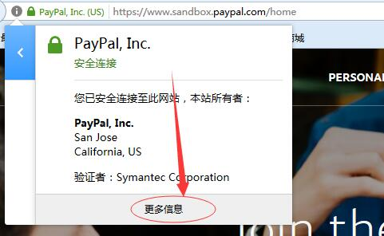
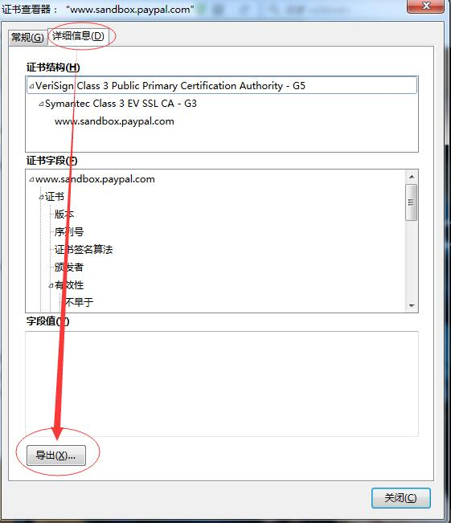
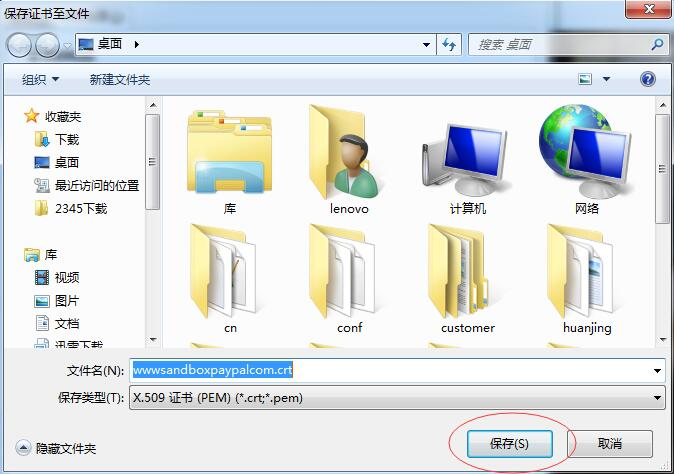

Fecshop 支付方式
==============

> 对支付平台的配置信息。


Payment支付配置文件：`@common/config/fecshop_local_services/Payment.php`

配置代码如下：

```
return [
	'payment' => [
		
		'noRelasePaymentMethod' => 'check_money',  	# 不需要释放库存的支付方式。譬如货到付款，在系统中
													# pending订单，如果一段时间未付款，会释放产品库存，但是货到付款类型的订单不会释放，
													# 如果需要释放产品库存，客服在后台取消订单即可释放产品库存。
		'paymentConfig' => [		# 支付方式配置
			'standard' => [			# 标准支付类型：在购物车页面进入下单页面，填写支付信息，然后跳转到第三方支付网站的支付类型。
				'check_money' => [	# 货到付款类型。
					'label' 				=> 'Check / Money Order',
					//'image' => ['images/mastercard.png','common'] ,# 支付页面显示的图片。
					'supplement' 			=> 'Off-line Money Payments', # 补充信息
					'style'					=> '<style></style>',  # 补充css，您可以在这里填写一些css
					'start_url' 			=> '@homeUrl/payment/checkmoney/start',	# 点击按钮后，跳转的url，在这个url里面写支付跳转前的提交信息。
					'success_redirect_url' 	=> '@homeUrl/payment/success',			# 在支付平台支付成功后，返回的页面
				],
				'paypal_standard' => [	# paypal标准支付类型
					'label' 				=> 'PayPal Website Payments Standard',
					'image' 				=> ['images/paypal_standard.png','common'], # 支付页面显示的图片。
					'supplement' 			=> 'You will be redirected to the PayPal website when you place an order. ', # 补充
					# 选择支付后，进入到相应支付页面的start页面。
					'start_url' 			=> '@homeUrl/payment/paypal/standard/start',
					# 接收IPN消息的页面。
					'IPN_url' 				=> '@homeUrl/payment/paypal/standard/ipn',
					# 在第三方支付成功后，跳转到网站的页面
					'success_redirect_url' 	=> '@homeUrl/payment/success',
					# 进入paypal支付页面，点击取消进入网站的页面。
					'cancel_url'			=> '@homeUrl/payment/paypal/standard/cancel',
					
					# 第三方支付网站的url
					'payment_url'=>'https://www.sandbox.paypal.com/cgi-bin/webscr',
					# 账号
					'account'=> 'zqy234api1-facilitator@126.com',
					# 密码
					'password'=>'HF4TNTTXUD6YQREH',
					# 签名
					'signature'=>'An5ns1Kso7MWUdW4ErQKJJJ4qi4-ANB-xrkMmTHpTszFaUx2v4EHqknV',
					
				],
			],
			
			'express' => [	# 在购物车页面直接跳转到支付平台，譬如paypal快捷支付方式。
				'paypal_express' =>[
					'nvp_url' => 'https://api-3t.sandbox.paypal.com/nvp',
					'api_url' => 'https://www.sandbox.paypal.com/cgi-bin/webscr',
					'account'=> 'zqy234api1-facilitator_api1.126.com',
					'password'=>'HF4TNTTXUD6YQREH',
					'signature'=>'An5ns1Kso7MWUdW4ErQKJJJ4qi4-ANB-xrkMmTHpTszFaUx2v4EHqknV',
					
					'enable'=> 1,
					'label'=>'PayPal Express Payments',
				],
			],
			
		],
		'childService' => [
			'paypal' => [
				'use_local_certs' => true,	# 
				'express_payment_method' => 'paypal_express',
				'version' => '109.0',
				'crt_file' 	=> [
					'www.sandbox.paypal.com' 	=>'@fecshop/services/payment/cert/paypal.crt',
					'api-3t.sandbox.paypal.com' =>'@fecshop/services/payment/cert/api-3tsandboxpaypalcom.crt',
				
				],
			],
		],
		
	]
];
```

### 设置paypal

首先需要下载证书，我本地是沙盒环境，下载的是沙盒环境的证书：

#### 1. `www.sandbox.paypal.com`
,打开火狐浏览器访问地址：https://www.sandbox.paypal.com/cgi-bin/webscr，
在火狐浏览器下，下载证书的步骤如图：










将下载的证书，ftp上传到fecshop，然后修改配置中 `crt_file` 下面 `www.sandbox.paypal.com` 对应的值
，譬如下载的证书为`wwwsandboxpaypalcom.crt`，ftp上传到`@common/config/wwwsandboxpaypalcom.crt`,
那么将配置中，`crt_file` 下面 `www.sandbox.paypal.com` 对应的值改成`@common/config/wwwsandboxpaypalcom.crt`即可

#### 2. `api-3t.sandbox.paypal.com`
,打开火狐浏览器访问地址：https://api-3t.sandbox.paypal.com/nvp
后面的步骤参看第一步。

另外注意，沙盒地址和线上paypal地址是不一样的，您需要去线上地址下载证书
，并上传，
另外，需要把上面的沙盒地址改成正式地址，也就是去掉地址中的sandbox，
譬如沙盒地址`https://api-3t.sandbox.paypal.com/nvp`对应的线上地址为：
`https://api-3t.paypal.com/nvp`
,然后设置paypal的账户密码，证书，签名等。


### 开发新支付 - 配置

当您想要开发一个新的支付方式的时候，您需要做一个跳转到第三方支付平台的准备页面（payment start url）
和一个支付成功返回的页面url。

#### 1.1 支付跳转前的工作


在支付页面，填写好支付信息后，点击支付按钮，fecshop会先进行一系列的处理，
最终生成订单，将订单编号保存到session中，然后跳转到当前支付配置对应的
`start_url`,譬如上面paypal的`start_url`为`@homeUrl/payment/paypal/standard/start`
（@homeUrl是首页url），在这个url中，需要将订单中的字段值取出，组合成支付平台想要的
数据格式，发送给第三方支付平台，并进行跳转到第三方支付平台。

#### 1.2 支付成功跳转后的工作

支付成功后，用户通过点击，或者由第三方支付平台自动，跳转到网站中，也就是上面配置的
`success_redirect_url`,该url对应的内容显示用户支付成功后的信息

#### 1.3 在第三方支付平台取消订单

如果用户在支付平台点击取消订单，那么就会跳转到fecshop的取消订单的链接，
也就是`cancel_url`对应的链接

#### 1.4 IPN消息url

当用户支付成功后，支付平台会给fecshop发送一个支付成功的消息，fecshop接收到消息
后会把接收到的参数传递给paypal并进行询问是否是paypal发送的，当paypal反馈是，
fecshop会把订单支付状态改成`processing`

### 开发新支付 - 功能实现

上面填写的4个url，您可以扩展一个新模块实现url对应的功能即可。
二开支付，知道原理后，还是蛮容易的。


