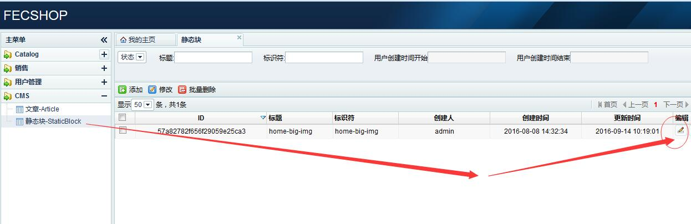

Fecshop 静态块
==============

> fecshop 静态块是指一块静态的html段，可以在后台通过配置的方式进行修改，
> 这样，可以很方面的让工作人员进行修改。

譬如首页的轮换大图，

页面底部的文件条款等区块

您可以在后台进行编辑

在content（内容部分），{{homeUrl}} 代表首页。 {{imgBaseUrl}} 代表图片url。
其中，{{imgBaseUrl}}为 对应的文件路径为@appimage/app入口名/

