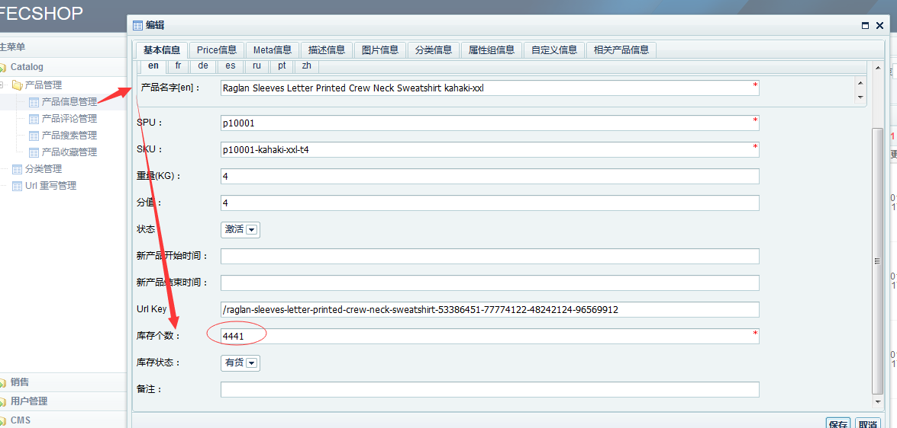
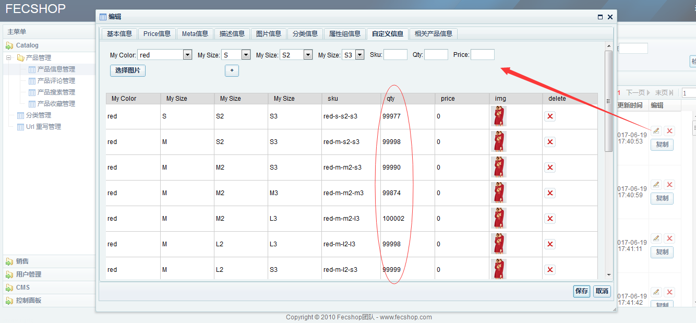

产品库存
==========

> 指的是产品的库存


### 1.产品库存类型

产品的类型分为两种，一种京东模式，一种淘宝模式，详情可以参看
：[fecshop产品](fecshop_product.md)

#### 京东模式

使用的是产品的qty字段，在后台编辑对应，如图：



#### 淘宝模式

对应的是custom_option（自定义属性）部分的产品库存，在淘宝模式中，
产品的库存值（指的是上面截图的库存选项）将会被忽略，下面图中设置的库存
为有效库存。




对于淘宝和京东模式，库存方面只能二选一。

### 2.库存存储

产品表是mongodb表，产品库存已经从mongodb中抽出来，放到mysql中
，因为产品库存操作具有多表事务性。
mongodb里面也会存储一个qty字段，但是这个存储的值无效，在
产品初始化的时候会使用mysql中的值覆盖掉。
库存在mysql中存储对应的表为：

淘宝模式库存：`product_custom_option_qty`

京东模式库存：`product_flat_qty`

### 3.库存扣除的流程和安全性

关于支付流程，订单支付库存扣除的流程，具体流程参看[fecshop 支付](fecshop_payment_method.md)


库存安全控制：a)高并发库存超卖控制， b)支付请求多次执行造成库存多次扣除的问题  c)未支付订单库存返还问题。

3.1 高并发库存超卖控制

为了防止超卖的控制，代码如下：`@fecshop/service/product/Stock.php`

```
// 开始扣除库存。
        if (is_array($items) && !empty($items)) {
            foreach ($items as $k=>$item) {
                $product_id         = $item['product_id'];
                $sale_qty           = (int)$item['qty'];
                $product_name       = Yii::$service->store->getStoreAttrVal($item['product_name'], 'name');
                $custom_option_sku  = $item['custom_option_sku'];
                if ($product_id && $sale_qty) {
                    if(!$custom_option_sku){
                        // 应对高并发库存超卖的控制，更新后在查询产品的库存，如果库存小于则回滚。
                        $sql = 'update '.ProductFlatQty::tableName().' set qty = qty - :sale_qty where product_id = :product_id';
                        $data = [
                            'sale_qty'  => $sale_qty,
                            'product_id'=> $product_id,
                        ];
                        $result = ProductFlatQty::getDb()->createCommand($sql,$data)->execute();
                        $productFlatQty = ProductFlatQty::find()->where([
                            'product_id' => $product_id
                        ])->one();
                        if($productFlatQty['qty'] < 0){
                            Yii::$service->helper->errors->add('product: [ '.$product_name.' ] is stock out ');
                            return false;
                        }
                    }else{
                        // 对于custom option（淘宝模式）的库存扣除
                        $sql = 'update '.ProductCustomOptionQty::tableName().' set qty = qty - :sale_qty where product_id = :product_id and custom_option_sku = :custom_option_sku';
                        $data = [
                            'sale_qty'  => $sale_qty,
                            'product_id'=> $product_id,
                            'custom_option_sku' => $custom_option_sku
                        ];
                        $result = ProductCustomOptionQty::getDb()->createCommand($sql,$data)->execute();
                        $productCustomOptionQty = ProductCustomOptionQty::find()->where([
                            'product_id' => $product_id,
                            'custom_option_sku' => $custom_option_sku,
                        ])->one();
                        if($productCustomOptionQty['qty'] < 0){
                            Yii::$service->helper->errors->add('product: [ '.$product_name.' ] is stock out ');
                            return false;
                        }
                    }
                }
            }
            return true;
        }

```

3.2 支付请求多次执行造成库存多次扣除的问题

这个是在购物车页面点击paypal支付按钮进行支付的方式，
在跳转前，生成一个订单号和token对应，等跳转回来的时候，通过token
查找订单，然后更新订单支付，涉及到更新，并发高可能被执行多次，
因此需要进行version控制一下。

具体代码： `@fecshop/service/Order.php`

```
protected  function  checkOrderVersion($increment_id){
    # 更新订单版本号，防止被多次执行。
    $sql    = 'update '.MyOrder::tableName().' set version = version + 1  where increment_id = :increment_id';
    $data   = [
        'increment_id'  => $increment_id,
    ];
    $result     = MyOrder::getDb()->createCommand($sql,$data)->execute();
    $MyOrder    = MyOrder::find()->where([
        'increment_id'  => $increment_id,
    ])->one();
    # 如果版本号不等于1，则回滚
    if($MyOrder['version'] > 1){
        Yii::$service->helper->errors->add('Your order has been paid');
        return false;
    }else if($MyOrder['version'] < 1){
        Yii::$service->helper->errors->add('Your order is error');
        return false;
    }else{
        return true;
    }
}
```

3.3 未支付订单库存返还问题。

@fecshop/shell/order/returnPendingProductQtyStock.sh


