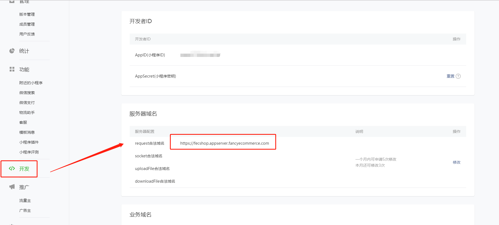

Fecshop 微信小程序
==============

> Fecshop小程序端的使用

### 微信小程序设置

1.您需要开通微信服务号，并开通微信支付，登陆微信商户平台设置收款信息，这个您可以
参看：[Fecshop 微信支付](fecshop_payment_wx_method.md)

2.小程序设置

2.1设置域名

注意，这个域名对应的是fecshop的appserver端的域名，线上需要https才行，开发环境可以用http（微信开发工具可以设置）

2.2小程序和微信商户平台进行关联

微信商户支付后台，进行关联：

微信小程序确认关联：

### 产品部分：

微信小程序端的产品，对于自定义属性部分，仅仅支持jd模式产品（不在支持淘宝模式产品，也就是后台
产品编辑的custom option部分），[fecshop产品介绍](http://www.fecshop.com/doc/fecshop-guide/instructions/cn-1.0/guide-fecshop_product.html#2)

### 首页修改

对于首页的走马灯大图，banner，产品信息等

您可以在 @appserver/config/fecshop_local_modules/Wx.php中进行修改。

