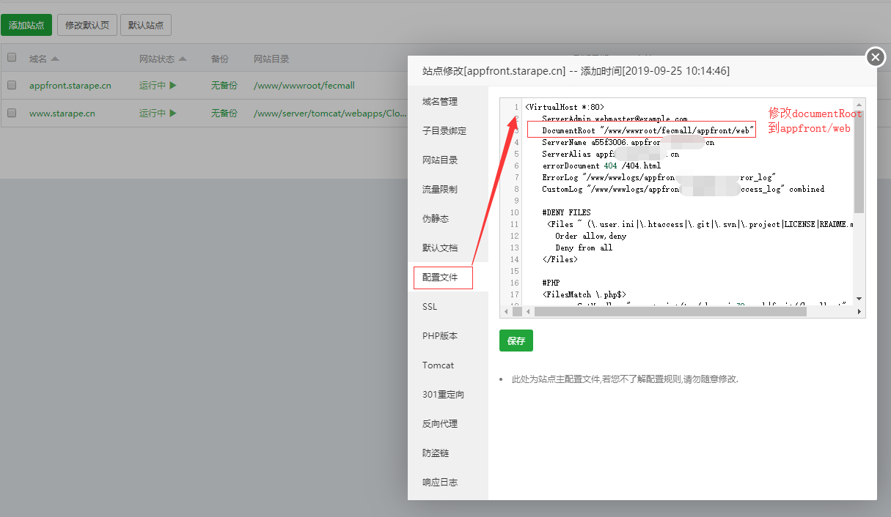
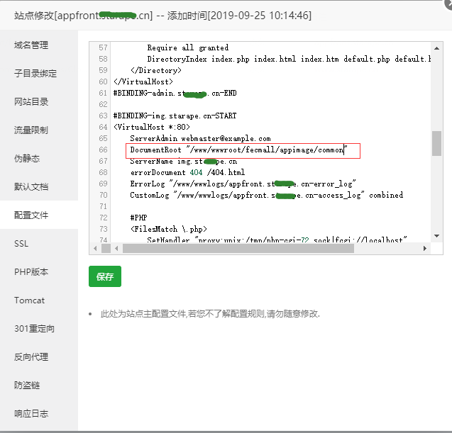
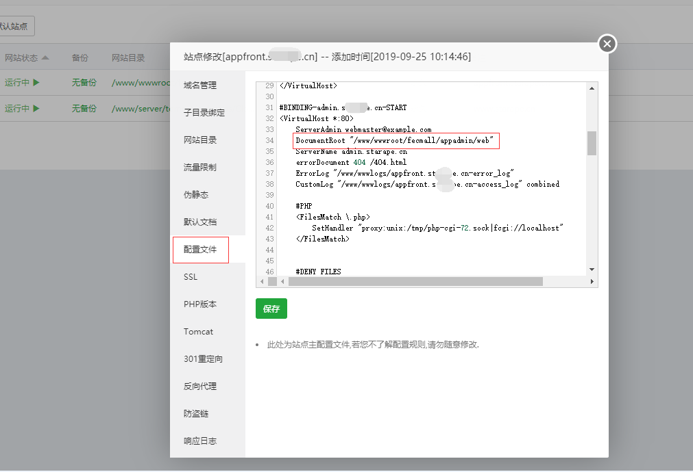
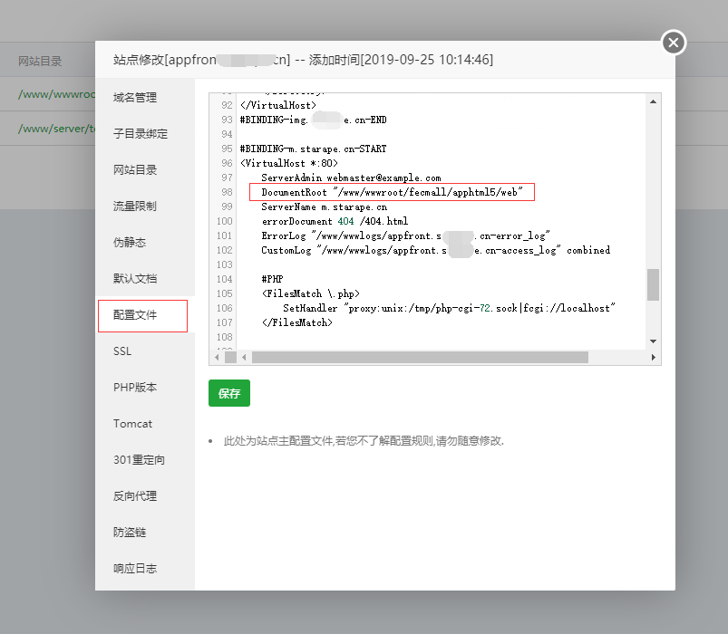

FecMall 宝塔Apache安装
================


> 很多用户希望可以宝塔安装fecmall，现在他来了。。，手把手宝塔安装fecmall教程。
> 
> 本教程是在宝塔控制面板下，使用apache， 如果您是Nginx，那么您可以访问  [FecMall 宝塔Nginx安装](fecmall-bt-nginx-install.md)

很多偏小白的用户，希望可以使用宝塔安装，并出一个手把手的教程，
下面是一个非常详细的教程，附带详细截图

在配置过程中如果出现报错，请反复查看文档操作，如果存在其他问题，请去论坛发帖。

1.登陆宝塔，创建网站


> 注意，这里创建网站，文件目录要写到 /www/wwwroot 下面，建议您`根目录`直接写 /www/wwwroot/fecmall，和下面安装的保持一致即可

将创建的ftp和mysql密码记录下来，后面要使用到

2.下载fecmall

```
cd /www/wwwroot
```

2.1composer下载

对于宝塔这种图形化管理的系统软件，后台界面创建网站，指定目录后（我设置指定的是/www/wwwroot/fecmall），会生成相应的一个文件夹，这个文件夹不要删除

而composer安装需要自行创建文件夹，不能使用一开始就有的目录，因此我们先安装到`/www/wwwroot/fecmall_2`文件夹，composer下载fecmall系统文件后，然后在复制到`/www/wwwroot/fecmall`即可。

**请将2.3.4 改成最近的fecmall版本，这里查看最新的版本号： https://github.com/fecshop/yii2_fecshop/releases**

```
// 使用阿里云的composer源
composer config -g repo.packagist composer https://mirrors.aliyun.com/composer/
// composer安装 fecmall
composer create-project fancyecommerce/fecshop-app-advanced  fecmall_2 2.3.4
```
 
下载成功后执行，将下载的文件内容复制到fecmall目录(下面的第二个命名代表将隐藏文件也复制过去)
 
```
mv fecmall_2/*  fecmall
mv fecmall_2/.[^.]*  fecmall
```
2.2完整包下载，请自行下载上传，建议使用composer，因为完整包的方式无法通过composer升级

2.2.1百度网盘下载地址：https://pan.baidu.com/s/1hs1iC2C ， 下载fecshop-2.x.x.zip （请下载最高的版本）

2.2.2加Q群文件下载：`官网首页有Q群号`，申请进群后，在`群文件`里面可以看到

将压缩包上传到/www/wwwroot/fecmall，解压。

3.fecmall文件下载成功后,进入fecmall根目录，执行init

```
cd fecmall
chmod 755 ./init
./init
```
执行后，执行log如果没有报错，则代表执行成功

4.设置apache



修改后，点击保存即可

5.访问安装界面路径

http://appfront.xxxx.cn/install.php

即可出来操作界面,填写上面创建的mysql的数据库账户密码


点击提交，成功后界面如下：


点击`进行数据初始化`,等待一段时间后，执行成功，界面如下：


点击`安装产品测试数据`


点击下一步，进入安装完成界面


然后您需要按照上面写的说明，进行操作，`设置权限`，`删除掉install.php文件`,`等`, 这个一定要操作
，否则存在安全问题。

6.宝塔后台设置其他的域名


6.2配置admin，img，m域名，点击左侧的`配置文件`

找到image部分进行改写（在后面加一个`/common`）



admin入口指向：`appadmin/web`



html5入口指向：`apphtml5/web`



,然后点击`保存`,因为截图是局部的，如果您还有疑惑，在本文档的底部有一个完整的apache配置内容，您可以
拖到底部看一下，进行参考

添加完成后，即可访问后台


账户密码： `admin  admin123`

先修改您自己的账户密码


7.后面的设置步骤，和其他的环境都是一样的，在后台进行配置
，参看安装文档（**注意：后面的步骤一定要操作，不要以为可以访问后台就配置完成了**）

http://www.fecmall.com/doc/fecshop-guide/develop/cn-2.0/guide-fecshop-2-graphical-install.html

下拉到这个位置


按照这里的教程进行后续的配置即可


### 帮助

贴一下宝塔Apache设置，配置文件里面的内容，供您参考。

```
<VirtualHost *:80>
    ServerAdmin webmaster@example.com
    DocumentRoot "/www/wwwroot/fecmall/appfront/web"
    ServerName a55f3006.appfront.domain.com
    ServerAlias appfront.domain.com
    errorDocument 404 /404.html
    ErrorLog "/www/wwwlogs/appfront.domain.com-error_log"
    CustomLog "/www/wwwlogs/appfront.domain.com-access_log" combined
    
    #DENY FILES
     <Files ~ (\.user.ini|\.htaccess|\.git|\.svn|\.project|LICENSE|README.md)$>
       Order allow,deny
       Deny from all
    </Files>
    
    #PHP
    <FilesMatch \.php$>
            SetHandler "proxy:unix:/tmp/php-cgi-72.sock|fcgi://localhost"
    </FilesMatch>
    
    #PATH
    <Directory "/www/wwwroot/fecmall">
        SetOutputFilter DEFLATE
        Options FollowSymLinks
        AllowOverride All
        Require all granted
        DirectoryIndex index.php index.html index.htm default.php default.html default.htm
    </Directory>
</VirtualHost>

#BINDING-admin.starape.cn-START
<VirtualHost *:80>
    ServerAdmin webmaster@example.com
    DocumentRoot "/www/wwwroot/fecmall/appadmin/web"
    ServerName admin.domain.com
    errorDocument 404 /404.html
    ErrorLog "/www/wwwlogs/appfront.domain.com-error_log"
    CustomLog "/www/wwwlogs/appfront.domain.com-access_log" combined
    
    #PHP     
    <FilesMatch \.php>
        SetHandler "proxy:unix:/tmp/php-cgi-72.sock|fcgi://localhost"
    </FilesMatch>
    
    
    #DENY FILES
     <Files ~ (\.user.ini|\.htaccess|\.git|\.svn|\.project|LICENSE|README.md)$>
       Order allow,deny
       Deny from all
    </Files>
    
    #PATH
    <Directory "/www/wwwroot/fecmall/appadmin">
        SetOutputFilter DEFLATE
        Options FollowSymLinks
        AllowOverride All
        Require all granted
        DirectoryIndex index.php index.html index.htm default.php default.html default.htm
    </Directory>
</VirtualHost>
#BINDING-admin.starape.cn-END

#BINDING-img.starape.cn-START
<VirtualHost *:80>
    ServerAdmin webmaster@example.com
    DocumentRoot "/www/wwwroot/fecmall/appimage/common"
    ServerName img.domain.com
    errorDocument 404 /404.html
    ErrorLog "/www/wwwlogs/appfront.domain.com-error_log"
    CustomLog "/www/wwwlogs/appfront.domain.com-access_log" combined
    
    #PHP     
    <FilesMatch \.php>
        SetHandler "proxy:unix:/tmp/php-cgi-72.sock|fcgi://localhost"
    </FilesMatch>
    
    
    #DENY FILES
     <Files ~ (\.user.ini|\.htaccess|\.git|\.svn|\.project|LICENSE|README.md)$>
       Order allow,deny
       Deny from all
    </Files>
    
    #PATH
    <Directory "/www/wwwroot/fecmall/appimage">
        SetOutputFilter DEFLATE
        Options FollowSymLinks
        AllowOverride All
        Require all granted
        DirectoryIndex index.php index.html index.htm default.php default.html default.htm
    </Directory>
</VirtualHost>
#BINDING-img.starape.cn-END

#BINDING-m.starape.cn-START
<VirtualHost *:80>
    ServerAdmin webmaster@example.com
    DocumentRoot "/www/wwwroot/fecmall/apphtml5/web"
    ServerName m.domain.com
    errorDocument 404 /404.html
    ErrorLog "/www/wwwlogs/appfront.domain.com-error_log"
    CustomLog "/www/wwwlogs/appfront.domain.com-access_log" combined
    
    #PHP     
    <FilesMatch \.php>
        SetHandler "proxy:unix:/tmp/php-cgi-72.sock|fcgi://localhost"
    </FilesMatch>
    
    
    #DENY FILES
     <Files ~ (\.user.ini|\.htaccess|\.git|\.svn|\.project|LICENSE|README.md)$>
       Order allow,deny
       Deny from all
    </Files>
    
    #PATH
    <Directory "/www/wwwroot/fecmall/apphtml5">
        SetOutputFilter DEFLATE
        Options FollowSymLinks
        AllowOverride All
        Require all granted
        DirectoryIndex index.php index.html index.htm default.php default.html default.htm
    </Directory>
</VirtualHost>
#BINDING-m.starape.cn-END
```


