FecMall 宝塔Nginx安装
================


> 很多用户希望可以宝塔安装fecmall，现在他来了。。，手把手宝塔安装fecmall教程。
> 
> 本教程是在宝塔控制面板下，使用 Nginx, 如果您是Apache，那么您可以访问 [FecMall 宝塔Apache安装](fecmall-bt-apache-install.md)

很多偏小白的用户，希望可以使用宝塔安装，并出一个手把手的教程，
下面是一个非常详细的教程，附带详细截图

在配置过程中如果出现报错，请反复查看文档操作，如果存在其他问题，请去论坛发帖。

1.登陆宝塔，创建网站

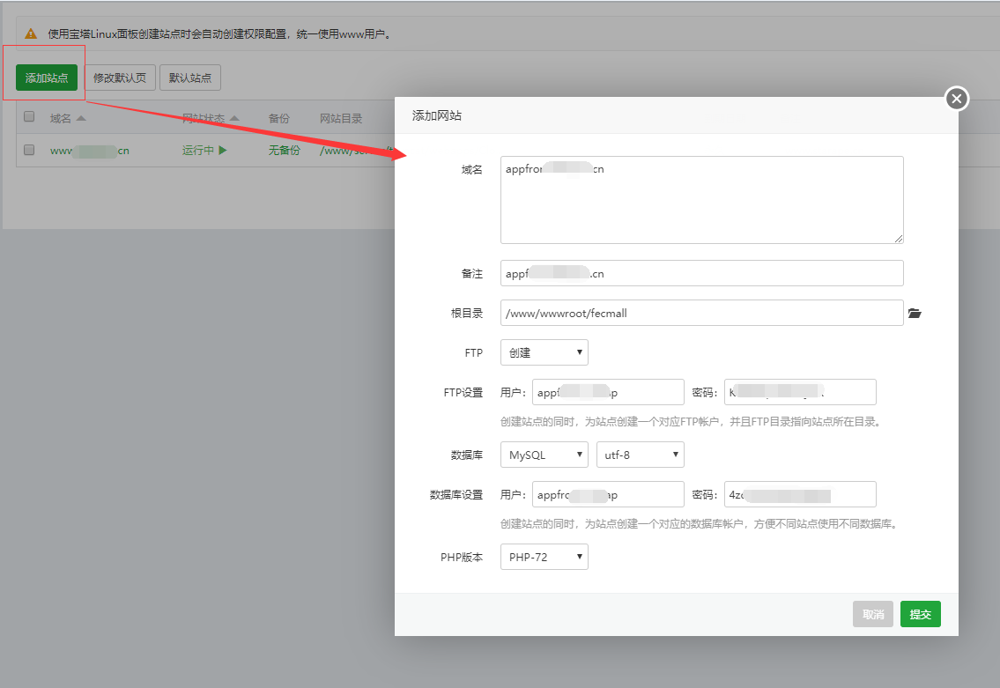

> 注意，这里创建网站，文件目录要写到 /www/wwwroot 下面，建议您`根目录`直接写 /www/wwwroot/fecmall，和下面安装的保持一致即可

将创建的ftp和mysql密码记录下来，后面要使用到

2.下载fecmall

```
cd /www/wwwroot
```

2.1composer下载

对于宝塔这种图形化管理的系统软件，后台界面创建网站，指定目录后（我设置指定的是/www/wwwroot/fecmall），会生成相应的一个文件夹，这个文件夹不要删除

而composer安装需要自行创建文件夹，不能使用一开始就有的目录，因此我们先安装到`/www/wwwroot/fecmall_2`文件夹，composer下载fecmall系统文件后，然后在复制到`/www/wwwroot/fecmall`即可。

**请将2.3.4 改成最近的fecmall版本，这里查看最新的版本号： https://github.com/fecshop/yii2_fecshop/releases**


```
// 使用阿里云的composer源
composer config -g repo.packagist composer https://mirrors.aliyun.com/composer/
// composer安装 fecmall
composer create-project fancyecommerce/fecshop-app-advanced  fecmall_2 2.3.4
```
 
下载成功后执行，将下载的文件内容复制到fecmall目录(下面的第二个命名代表将隐藏文件也复制过去)
 
```
mv fecmall_2/*  fecmall
mv fecmall_2/.[^.]*  fecmall
```
2.2完整包下载，请自行下载上传，建议使用composer，因为完整包的方式无法通过composer升级

百度网盘下载地址：https://pan.baidu.com/s/1hs1iC2C ， 下载fecshop-2.x.x.zip （请下载最高的版本）

Q群文件下载：官网首页有Q群号，申请进群后，在群文件里面可以看到

将压缩包上传到/www/wwwroot/fecmall，解压。

3.fecmall文件下载成功后,进入fecmall根目录，执行init

```
cd fecmall
chmod 755 ./init
./init
```
执行后，执行log如果没有报错，则代表执行成功

4.设置Nginx

在下面如图进行修改，也就是添加`appfront/web`字符，让其指向该web目录

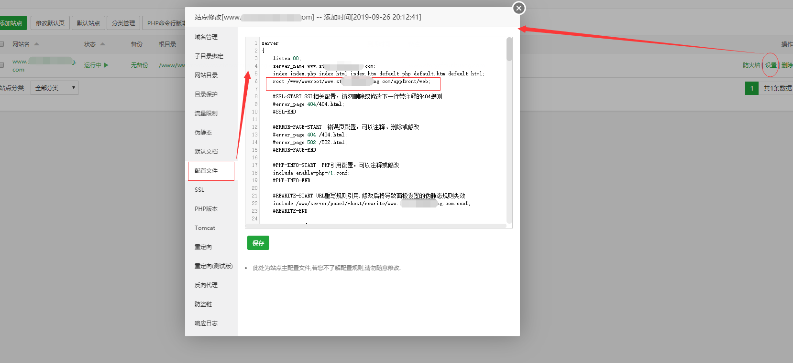

添加去掉index.php的nginx配置

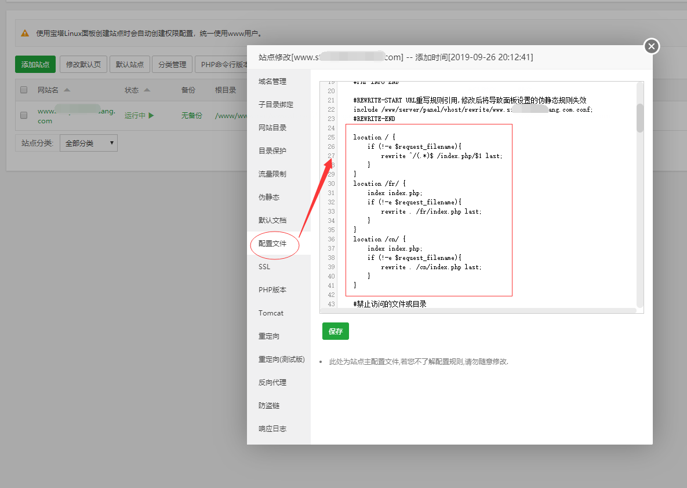

添加的配置字符如下：

```
location / {
    if (!-e $request_filename){
        rewrite ^/(.*)$ /index.php/$1 last;
    }
}
location /fr/ {
    index index.php;
    if (!-e $request_filename){
        rewrite . /fr/index.php last;
    }
}
location /cn/ {
    index index.php;
    if (!-e $request_filename){
        rewrite . /cn/index.php last;
    }
}
```

修改后，点击`保存`即可

5.访问安装界面路径

http://appfront.xxxx.cn/install.php

即可出来操作界面,填写上面创建的mysql的数据库账户密码

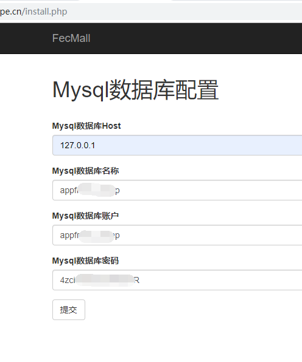

点击提交，成功后界面如下：

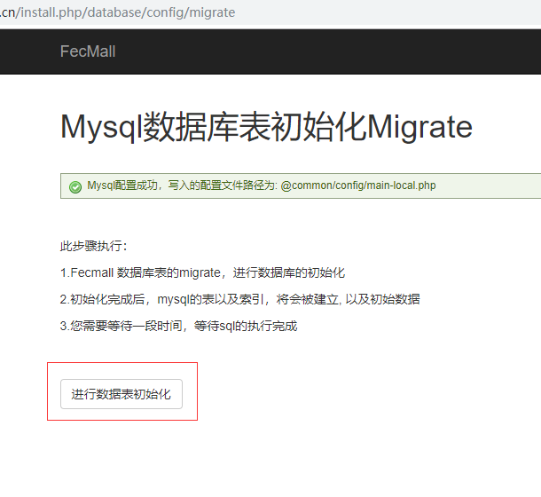

点击`进行数据初始化`,等待一段时间后，执行成功，界面如下：

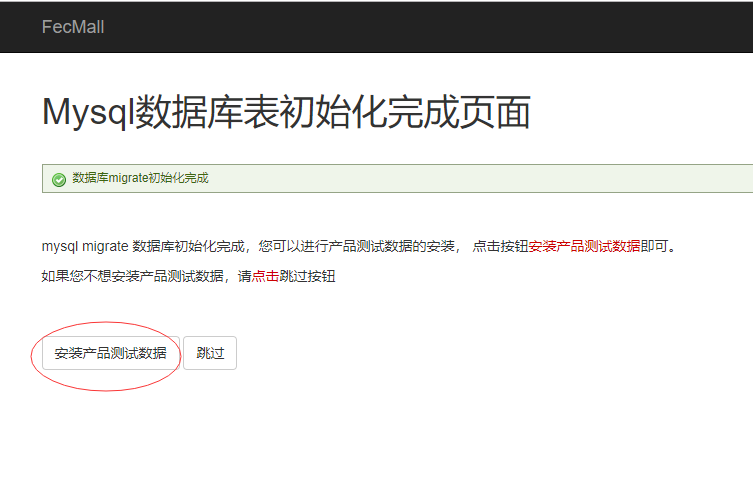

点击`安装产品测试数据`

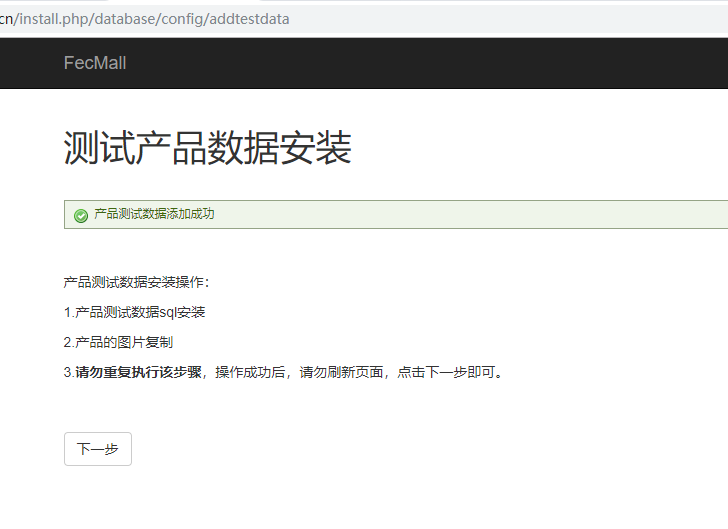

点击下一步，进入安装完成界面

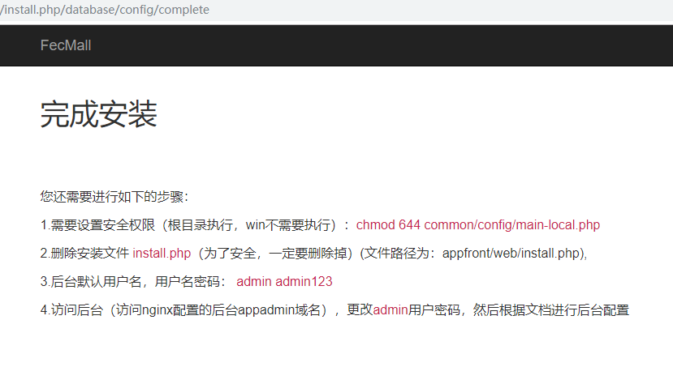

然后您需要按照上面写的说明，进行操作，`设置权限`，`删除掉install.php文件`,`等`, 这个一定要操作
，否则存在安全问题。

6.宝塔后台设置其他的域名, admin 代表后台，img代表图片域名，m代表手机web

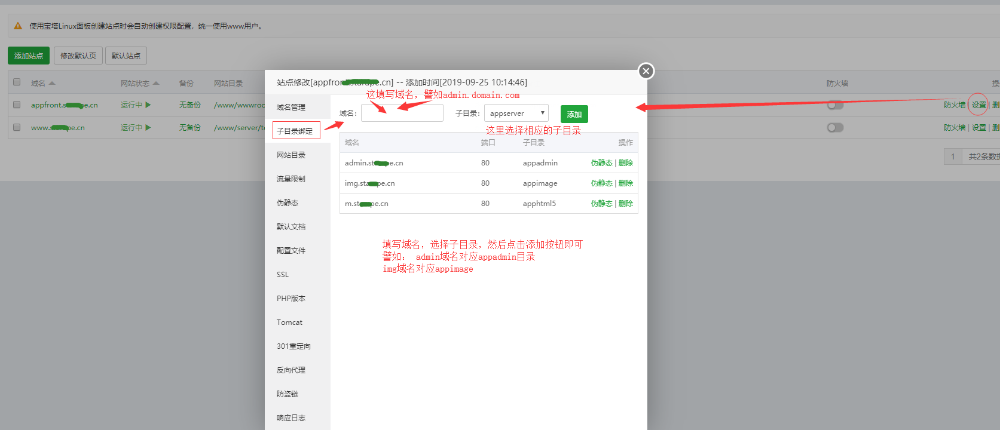

6.2配置admin，img，m域名，点击左侧的`配置文件`，修改配置

admin域名的nginx

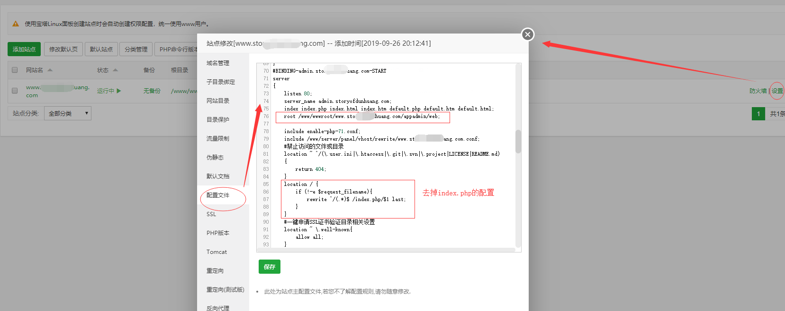

```

admin域名添加的去掉index.php的配置如下

location / {
    if (!-e $request_filename){
        rewrite ^/(.*)$ /index.php/$1 last;
    }
}
```

图片域名的nginx配置


html5域名的nginx配置

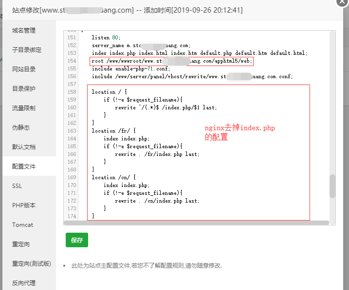

html5域名添加的去掉index.php的配置如下

```
    location / {
        if (!-e $request_filename){
            rewrite ^/(.*)$ /index.php/$1 last;
        }
    }
    location /fr/ {
        index index.php;
        if (!-e $request_filename){
            rewrite . /fr/index.php last;
        }
    }
    location /cn/ {
        index index.php;
        if (!-e $request_filename){
            rewrite . /cn/index.php last;
        }
    }

```

然后点击`保存`,因为截图是局部的，如果您还有疑惑，**在本文档的底部有一个完整的`nginx配置`内容**，您可以
拖到底部看一下，进行参考


添加完成后，即可访问后台

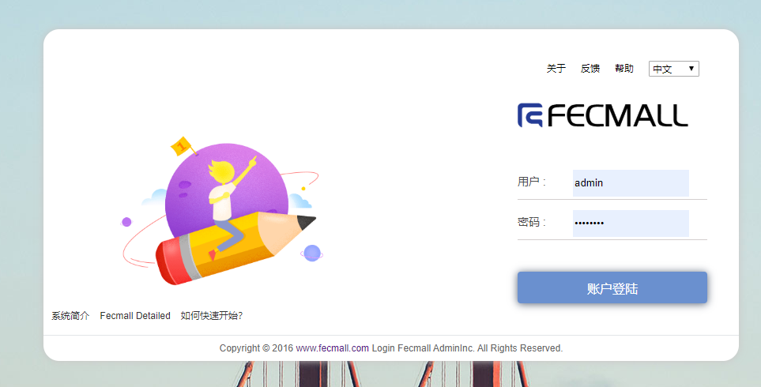

账户密码： `admin  admin123`

先修改您自己的账户密码

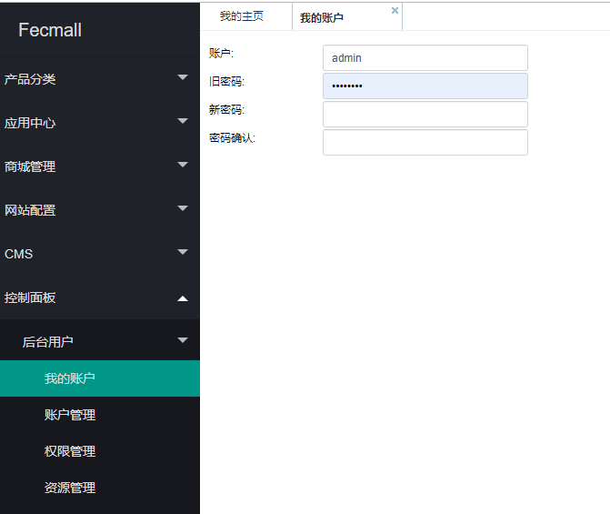

7.后面的设置步骤，和其他的环境都是一样的，在后台进行配置
，参看安装文档（**注意：后面的步骤一定要操作，不要以为可以访问后台就配置完成了**）

http://www.fecmall.com/doc/fecshop-guide/develop/cn-2.0/guide-fecshop-2-graphical-install.html

下拉到这个位置

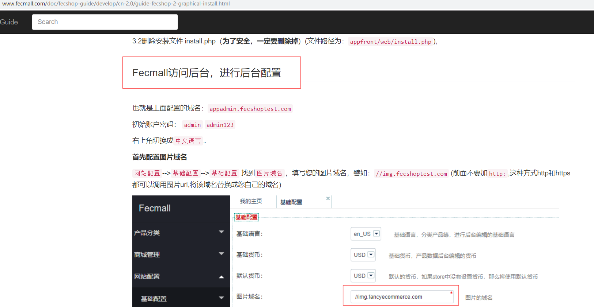

按照这里的教程进行后续的配置即可


### 帮助

贴一下宝塔Nginx设置，配置文件里面的内容，供您参考。

```
server
{
    listen 80;
    server_name www.domain.com;
    index index.php index.html index.htm default.php default.htm default.html;
    root /www/wwwroot/www.domain.com/appfront/web;
    
    #SSL-START SSL相关配置，请勿删除或修改下一行带注释的404规则
    #error_page 404/404.html;
    #SSL-END
    
    #ERROR-PAGE-START  错误页配置，可以注释、删除或修改
    #error_page 404 /404.html;
    #error_page 502 /502.html;
    #ERROR-PAGE-END
    
    #PHP-INFO-START  PHP引用配置，可以注释或修改
    include enable-php-71.conf;
    #PHP-INFO-END
    
    #REWRITE-START URL重写规则引用,修改后将导致面板设置的伪静态规则失效
    include /www/server/panel/vhost/rewrite/www.domain.com.conf;
    #REWRITE-END
    
    location / {
        if (!-e $request_filename){
            rewrite ^/(.*)$ /index.php/$1 last;
        }
    }
    location /fr/ {
        index index.php;
        if (!-e $request_filename){
            rewrite . /fr/index.php last;
        }
    }
    location /cn/ {
        index index.php;
        if (!-e $request_filename){
            rewrite . /cn/index.php last;
        }
    }
    
    #禁止访问的文件或目录
    location ~ ^/(\.user.ini|\.htaccess|\.git|\.svn|\.project|LICENSE|README.md)
    {
        return 404;
    }
    
    #一键申请SSL证书验证目录相关设置
    location ~ \.well-known{
        allow all;
    }
    
    location ~ .*\.(gif|jpg|jpeg|png|bmp|swf)$
    {
        expires      30d;
        error_log off;
        access_log /dev/null;
    }
    
    location ~ .*\.(js|css)?$
    {
        expires      12h;
        error_log off;
        access_log /dev/null; 
    }
    access_log  /www/wwwlogs/www.domain.com.log;
    error_log  /www/wwwlogs/www.domain.com.error.log;
}
#BINDING-admin.domain.com-START
server
{
    listen 80;
    server_name admin.domain.com;
    index index.php index.html index.htm default.php default.htm default.html;
    root /www/wwwroot/www.domain.com/appadmin/web;
    
    include enable-php-71.conf;
    include /www/server/panel/vhost/rewrite/www.domain.com.conf;
    #禁止访问的文件或目录
    location ~ ^/(\.user.ini|\.htaccess|\.git|\.svn|\.project|LICENSE|README.md)
    {
        return 404;
    }
    location / {
        if (!-e $request_filename){
            rewrite ^/(.*)$ /index.php/$1 last;
        }
    }
    #一键申请SSL证书验证目录相关设置
    location ~ \.well-known{
        allow all;
    }
    
    location ~ .*\.(gif|jpg|jpeg|png|bmp|swf)$
    {
        expires      30d;
        error_log off;
        access_log /dev/null; 
    }
    location ~ .*\.(js|css)?$
    {
        expires      12h;
        error_log off;
        access_log /dev/null; 
    }
    access_log /www/wwwlogs/www.domain.com.log;
    error_log  /www/wwwlogs/www.domain.com.error.log;
}
#BINDING-admin.domain.com-END
#BINDING-img.domain.com-START
server
{
    listen 80;
    server_name img.domain.com;
    index index.php index.html index.htm default.php default.htm default.html;
    root /www/wwwroot/www.domain.com/appimage/common;
    
    include enable-php-71.conf;
    include /www/server/panel/vhost/rewrite/www.domain.com.conf;
    #禁止访问的文件或目录
    location ~ ^/(\.user.ini|\.htaccess|\.git|\.svn|\.project|LICENSE|README.md)
    {
        return 404;
    }
    
    #一键申请SSL证书验证目录相关设置
    location ~ \.well-known{
        allow all;
    }
    
    location ~ .*\.(gif|jpg|jpeg|png|bmp|swf)$
    {
        expires      30d;
        error_log off;
        access_log /dev/null; 
    }
    location ~ .*\.(js|css)?$
    {
        expires      12h;
        error_log off;
        access_log /dev/null; 
    }
    access_log /www/wwwlogs/www.domain.com.log;
    error_log  /www/wwwlogs/www.domain.com.error.log;
}
#BINDING-img.domain.com-END
#BINDING-m.domain.com-START
server
{
    listen 80;
    server_name m.domain.com;
    index index.php index.html index.htm default.php default.htm default.html;
    root /www/wwwroot/www.domain.com/apphtml5/web;
    include enable-php-71.conf;
    include /www/server/panel/vhost/rewrite/www.domain.com.conf;
    
    location / {
        if (!-e $request_filename){
            rewrite ^/(.*)$ /index.php/$1 last;
        }
    }
    location /fr/ {
        index index.php;
        if (!-e $request_filename){
            rewrite . /fr/index.php last;
        }
    }
    location /cn/ {
        index index.php;
        if (!-e $request_filename){
            rewrite . /cn/index.php last;
        }
    }
    #禁止访问的文件或目录
    location ~ ^/(\.user.ini|\.htaccess|\.git|\.svn|\.project|LICENSE|README.md)
    {
        return 404;
    }
    #一键申请SSL证书验证目录相关设置
    location ~ \.well-known{
        allow all;
    }
    
    location ~ .*\.(gif|jpg|jpeg|png|bmp|swf)$
    {
        expires      30d;
        error_log off;
        access_log /dev/null; 
    }
    location ~ .*\.(js|css)?$
    {
        expires      12h;
        error_log off;
        access_log /dev/null; 
    }
    access_log /www/wwwlogs/www.domain.com.log;
    error_log  /www/wwwlogs/www.domain.com.error.log;
}
#BINDING-m.domain.com-END
```


