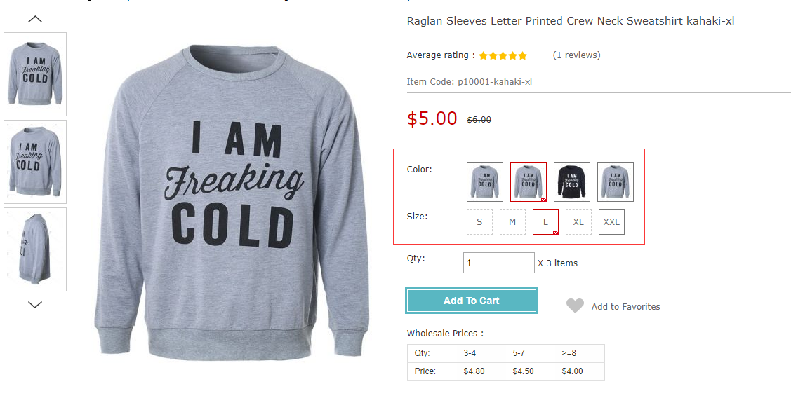
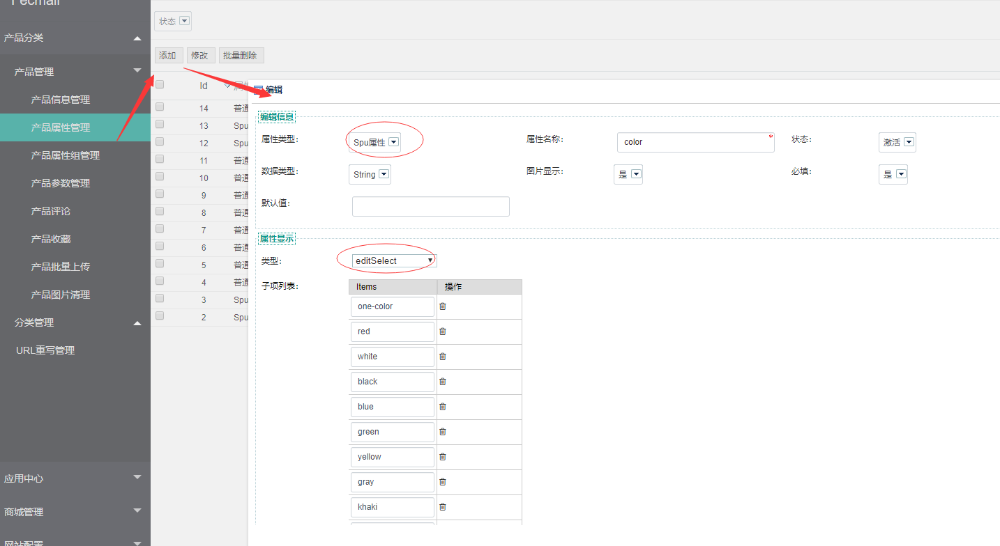
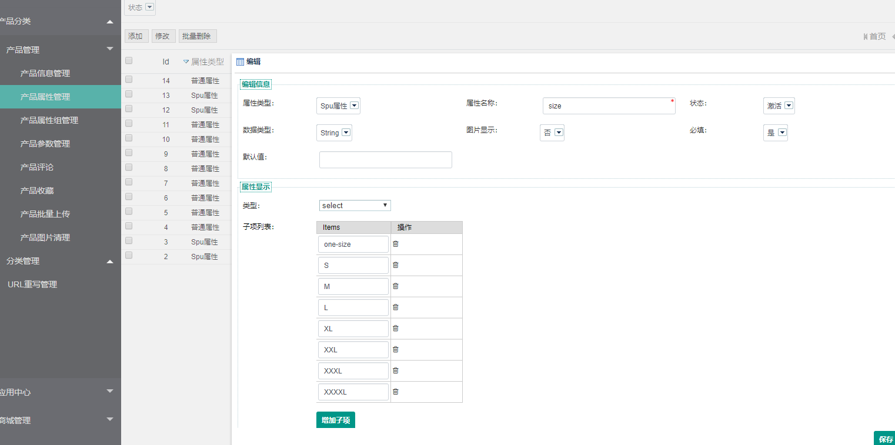
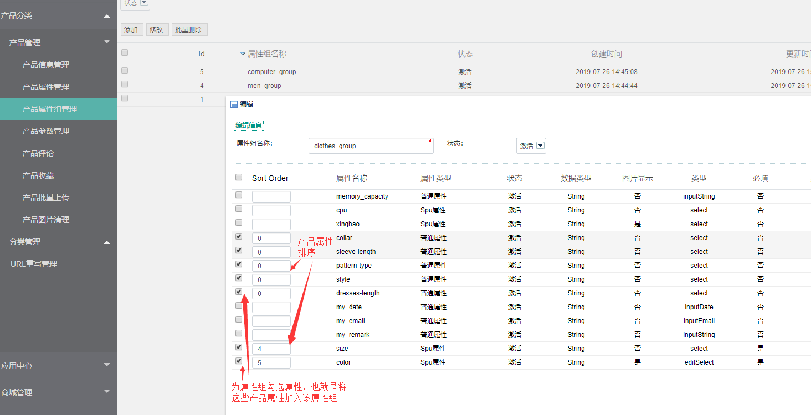
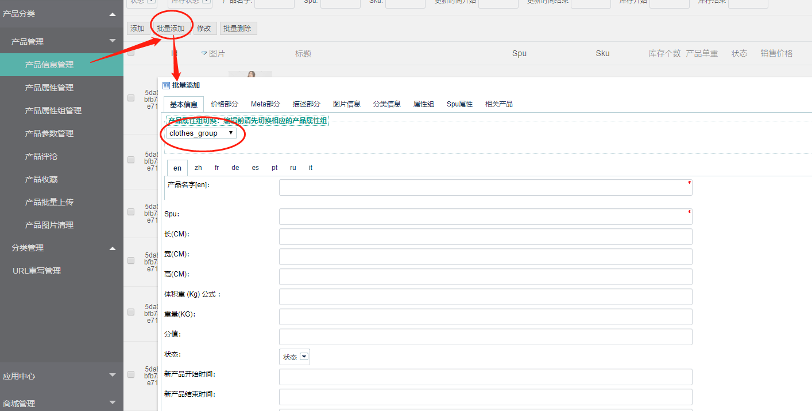
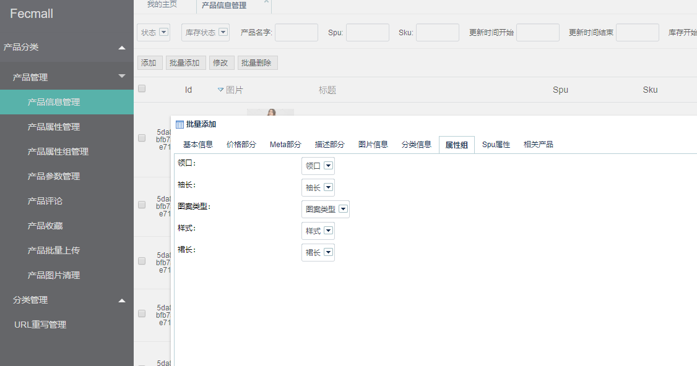
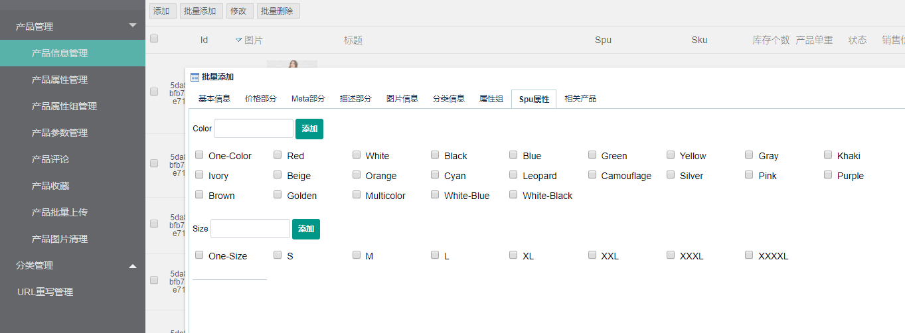
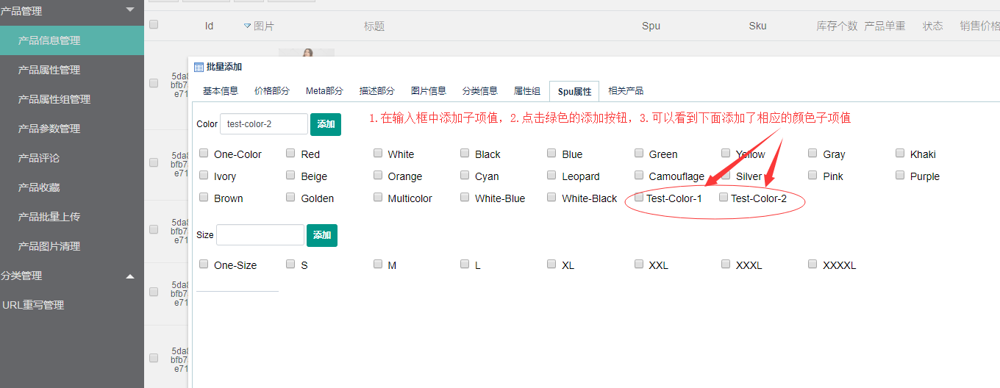
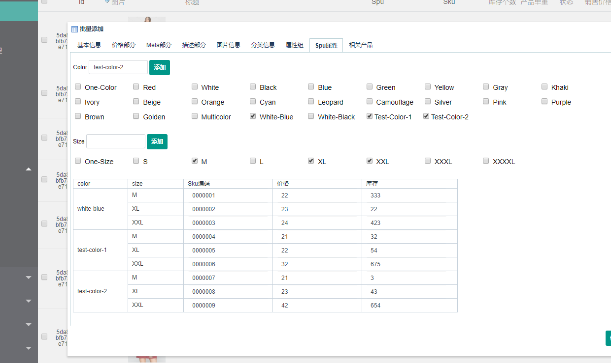
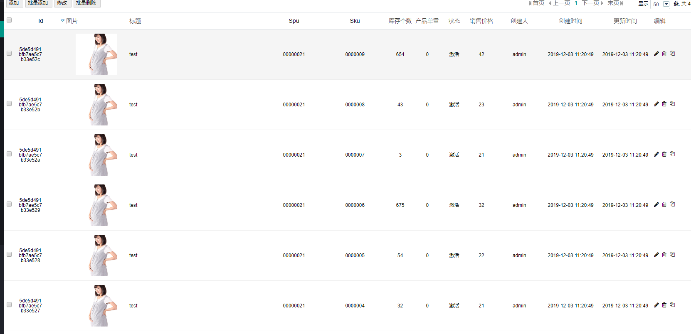

Fecmall 如何添加规格属性(自定义属性),并新建相应的产品
=============

> 规格属性指的是用户将产品加入购物车，需要选择的产品属性，譬如`颜色`,`尺码`等属性

### 概念：规格属性

对于产品属性，用户下单的时候需要进行选择，也就是本部分所说的`规格属性`，又称为`自定义属性`

譬如：http://fecshop.appfront.fancyecommerce.com/raglan-sleeves-letter-printed-crew-neck-sweatshirt-53386451-74241996

fecmall-2版本，实现的是JD模式产品，淘宝模式产品模型被弃用，详细参看：http://www.fecmall.com/topic/2258

### 产品，属性，属性组关系

`产品属性`：可以在后台新建产品属性，分为普通属性和spu属性（规格属性），
普通属性一般用来显示产品的属性，譬如衣服的袖长，领口，材质等等，是用来描述产品的，
spu属性是产品的规格属性，譬如颜色尺码等，需要用户下单的时候进行选择的属性

`产品属性组`：我们新建产品属性后，可以将其加入属性组，一个属性组包含很多的`产品属性`，是`一对多`的关系.

`产品`：可以为`产品`选择`属性组`，选择`属性组`后，该产品就有了该`属性组`下面的所有的`产品属性`，是`一对一`的关系, 您可以新建N个产品属性，
然后加入到新建的`属性组`中，然后新建产品，选择该属性组，那么该产品就有了您新建的`N个产品属性`。

### 为产品添加规格属性, 执行流程详细

1.后台添加产品属性

对于`规格属性`，需要在后台添加`spu属性`,这个就是`规格属性`, 譬如我们新建`颜色`,`尺码`规格属性 如图：

1.1添加规格属性color

属性类型选择editSelect，color属性需要显示图片，一般只会让一个规格属性显示产品图片，譬如颜色部分，
其他的规格属性则不显示图片。

1.2添加规格属性size

2.新建属性组，添加属性

勾选产品属性，然后设置排序的数字。

3.批量新建规格属性产品

3.1后台进入产品管理菜单，点击批量添加，ajax弹出页面后，在产品属性组下拉条部分，选择我们上面新建的`clothes_group`,

3.2点击属性组，就可以看到`clothes_group`属性组对应的`普通属性`

3.3点击spu属性，就可以看到`clothes_group`属性组对应的`spu属性`（规格属性）

对于规格属性，下面显示的各个子项，就是前面添加spu属性设置的子项，
如果您想要添加的某个子项，在这里没有，那么您可以在里面输入值，进行添加

3.4勾选需要生成的某些子项，勾选后，就会在底部出来各个颜色尺码对应的条目，如图填写内容即可

3.5将产品的其他信息进行添加，填写完成后，就可以进行保存

然后可以去前台查看该产品了

在产品页面规格属性临时添加的，会出现无法显示的问题，这里已经修复（fecmall-2.3.7以前的版本需要修复该bug，2,3,7以后的版本不需要）

https://github.com/fecshop/yii2_fecshop/commit/ef792f634e3f1a7690fbb89b9d3389b5f49978e9

