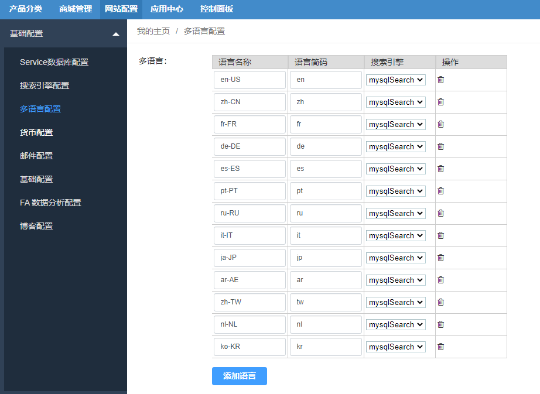
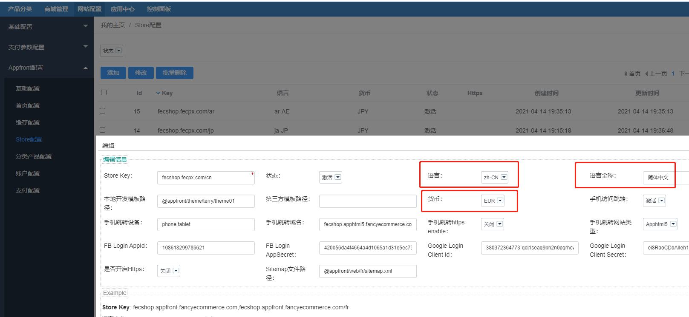

Fecmall 添加多语言
=========

> fecmall添加多语言的详细说明


**注意**：本部分适应于`fecmall-2.13.0+版本`。


1.什么是`后缀的方式`添加多语言?

例子：

中文store：www.xxxx/com/cn  

法语store：www.xxxx/com/fr

2.fecmall默认支持的语言，13种语言

```
ar   ar-AE  阿拉伯语言  عربى
cn  zh-CN 中文 中文
de  de-DE 德语 Deutsche
en en-US  英语 English
es  es-ES 西班牙语 Español
fr  fr-FR 法语 Français
it  it-IT 意大利语 Italiano
jp  ja-JP 日语 日本語
kr  ko-KR 韩语 한국어
nl  nl-NL 荷兰语 Nederlands
pt  pt-PT  葡萄牙语 Português
ru ru-RU 俄语 Pусский
tw  zh-TW 中文繁体 中文繁體
```


2.1在appfront/web/下面，您可以看到各个语言对应的文件夹，譬如:

```
appfront/web/cn
appfront/web/fr
```

2.2对于开源fecmall，13种语言的语言翻译包都已经翻译（除了中文简体，中文繁体，英文，日语，其他的用google翻译的语言包）


2.3如果您的语言不在13种语言种，您可以参看文档：https://www.fecmall.com/topic/2230


### 添加多语言

下面是默认支持的13种语言说明

1.后台添加多语言



添加多语言，请按照语言简码进行编辑，默认支持的13种语言


```
ar   ar-AE  阿拉伯语言  عربى
cn  zh-CN 中文 中文
de  de-DE 德语 Deutsche
en en-US  英语 English
es  es-ES 西班牙语 Español
fr  fr-FR 法语 Français
it  it-IT 意大利语 Italiano
jp  ja-JP 日语 日本語
kr  ko-KR 韩语 한국어
nl  nl-NL 荷兰语 Nederlands
pt  pt-PT  葡萄牙语 Português
ru ru-RU 俄语 Pусский
tw  zh-TW 中文繁体 中文繁體
```

2.入口store配置

当基础部分配置多语言后，就可以在为入口的store设置语言信息。




`Store Key`：譬如：  英文store设置 ：www.xxx.com,  中文store设置：www.xxx.com/cn ,   法语store设置 www.xxx.com/fr

`语言`：下拉条选择对应的语言


`语言全称`：语言全称，您可以复制上面语言列表里面的语言全称


3.nginx配置


需要nginx做rewrite配置，下面是13种语言对应的配置

```
    location /fr/ {
        index index.php;
        if (!-e $request_filename){
                rewrite . /fr/index.php last;
        }
	}
    
    location /jp/ {
        index index.php;
        if (!-e $request_filename){
                rewrite . /jp/index.php last;
        }
	}
	
	location /it/ {
       	 	index index.php;
        	if (!-e $request_filename){
                	rewrite . /it/index.php last;
        	}
        }

	location /es/ {
        index index.php;
        if (!-e $request_filename){
                rewrite . /es/index.php last;
        }
	}

	location /cn/ {
        index index.php;
        if (!-e $request_filename){
                rewrite . /cn/index.php last;
        }
    }

	location /de/ {
        index index.php;
        if (!-e $request_filename){
                rewrite . /de/index.php last;
        }
    }
    
    
    location /ar/ {
        index index.php;
        if (!-e $request_filename){
                rewrite . /ar/index.php last;
        }
    }
    
    location /en/ {
        index index.php;
        if (!-e $request_filename){
                rewrite . /en/index.php last;
        }
    }
    
    location /kr/ {
        index index.php;
        if (!-e $request_filename){
                rewrite . /kr/index.php last;
        }
    }
    
    location /nl/ {
        index index.php;
        if (!-e $request_filename){
                rewrite . /nl/index.php last;
        }
    }
    
    location /pt/ {
        index index.php;
        if (!-e $request_filename){
                rewrite . /pt/index.php last;
        }
    }
    
    location /ru/ {
        index index.php;
        if (!-e $request_filename){
                rewrite . /ru/index.php last;
        }
    }
    
    location /tw/ {
        index index.php;
        if (!-e $request_filename){
                rewrite . /tw/index.php last;
        }
    }
```


重启nginx就可以了。


