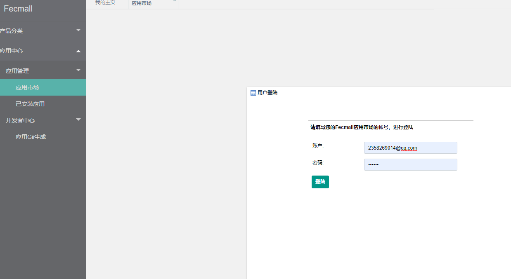
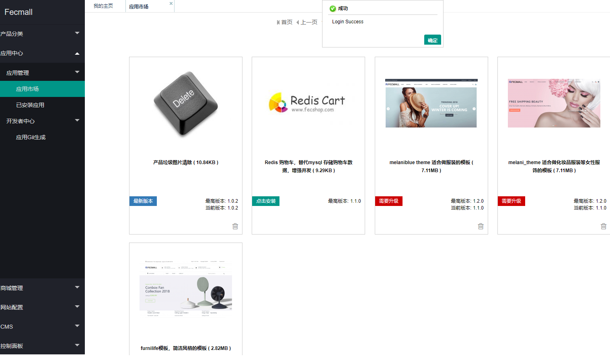
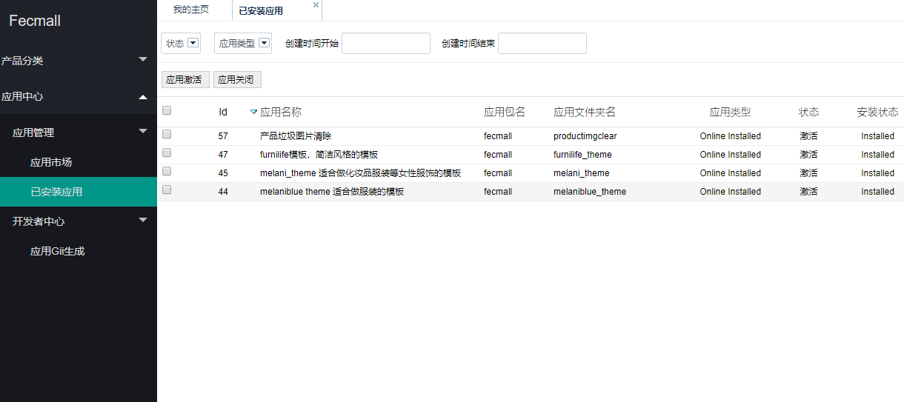
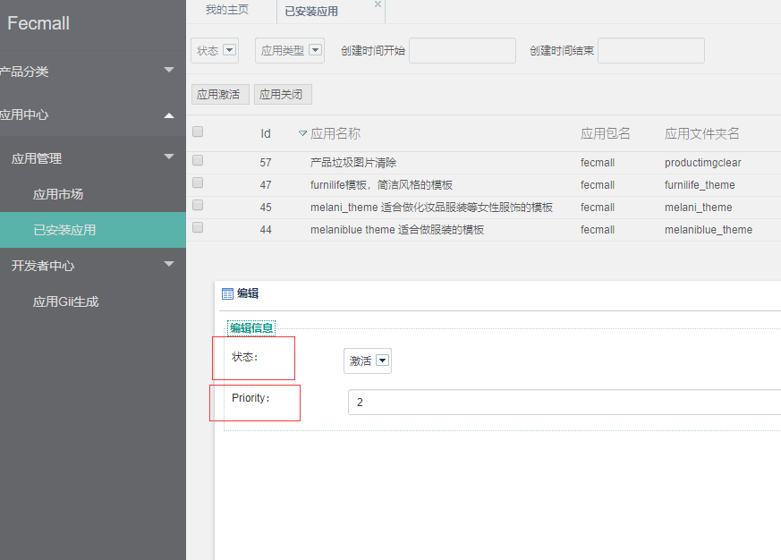
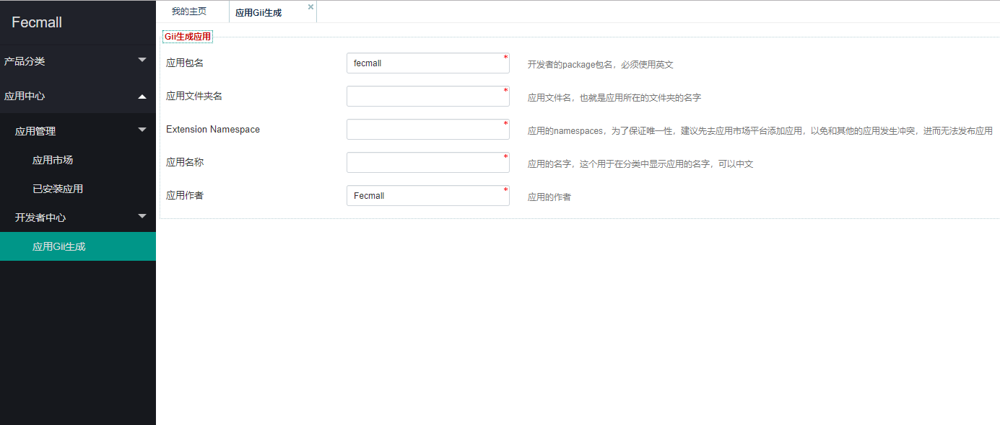

Fecmall后台-应用市场
=============

> 您在应用市场购买应用后，可以在fecmall后台进行在线安装

### 应用市场

1.应用市场网址：http://addons.fecmall.com/

注册账户，购买应用，然后您就拥有该应用。

2.在应用中心后台登陆您的应用市场的账户



3.可以看到您在应用市场平台购买的应用列表





您可以安装，升级，卸载应用


### 已安装应用

您安装了应用后，可以在这里看到安装的应用列表：



您可以`开启`和`关闭`应用，以及设置应用的`优先级`



### 应用Gii生成

对于fecmall应用开发者，您可以使用该工具快速的`初始化创建`您的开发应用包文件





`应用包名` 和  `应用作者` 是您在   应用市场申请成为开发者
的时候填写的，您这里不要做改动（一定不要改动），上传到
应用市场保持一致。

`应用文件夹名`：应用创建的文件夹名字，完整路径格式为
@addons/`应用包名`/`应用文件夹名`, 每个开发者的`应用包名`是唯一的
，然后为每一个应用，创建一个`应用文件夹名`

`Extension Namespace`: 插件的namespace，这个必须唯一，因此，在创建前，
您最好在应用市场中先创建应用，然后使用其中的namespace，
您可以在您的应用中`config.php`进行定义：

```
Yii::setAlias('@fectfurnilife', dirname(dirname(dirname(__DIR__))).'/addons/fecmall/furnilife_theme/');
```


更详细的关于应用市场的文档，参看：http://www.fecmall.com/doc/fecshop-guide/addons/cn-2.0/guide-README.html


