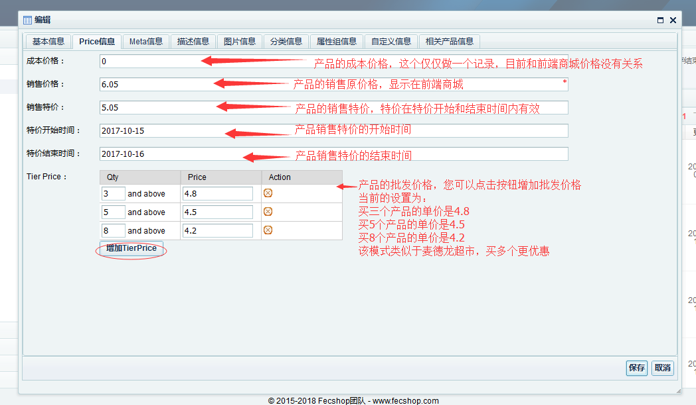
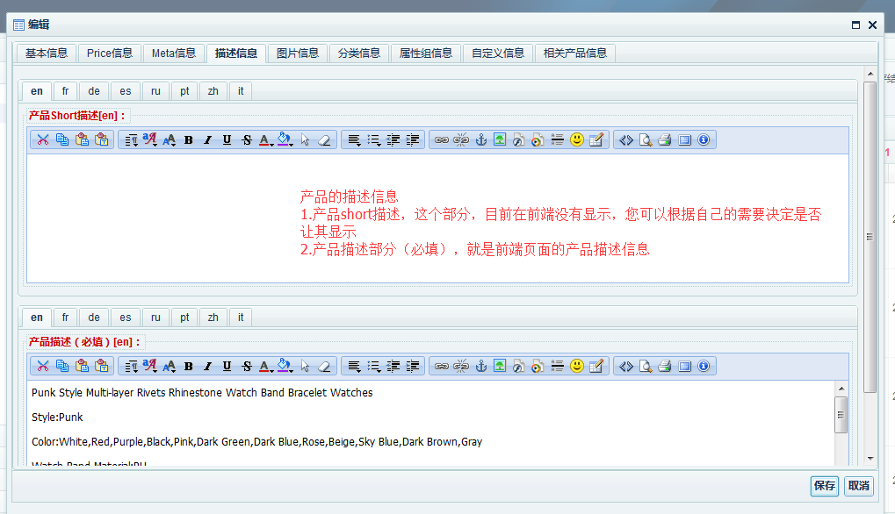
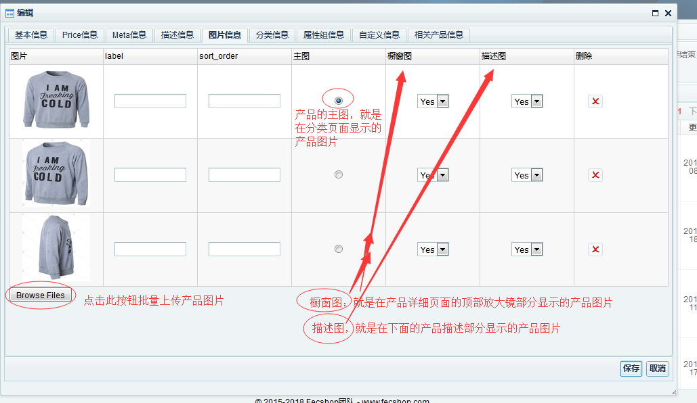
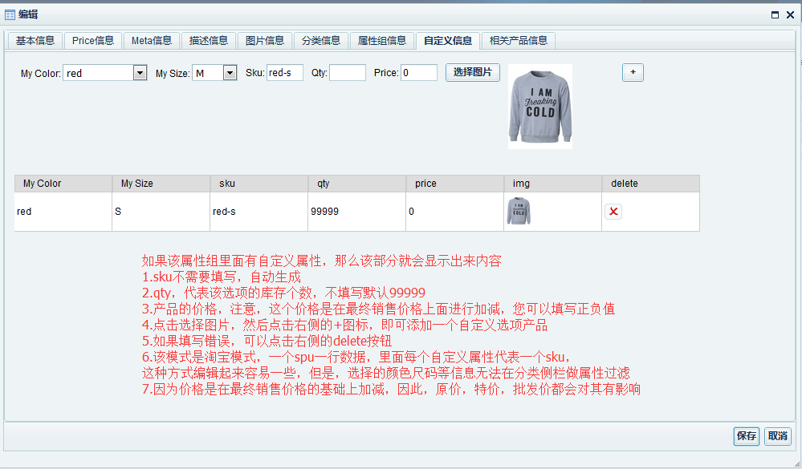
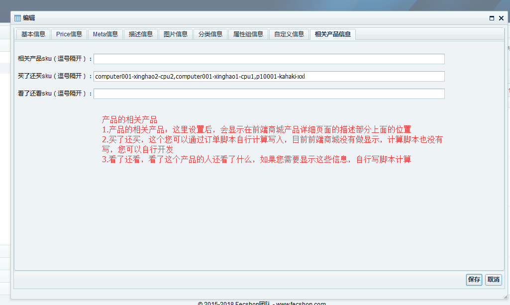
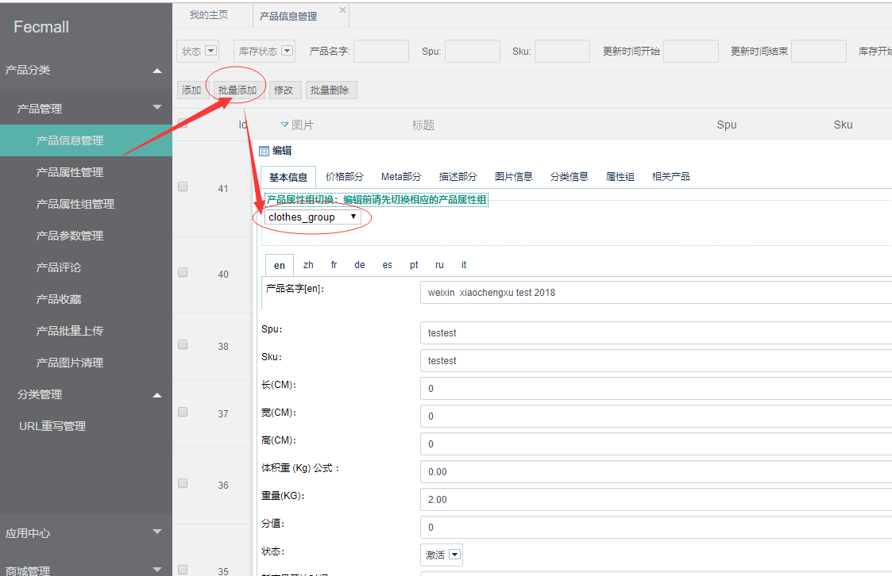
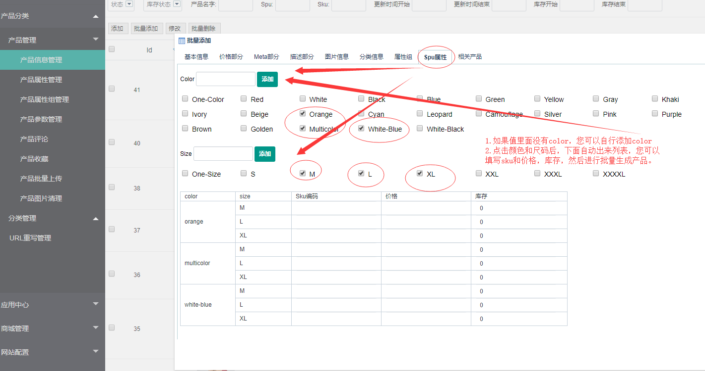

Fecshop后台-产品编辑
=================

### 产品管理

产品数据的编辑，这个部分东西比较多，
下面是截图，每个截图都进行了说明

因为截图比较大，您可以放大浏览器（按住ctrl，滑动鼠标中间滑轮），
图片会更清晰一些

> 下面是fecmall-1的界面截图，不过内容说明是没有问题的，和fecmall-2版本是一致的

OK,产品数据编辑，大致这些内容

### 多规格产品：批量添加产品

对于颜色尺码存在多个规格的产品，可以批量依次添加，下面是截图步骤

关于产品的更多信息，查看：

[Fecmall 产品](fecmall_product.md)

[Fecmall 产品图片](fecmall_product_image.md)

[Fecmall 库存](fecmall_stock.md)

