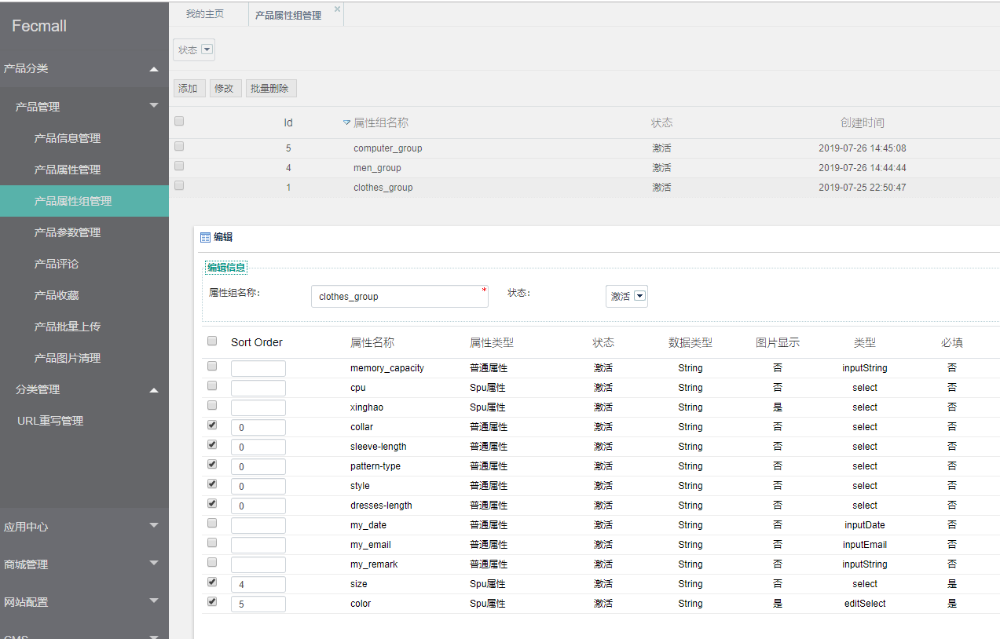

Fecmall后台-产品属性和属性组
================

>fecmall-2版本，在后台添加产品属性和属性组

### 简介

对于产品，存在通用属性，譬如sku，价格，name等，但是有一些产品
的属性，是根据产品的不同而存在的，譬如衣服有颜色尺码，
电脑有内存和cpu型号等，
因此我们这里引入一个`产品属性组`的概念

1.在后台添加`产品属性`

2.新建`产品属性组`，然后为这个`产品属性组`加入相应的`属性`

3.新建产品的时候，选择相应的`属性组`，该产品即可得到`属性组`对应的`属性列表`

### 后台设置产品属性

`普通属性`：产品的普通属性

`spu属性`：产品的规格属性，譬如颜色尺码等，也就是加入购物车需要进行选择的规格属性

### 后台设置产品属性组

为`产品属性组`，选择相应的属性即可

