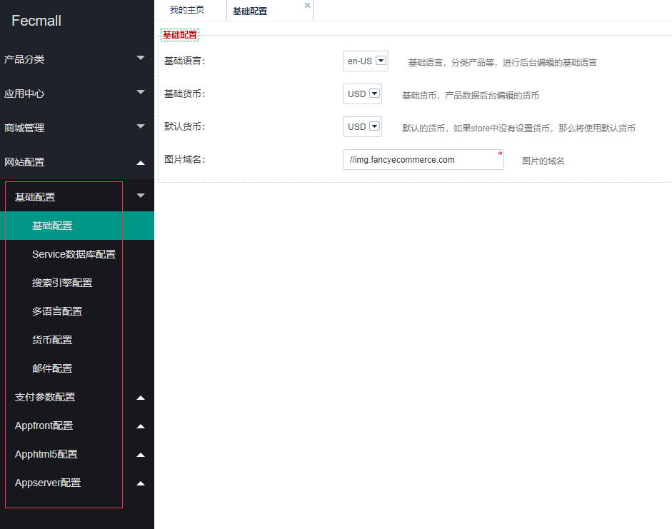
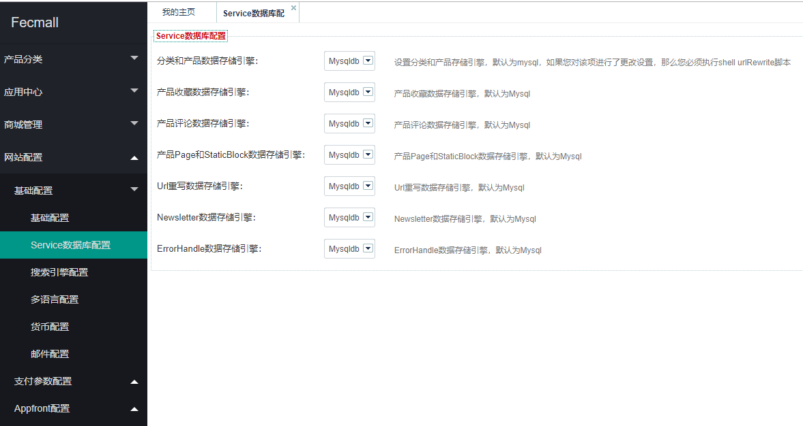
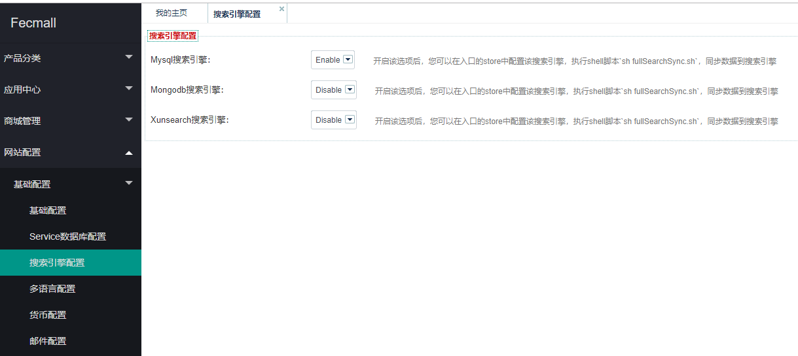
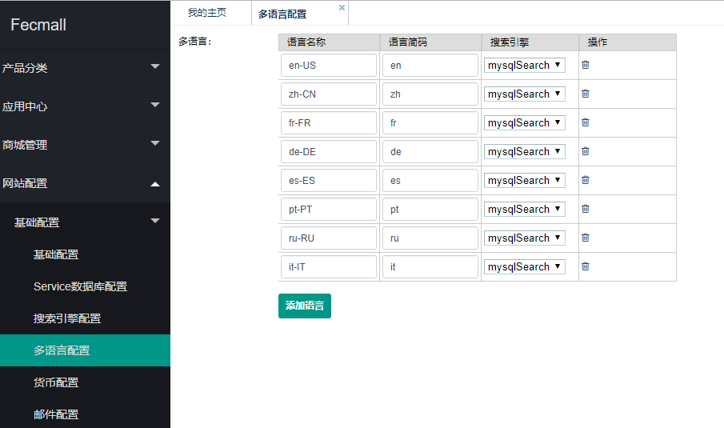
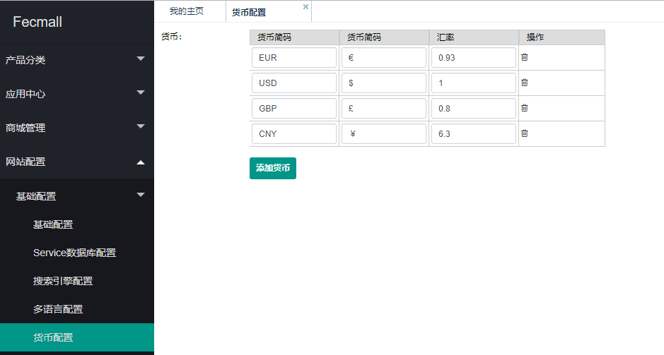
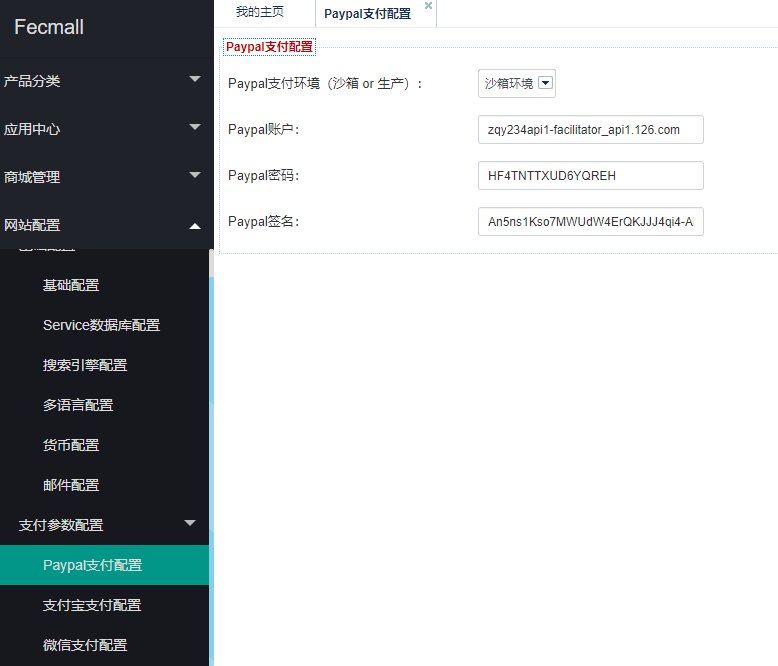
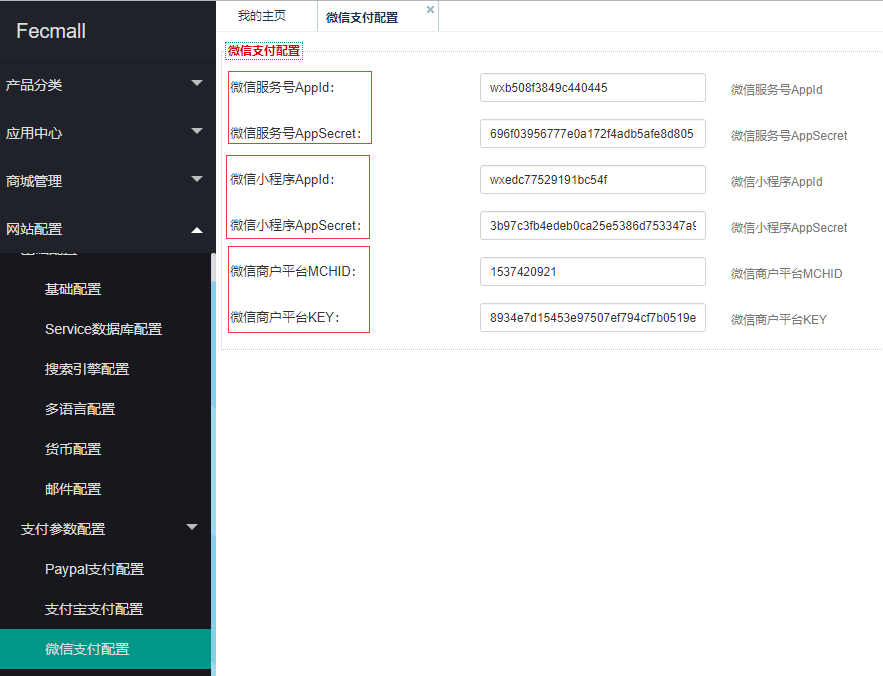
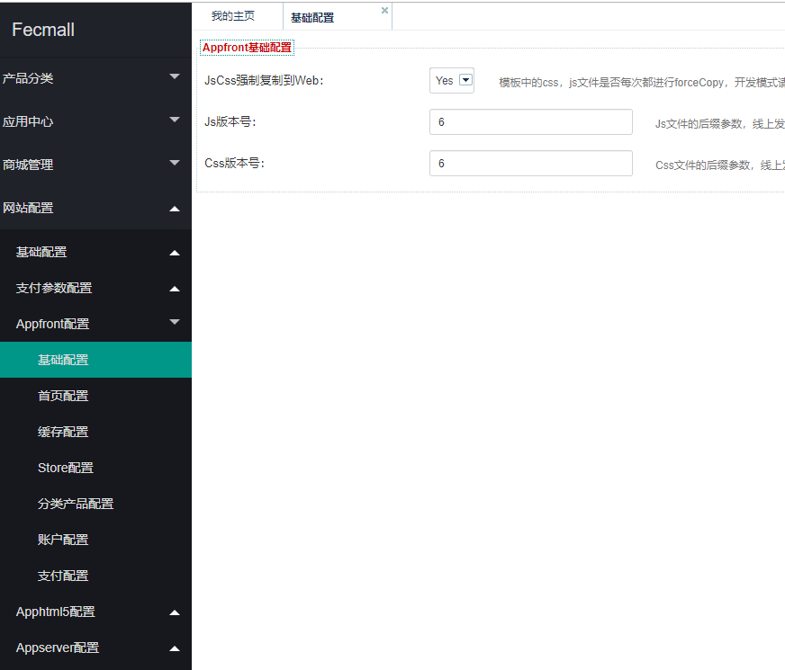

Fecmall后台-网站配置
=============

### 后台配置

网站后台，对一些商城参数的配置，以及一些初始化变量的配置

1.配置语言，货币，图片域名

2.services数据库配置

fecmall是双数据库系统，您可以将下面的这些模块切换成mongodb，或者mysql，
在切换前，您需要进行mongodb的配置，关于mongodb参看：

[Fecmall-Service数据库配置](http://www.fecmall.com/doc/fecshop-guide/develop/cn-2.0/guide-fecshop-2-service-database.html)

[Fecmall-使用Mongodb](http://www.fecmall.com/doc/fecshop-guide/develop/cn-2.0/guide-fecshop-2-use-mongo.html)

3.搜索引擎配置

您可以切换使用不同的搜索引擎
，在使用之前，您需要先安装相应的软件和配置

[Fecmall-使用Xunsearch](http://www.fecmall.com/doc/fecshop-guide/develop/cn-2.0/guide-fecshop-2-use-xunsearch.html)

4.多语言配置

您可以在此处，添加和编辑多语言

5.货币设置

6.邮件设置

7.paypal支付设置

8.支付宝设置

9.微信支付以及微信小程序设置

10.入口设置

入口设置分为appfront(pc端)，apphtml（手机html5入口），appserver（vue，微信小程序
等入口）

这里不一一介绍，您可以自己细细参看

