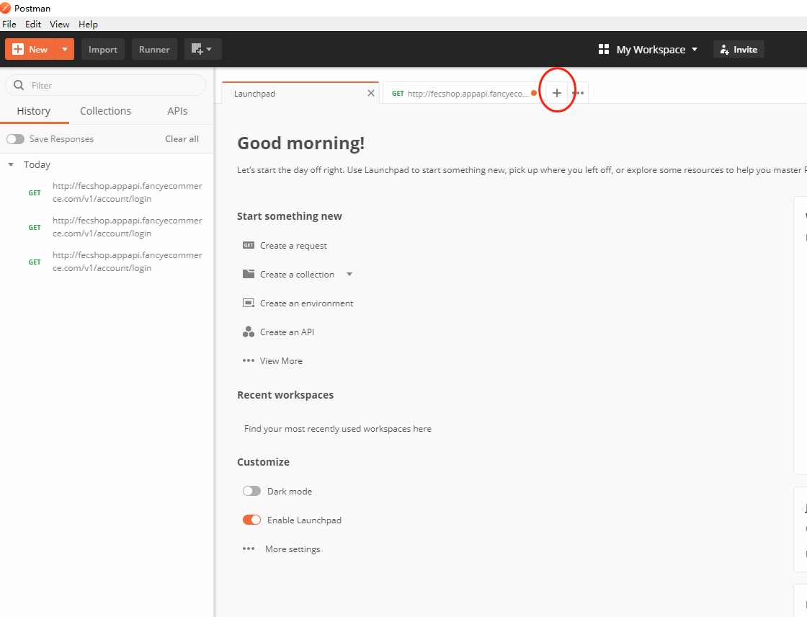
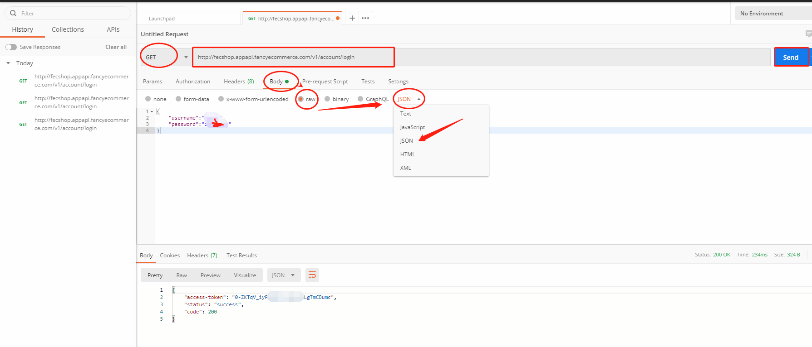
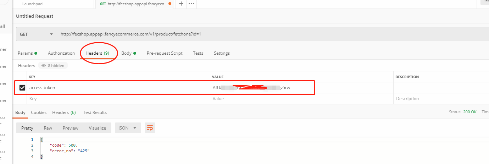
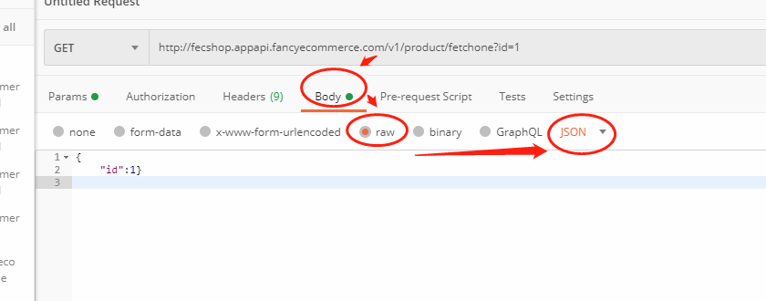

Fecmall 如何使用postman测试Api
======================

> Fecmall的Appserver（微信小程序等前后端分离商城入口），AppApi（和第三方交互的入口）都是基于api的，本文讲述如何使用postman进行测试api

### 关于postman

1.postman是谷歌公司开发的测试api的产品，可以单独下载

2.postman下载地址：https://www.postman.com/downloads/

3.下载后，直接运行exe文件即可，进入后需要注册账户，随便找个邮箱注册一下账户即可进入,如图：

4.使用post

4.1我们以文档： [Fecshop Api 登录和验证](http://www.fecmall.com/doc/fecshop-guide/develop/cn-2.0/guide-fecmall-api-login-and-verification.html)
,作为例子来讲解如何使用postman

文档中的参数，按照上面的方式填写，然后执行就可以得到api的结果值。

4.2后面的请求，将access-token加入到request header里面

4.3对于get请求，您可以直接把参数写到url里面

4.4对于post请求，您可以将请求的参数写道Body里面，截图如下：

写到里面即可。

