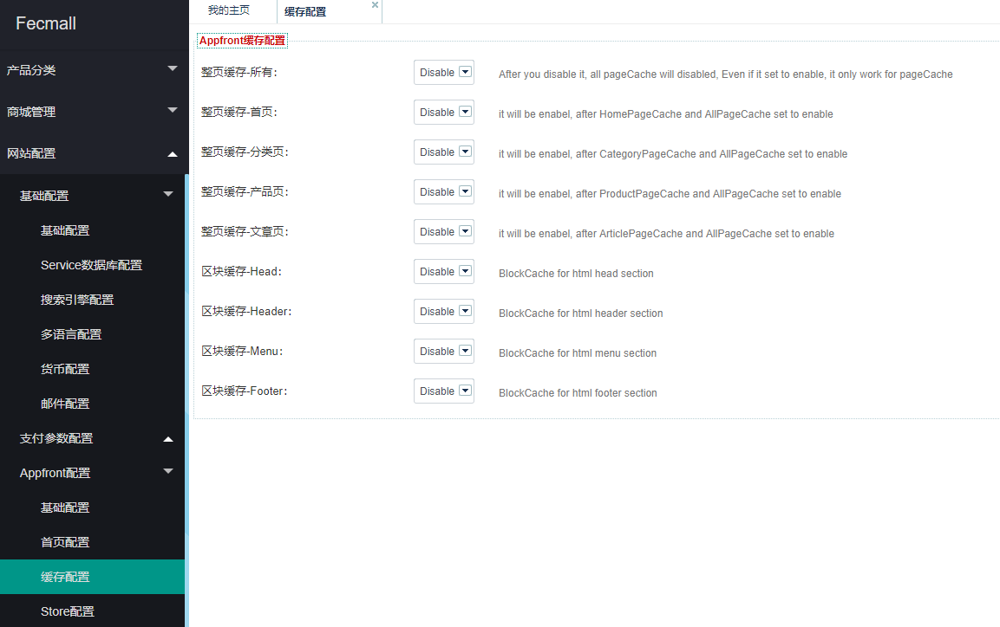
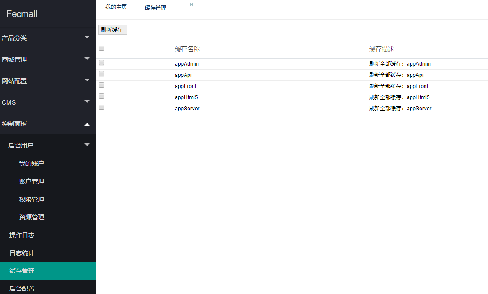

FecShop 缓存
===========

> fecshop 有整页缓存和局部缓存

###Fecmall 后台设置缓存

1.设置后台是否开启缓存



2.刷新缓存




fecmall默认使用的是文件缓存数据，如果你想使用redis'来缓存数据，可以
配置使用redis cache

打开@common/config/main-local.php


```
// 配置redis
'redis' => [
    'class' => 'yii\redis\Connection',
    'hostname' => '127.0.0.1',    // redis的host
    'port' => 6379,               // redis的端口     
    'password'  => 'dfa@#dsfaerfwev@#R$FRE23r12EDFqa', // redis的密码
    'database' => 0,    // redis的库，此处不要改动
],
//配置redis cache
'cache' => [
    'class'     => 'yii\redis\Cache',  // 'class' => 'yii\caching\FileCache',
    // 缓存配置独立的redis，如何和redis 组件一致，则不需要单独配置。
    //'redis' => [
    //    'hostname' => '127.0.0.1',   // redis的host
    //    'port' => 6379,              // redis的端口   
    //    'password'  => 'dfa@#dsfaerfwev@#R$FRE23r12EDFqa', // redis的密码
    //],
],
```

然后将原来的redis cache 去掉即可。


### 关于Yii2 cache

更多的参看：[Yii2 cache](http://www.yiichina.com/doc/guide/2.0/caching-overview)


