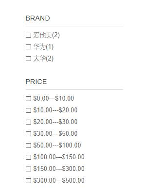
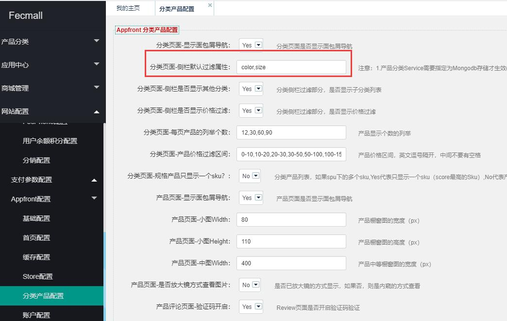
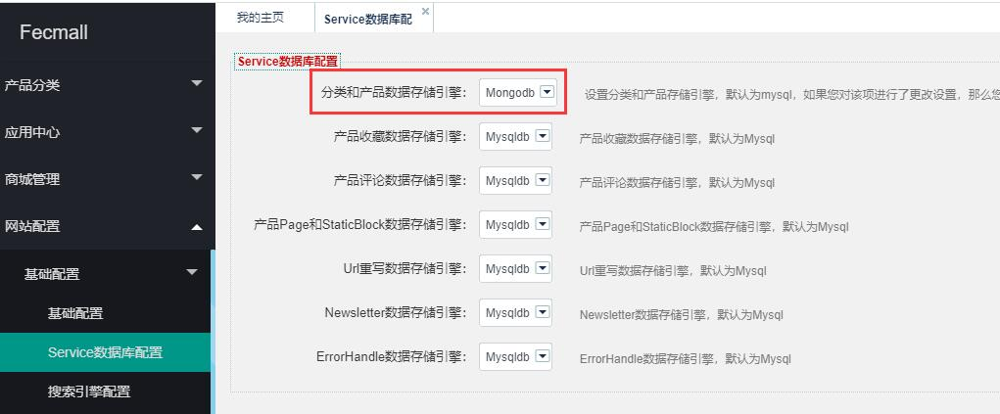
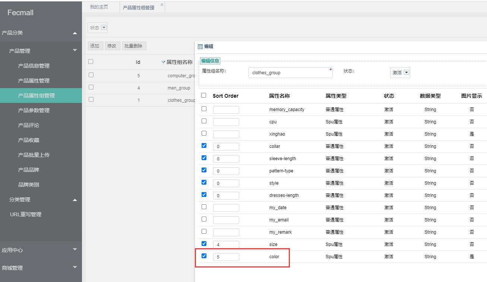
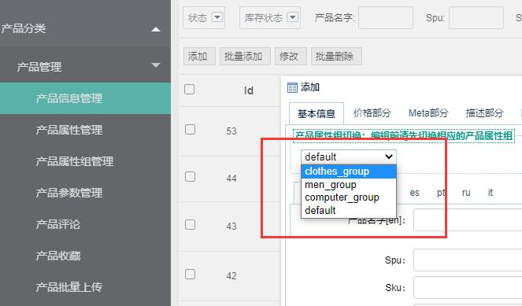
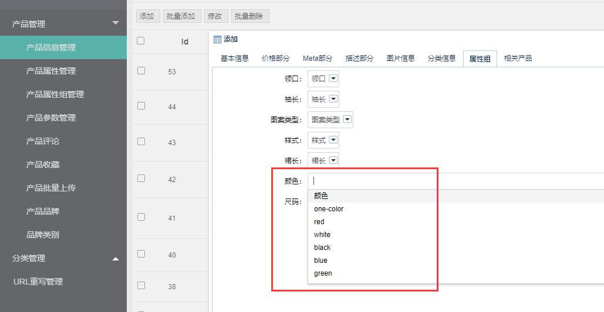
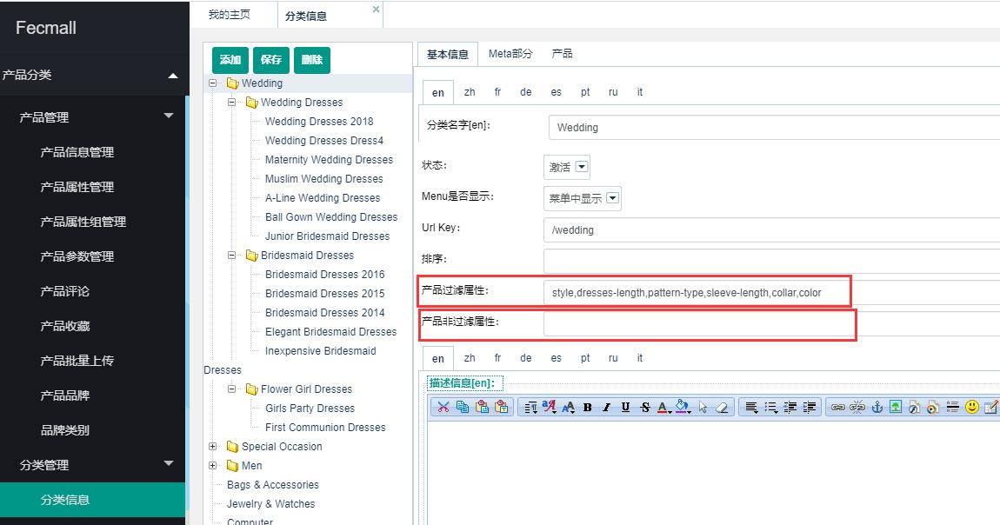

Fecmall 分类侧栏属性过滤
==============

> fecmall 前端商城，分类页面，侧栏属性过滤的`介绍`以及`新增`过滤字段


### 分类侧栏过滤属性


前端商城的`分类侧栏过滤属性`，譬如：http://fecshop.appfront.fancyecommerce.com/test-product-name111111




我们可以通过点击不同的属性值，进行`产品过滤`，方便筛选

fecmall开源商城，默认只有`价格`和`品牌`两个过滤属性，您可以根据自己的需要添加`属性过滤`
，目前的产品services有2种，`mongodb`和`mysql`，`默认`是mysql的方式


Mysql Product Services，添加侧栏过滤属性
-----------------

> fecmall`默认`用的是`mysql`存储的产品数据，使用该部分，fecmall版本必须`2.8.0+`以上
，mysql添加侧栏过滤属性还是麻烦一些（对于不熟悉mongodb的用户，建议使用该方式添加）

譬如我们想给产品添加 `colorss`字段

1.添加产品表字段 （`product_flat`）

进入表：`product_flat`， 添加表字段`colorss`

2.后台产品编辑 添加`属性编辑`

后台产品编辑文件： 

`fecshop\app\appadmin\modules\Catalog\block\productinfo\index\Attr.php`

`fecshop\app\appadmin\modules\Catalog\block\productinfo\index\BatchAttr.php`

您可以在`getBaseInfo()`方法中添加字段,下面2种方式二选一即可。


```
// 1.添加select下拉条编辑类型
$colorssData = [
    'blue' => 'blue',
    'red' => 'red',
];
[
    'label' => Yii::$service->page->translate->__('Colorss'),
    'name'  => 'colorss',
    'display' => [
        'type' => 'select',
        'data' => $colorData,
    ],
    'require' => 0,
],

//2.字符串输入框编辑类型
[
    'label' => Yii::$service->page->translate->__('Colorss'),
    'name'  => 'colorss',
    'display' => [
        'type' => 'inputString',
        'lang' => false,
    ],
    'require' => 0,
],

```


如果您使用`fecyo`，`fecbbc`，`tbgoods`等可能重写了该文件，您需要根据具体系统，重写文件，加入后台`产品编辑`选项

最终以后台可以正常`编辑`产品 `colorss` 属性为准


3.后台设置`分类页面-侧栏默认过滤属性`

下面是appfront入口得设置，多个过滤属性`逗号`隔开



对于apphtml5，appserver入口，都需要`单独设置`各个入口


4.产品编辑字段值

您需要编辑几个产品，设置`属性值`，当分类下的产品该属性值全部为空，将不会显示在分类侧栏属性过滤，
因此您需要先编辑几个产品，然后进入相应的分类，查看具体的侧栏属性过滤


5.`自定义`侧栏属性名称以及属性值

> 在侧栏的显示，默认的以数据表`product_flat`的表字段和值显示的，如果您想`自定义`，可以添加配置

譬如 产品表的品牌，是品牌表的id ， `brand_id`，对应的是
`int`，我们希望自定义属性名称以及属性值，那么，您可以在`category services`配置里面加入：（下面是category services的配置，通过配置注入值，您可以在本地开发环境中添加
，譬如`@appfront/config/fecshop_local_services/Category.php`（没有则新建）中添加配置）


```
<?php
return [
    'category' => [
        // 加入下面的配置
        'customCategoryFilterAttr' => [
            'brand_id' => [
                'label' => 'Brand',
                'items' =>  [
                    1 => '华为',
                    3 => '小米',
                    4 => '大华',
                ],
            ],
        ],
    ],
];
```

属性显示将由`brand_id` 替换成``label`` 对应的 `Brand`

属性值`brand_id 4`，将会替换成`'大华'`


Mongodb Product Services，添加侧栏过滤属性
-----------------

> 网站产品多，网站流量大，可以使用`mongodb services`存储产品数据，
对于不熟悉mongodb而且时间精力不够的用户，不建议使用，下面是讲解如何在mongo下添加侧栏属性过滤

1.您需要先部署mongodb环境，产品使用`mongodb`，
详细参看：[Fecmall-使用Mongodb](http://www.fecmall.com/doc/fecshop-guide/develop/cn-2.0/guide-fecshop-2-use-mongo.html)


2.后台开启product services，如图：




3.新建产品属性


4.产品属性加入属性组



勾选 `colorss` 属性，并且保存

5.新建产品，选择相应的属性组




在属性组列，`编辑属性`





`保存`产品即可


6.配置分类显示`colorss`属性过滤


`appfront`，`apphtml5`，`appserver`需要单独配置


到这里就配置完成了，去前端商城显示出来了（访问的分类对应的产品，`colorss`必须`有值`，才会`显示`过滤属性）


分类单独配置属性(自定义custom)
-----------------

当某个分类，我们希望某个`属性过滤`的显示`自定义`，那么可以单独设置`关闭`和`显示`




需要注意的是，设置了`显示`，该分类下的产品，产品属性`有值`才会`显示`属性过滤。/
