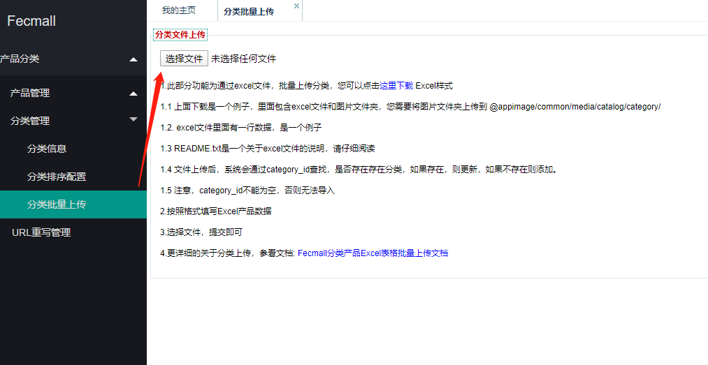
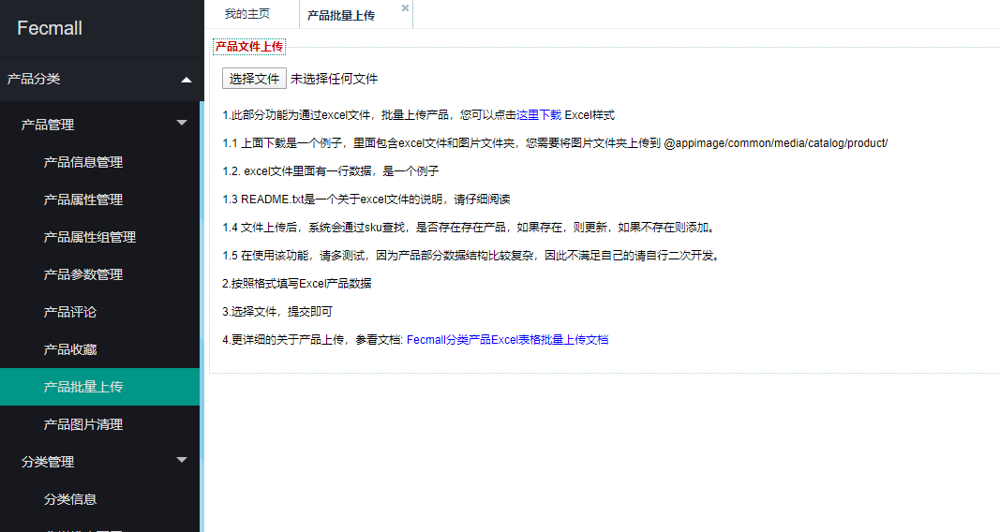

Fecmall 产品分类Excel批量上传
===============

> 在fecmall后台，通过excel表格，进行产品和分类批量上传的操作。

### Fecmall 分类Excel批量上传

一：后台功能说明

1.在fecmall后台菜单，可以看到`Fecmall 分类Excel批量上传`,

在上图，可以看到下载excel样式的链接，点击下载zip包，解压后，有一个`Excel导入分类的实例表格`

2.分类导入，对于excel导入数据，分类的一个语言对应一行数据，譬如`某分类`有`五种语言`，那么您需要
写入`5`行数据，每行不同的`语言code`

二.Excel表格字段说明

1.`category_id`

分类的`id`, 如果是其他`系统B`数据导入，直接使用`B系统`的id导入即可

2.`parent_id`

分类的`父类id`，如果是一级分类，那么该值填写`0`

3.`language_code`

语言简码，各个语言的简码参看：http://www.fecmall.com/doc/fecshop-guide/instructions/cn-2.0/guide-fecmall_mutil_lang.html

4.`category_name`

当前 `language_code 下分类name

5.`status`

分类状态，`1`代表激活，`2`代表关闭

6.`menu_show`

前端商城菜单是否显示该分类，`1`代表显示，`2`代表不现实

7.`url_key`

前端商城，分类的url链接生成部分，`url_key`作为分类url

8.`description`

当前 `language_code` 下的分类描述信息

9.`title`

当前 `language_code`  下的分类描述信息

10.`meta_keywords`

当前 language_code  下的`meta_keywords`

11.`meta_description`

当前 language_code  下的 `meta_description`

12.`image`

category图片，譬如：`/r/lb/rlbew0pplyrh1811561447365.jpg`

产品主图的图片相对路径，请将图片文件包上传到 `@appimage/common/media/catalog/product/` 下面

13.`thumbnail_image`

category缩略图图片

譬如：`/r/lb/rlbew0pplyrh1811561447365.jpg`

产品主图的图片相对路径，请将图片文件包上传到 `@appimage/common/media/catalog/category/` 下面

### Fecmall 产品Excel批量上传

一：后台功能说明

在fecmall后台菜单，可以看到`Fecmall 产品Excel批量上传`,

在上图，可以看到下载excel样式的链接，点击下载zip包，解压后，有一个`Excel导入产品的实例表格`

2.产品导入，对于excel导入数据，产品的一个语言对应一行数据，譬如`某产品`有`五种语言`，那么您需要
写入`5`行数据，每行不同的`语言code`

二.Excel表格字段说明

1.`product_name`(产品名称)

当前 `language_code` 下的产品name

2.`language_code`

语言简码，各个语言的简码参看：http://www.fecmall.com/doc/fecshop-guide/instructions/cn-2.0/guide-fecmall_mutil_lang.html

3.`spu`

4.`sku`

5.category_ids(分类id，多个用逗号隔开)

这个填写产品对应的分类的id，多个id用英文逗号隔开

6.`weight`

产品重量

7.`status`(状态)

填写值：1代表激活，2代表关闭

8.`url_key`

前端商城，产品的url链接生成部分，`url_key`作为分类url

9.`qty`(库存)

产品的库存值

10.`stock_status`(库存状态)

填写值：1代表有货，2代表缺货

11.`remark`(备注)

12.`cost_price`

产品的成本价

13.`sale_price`（销售价格）

产品的销售价格

14.`special_price`（销售特价）

产品的销售特价

15.`tier_price`（批发价格）

填写值：[{"qty":2,"price:17"},{"qty":5,"price":15}]

填写JSON格式，代表2个产品的单价为17，5个产品的单价为15

16.`meta_title`

当前 `language_code`  下的产品页面meta_title

17.`meta_keywords`

当前 language_code  下的`meta_keywords`

18.`meta_description`

当前 language_code  下的 `meta_description`

19.`short_description`

当前 `language_code` 下的产品short_description信息

20.`description`

当前 `language_code` 下的产品description信息

21.`main_image`（产品主图）

产品主图的图片相对路径，请将图片文件包上传到 `@appimage/common/media/catalog/product/` 下面

然后填写文件的相对路径即可

22.`gallery_image`（细节图）

产品`细节图`，多个细节图用逗号隔开（英文逗号`,`）

请将`图片`文件包上传到 `@appimage/common/media/catalog/product/` 下面

23.`group_attr_name`（属性组名称）

产品属性组

24.`group_attrs`（属性组属性，json格式）

`产品属性组`里面的各个`属性`对应的值，`JSON格式`

譬如：{"color":"red","size":"s"}

