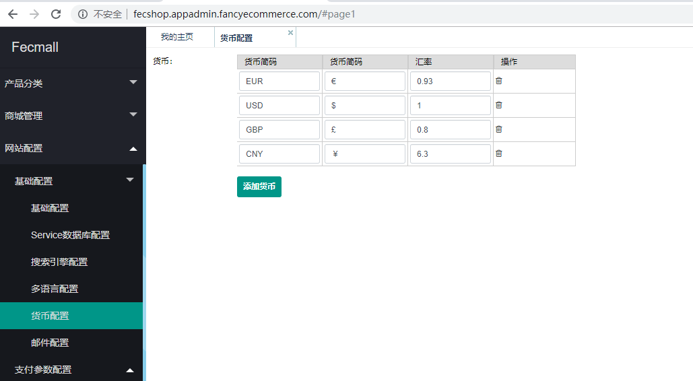

Fecmall 货币  
=============

> fecmall 支持多货币

Fecmall后台配置货币currency

`基础货币`：代表商城的`基础货币`，也就是产品部分填写的货币，就是`基础货币`，然后其他的
`货币`按照汇率换算

`默认货币`：如果您的商城`没有设置货币`，那么您的商城将使用`默认货币`作为当前货币的值

`编辑货币`：您可以在这里添加，编辑，删除货币

设置默认货币后，您访问前端入口页面，会发现货币没有切换过来，原因和原理可以参看文档：
[为什么我在后台store里面设置了默认货币currency，保存后，前台还是原来的货币，并没有切换？](http://www.fecshop.com/topic/819)

