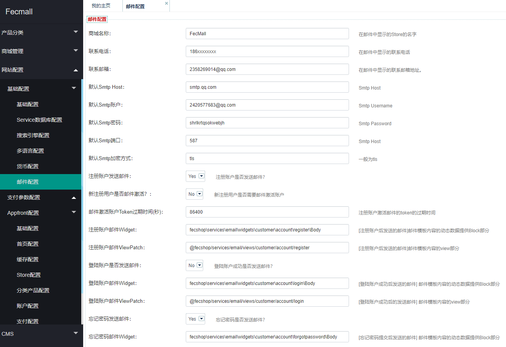
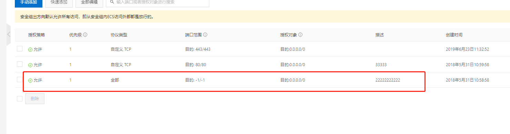

Fecmall 邮件
============

> fecmall的邮件发送，是基于yii2框架的`Swift_SmtpTransport`, 调用email组件来实现的，当用户注册邮箱，下单，忘记密码等，都会给用户发送一封邮件，邮件部分
> 支持多语言。

Fecmall后台设置邮件





### 邮件模板配置介绍，以及邮件多语言原理


`viewPath` 就是邮件模板html部分 ， `widget`是动态数据提供部分。


对于邮件模板 ， `widget` （动态数据） 和 `viewPath`（静态文件）
功能形成了模板内容。

`widget` 对应的是动态数据的php对象，譬如：` 'widget'		=> 'fecshop\services\email\widgets\customer\newsletter\Body' `
对应的是`@fecshop\services\email\widgets\customer\newsletter\Body.php`文件

`view`是html部分的路径，在该路径下面需要有`subject`（邮件标题）和`body`（邮件内容）两个部分，然后加上语言，
譬如：`@fecshop/services/email/views/customer/newsletter`下面有
`subject_en.php`和`body_en.php`两个文件，代表英文语言的邮件标题和邮件内容，
你可以添加subject_fr.php和body_fr.php两个文件，代表
法文状态下的邮件标题和邮件内容。

如果您想要得到法文的邮件，但是没有subject_fr.php 和 body_fr.php
文件，那么，系统会使用默认语言的邮件，也就是subject_en.php
和body_en.php


### 邮件重写


> 如果您想重写邮件的内容，那么您在后台配置部分重新指定`viewPath`和`widget`
> 的值，在路径中重新写`subject`和`body`文件即可。


譬如重写登录发送邮件的模板:

您可以新建一个`widget` 继承`fecshop\services\email\widgets\customer\account\login\Body`,
来实现`widget`的重写。

对于view文件，可以新建一个`viewPath`，然后把
`@fecshop/services/email/views/customer/account/login` 里面的所有文件复制
到本地的`viewPath`中，然后重写即可。


### 邮件LOGO

邮件使用的logo，默认图片文件路径为(fecmall安装的根目录下)：`./appimage/common/appfront/mail/logo.png`

### 邮件功能debug


经常有一些童鞋，配置了邮件的smtp后，但是邮件发不出去


一：您的smtp信息有误，您的smtp开通有问题，或者您填写错了，请检查是否有空格，其他字符等。

90%的童鞋都是因为这个原因导致没有邮件。

二：端口问题检测
在debug之前，请先检测您的smtp是否正确可用，您可以找个第三方的软件查看，是否可用

如果smtp信息正确， 而且后台准确配置，那么您可以检测一下端口的`出方向`是否有问题, 
譬如，下面是阿里云的出方向，全部打开了。




二：代码层面debug

下面写一下邮件发送的各个文件路径，方便进行debug代码

以账号注册为例子：

`@fecshop`代表是是 `vendor/fancyecommerce/fecshop`

1.账户注册，提交后，执行的controller文件：


@fecshop\app\appfront\modules\Customer\controllers\AccountController.php

```
public function actionRegister()
{
    ....
}
```

执行注册的是`$registerStatus = $this->getBlock()->register($param);`

2.打开文件`@fecshop\app\appfront\modules\Customer\block\account\Register.php` 

找到注册函数

```
public function register($param)
    {
        $captcha = $param['captcha'];
        $appName = Yii::$service->helper->getAppName();
        $registerPageCaptcha = Yii::$app->store->get($appName.'_account', 'registerPageCaptcha');
        
        //$registerParam = \Yii::$app->getModule('customer')->params['register'];
        //$registerPageCaptcha = isset($registerParam['registerPageCaptcha']) ? $registerParam['registerPageCaptcha'] : false;
        // 如果开启了验证码，但是验证码验证不正确就报错返回。
        if (($registerPageCaptcha == Yii::$app->store->enable)  && !$captcha) {
            Yii::$service->page->message->addError(['Captcha can not empty']);

            return;
        } elseif ($captcha && $registerPageCaptcha && !\Yii::$service->helper->captcha->validateCaptcha($captcha)) {
            Yii::$service->page->message->addError(['Captcha is not right']);

            return;
        }
        Yii::$service->customer->register($param);
        
        $errors = Yii::$service->page->message->addByHelperErrors();
        if (!$errors) {
            // 发送注册邮件
            $this->sendRegisterEmail($param);

            return true;
        }
    }

```

可以看到发送邮件`$this->sendRegisterEmail($param);`, 找到这个函数


```
/**
 * 发送登录邮件.
 */
public function sendRegisterEmail($param)
{
    if ($param) {
        //Email::sendRegisterEmail($param); 
        if (Yii::$service->email->customer->registerAccountIsNeedEnableByEmail) {
            $registerEnableToken = Yii::$service->customer->generateRegisterEnableToken($param['email']);
            if ($registerEnableToken) {
                $param['register_enable_token'] = $registerEnableToken;
                
                Yii::$service->email->customer->sendRegisterEmail($param);
                return true;
            }
        } else {
            Yii::$service->email->customer->sendRegisterEmail($param);
            return true;
        }
        
    }
}
```

可以看到发送邮件的函数是：`Yii::$service->email->customer->sendRegisterEmail($param);`


`fecshop\services\email\Customer.php`


```
public function sendRegisterEmail($emailInfo)
    {
        $toEmail = $emailInfo['email'];
        $registerInfo = $this->emailTheme['register'];
        if (isset($registerInfo['enable']) && $registerInfo['enable']) {
            $mailerConfigParam = '';
            if (isset($registerInfo['mailerConfig']) && $registerInfo['mailerConfig']) {
                $mailerConfigParam = $registerInfo['mailerConfig'];
            }
            if (isset($registerInfo['widget']) && $registerInfo['widget']) {
                $widget = $registerInfo['widget'];
            }
            if (isset($registerInfo['viewPath']) && $registerInfo['viewPath']) {
                $viewPath = $registerInfo['viewPath'];
            }
            if ($widget && $viewPath) {
                list($subject, $htmlBody) = Yii::$service->email->getSubjectAndBody($widget, $viewPath, '', $emailInfo);
                $sendInfo = [
                    'to'        => $toEmail,
                    'subject'    => $subject,
                    'htmlBody' => $htmlBody,
                    'senderName'=> Yii::$service->store->currentStore,
                ];
                Yii::$service->email->send($sendInfo, $mailerConfigParam);

                return true;
            }
        }
    }
```

邮件的发送，`Yii::$service->email->send($sendInfo, $mailerConfigParam);`

打开@fecshop/services/Email，找到这个函数


```
public function send($sendInfo, $mailerConfigParam = '')
    {
        $to         = isset($sendInfo['to']) ? $sendInfo['to'] : '';
        $subject    = isset($sendInfo['subject']) ? $sendInfo['subject'] : '';
        $htmlBody   = isset($sendInfo['htmlBody']) ? $sendInfo['htmlBody'] : '';
        $senderName = isset($sendInfo['senderName']) ? $sendInfo['senderName'] : '';
        if (!$subject) {
            Yii::$service->helper->errors->add('email title is empty');

            return false;
        }
        if (!$htmlBody) {
            Yii::$service->helper->errors->add('email body is empty');

            return false;
        }

        $mailer = $this->mailer($mailerConfigParam);
        if (!$mailer) {
            Yii::$service->helper->errors->add('compose is empty, you must check you email config');

            return false;
        }

        if (!$this->_from) {
            Yii::$service->helper->errors->add('email send from is empty');

            return false;
        } else {
            $from = $this->_from;
        }
        if ($senderName) {
            $setFrom = [$from => $senderName];
        } else {
            $setFrom = $from;
        }
        try {
            $mailer->compose()
                ->setFrom($setFrom)
                ->setTo($to)
                ->setSubject($subject)
                ->setHtmlBody($htmlBody)
                ->send();
                
            return true;
        } catch (\Swift_TransportException $e) {
            $errorMessage = $e->getMessage();
            Yii::$service->helper->errors->add($errorMessage);
            
            return false;
        } catch (\Exception $e) {
            Yii::$service->helper->errors->add('send email fail');
            
            return false;
        }
    }
```

`$mailer`就是Yii2的email组件。

好了，到这里就把这个整个过程写清楚了，出现问题自行debug吧


