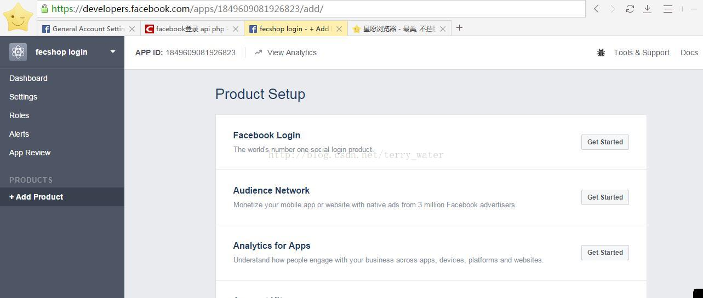
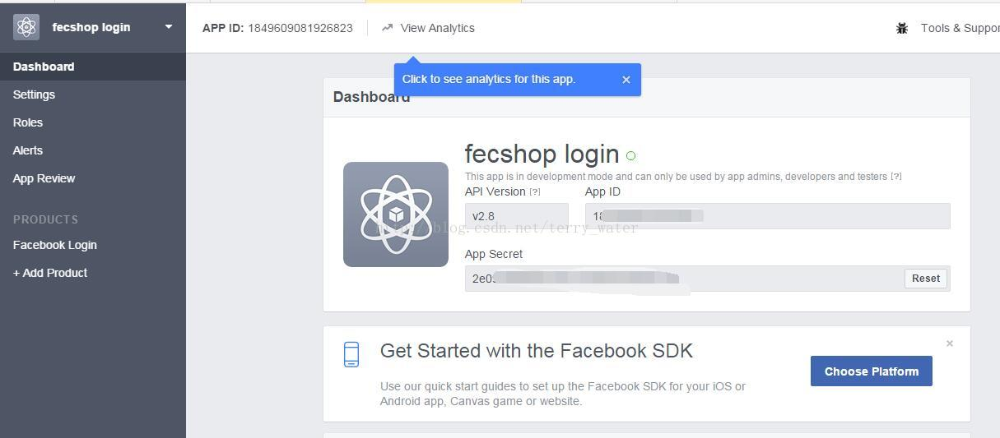

Fecmall facebook login 申请 app_id 和 app_secret
=====================================


1.访问首先进入www.facebook.com ，登录您的fb账户


2. 访问：https://developers.facebook.com/apps/108618299786621/fb-login/




勾选选项，填写登录成功回调的url地址。


上面图填写的网址为

```
http://fecshop.appfront.fancyecommerce.com/customer/facebook/loginv
http://fecshop.apphtml5.fancyecommerce.com/customer/facebook/loginv
```

`http://fecshop.appfront.fancyecommerce.com`:pc端，appfront的域名

`http://fecshop.apphtml5.fancyecommerce.com`:html5端，apphtml5的域名

您将域名替换成您自己的域名即可，如果您还有其他域名都需要都添加，

如果您使用vue端，那么需要将appserver部分添加上，譬如，您的
appserver端的域名配置为：http://fecshop.appserver.fancyecommerce.com ， 那么
需要加上

```
http://fecshop.appserver.fancyecommerce.com/customer/facebook/loginv
```

上面填写完成，保存，保存成功后，点击左侧的Dashborad，查看app id 和 app secret代码。



到这里就完成facebook login 的app id 和app secret了。


填写邮箱，保存


由测试改成public。


到这里就可以在配置中填写  app_id 和 app_secret 然后使用了


