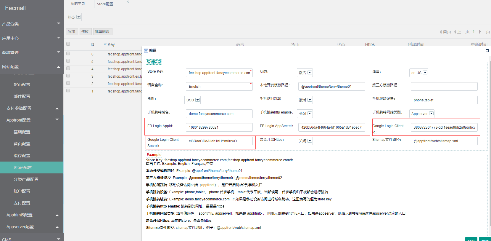

Fecmall Facebook Google登录
============================

> Facemall Google 登录，指的是用户可以直接使用Facebook Google 账号登录
> fecmall，而不需要注册账户

### 1、配置

后台配置

上面的app_id 和 secret是google 和facebook授权的，
这些信息，您需要到官方登录得到授权信息。

[facebook login 申请 app_id 和 app_secret](http://www.fecshop.com/topic/164)

[google login api 申请 CLIENT_SECRET 和 CLIENT_SECRET ](http://blog.csdn.net/terry_water/article/details/55095209)

按照上面的文章的步骤设置好，然后将授权信息填写到相应的store中即可。

注意：每一个store都需要填写，除非你不想该store支持Facebook Google 登录

