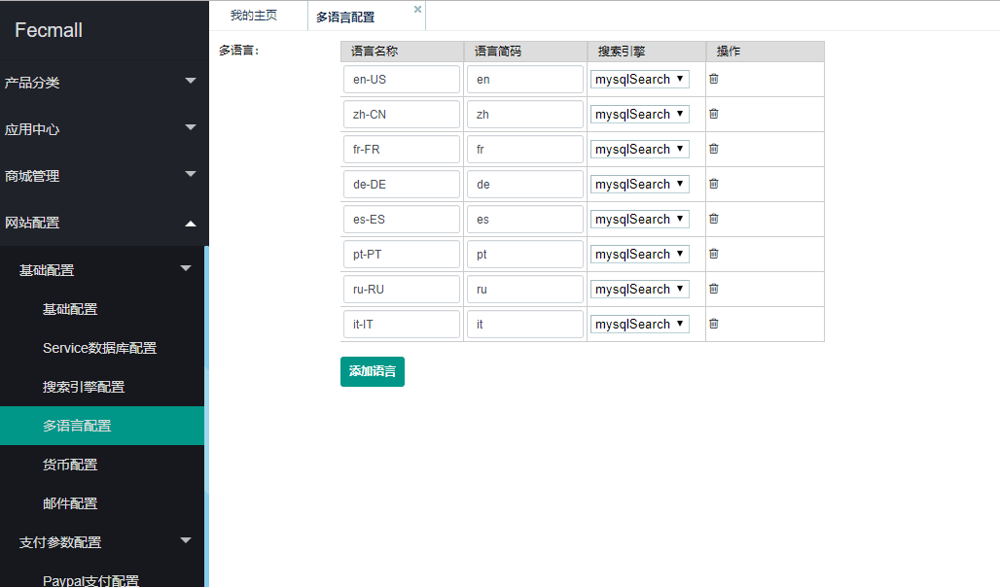
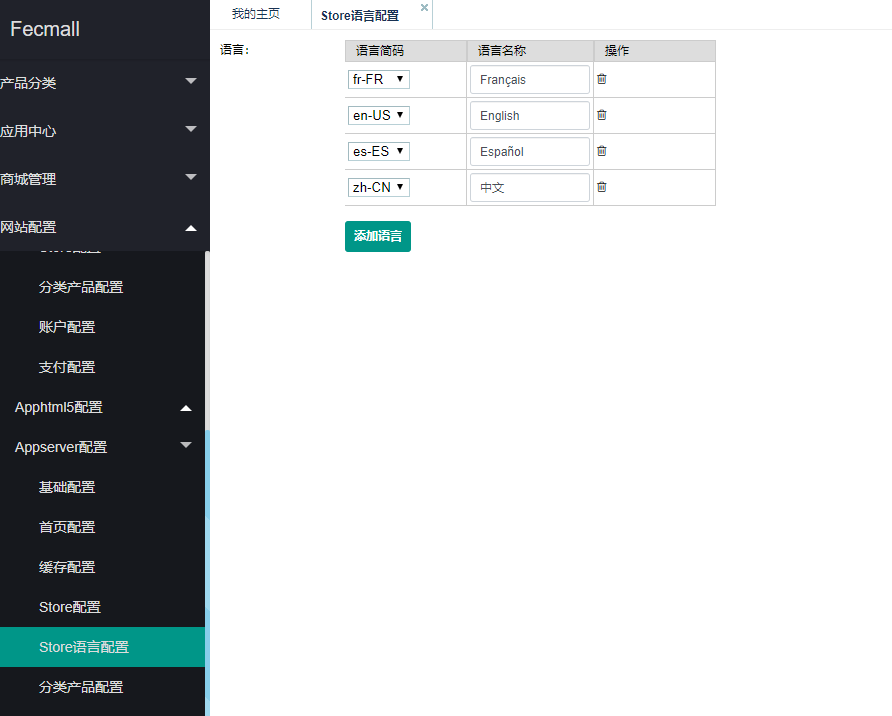

Fecmall 如何新增一门语言，并相应的添加一个store，将store设置成该语言
===================


对于Fecmall的多语言方面的知识，可以参看：[Fecmall 多语言](http://www.fecshop.com/doc/fecshop-guide/instructions/cn-2.0/guide-fecmall_mutil_lang.html)

下面一步一步的讲解，fecmall 如何新增一门语言，并相应的添加一个store，将store设置成该语言，
我们添加的语言为意大利语。

1.后台添加语言配置




2.后台查看，如图，可以看到it语言已经添加。


关掉这个窗口，编辑一个产品，在it语言部分，填写上产品的名字和描述

**对于store的添加，参看上面的文档，可以了解到有两种，子域名的方式和语言后缀的方式，譬如：http://it.fecshopc.com/ 和 http://www.fecshop.com/it/ ,下面一一讲解**

3.语言后缀的方式：在入口appfront新增 it store， 后缀（www.domain.com/it/xxxx）的方式


3.1添加文件

在@appfront/web/ 下面新建it文件夹，然后

新建文件夹：`@appfront/web/it/assets/` 并设置可写: `chmod 777 -R appfront/web/it/assets/`

新建文件：`@appfront/web/it/index.php` ,然后，将 @appfront/web/fr/index.php里面的内容
复制到该文件。

新建文件：`@appfront/web/it/sitemap.xml`，设置可写，这个是为了生成sitemap.xml

新建文件：`@appfront/web/it/gss.xsl`，内容可以复制 @appfront/web/fr/gss.xsl，这个文件是访问www.domain.com/it/sitemap.xml
的时候渲染页面用的

新建文件：`@appfront/web/it/robots.txt`，这个是设置搜索引擎的robots文件，里面可以做设置，也可以不填写东西


3.2.添加store域名，语言


3.3.nginx做去掉index.php的设置

`vim /usr/local/nginx/conf/conf.d/default.conf`

添加配置：(可以参考nginx对fr的配置)

```
location /it/ {
                index index.php;
                if (!-e $request_filename){
                        rewrite . /it/index.php last;
                }
        }

```

3.4重新加载nginx的配置  `/etc/init.d/nginx reload` ,或者重启nginx

然后访问`appfront` 就可以了，刚才我们修改的那个产品，切换语言后，就会看到内容的改变

4.子域名多语言的方式

> 该方式，也就是类似于  https://fecshop.appfront.it.fancyecommerce.com/3232-62393214
> ，通过不同的子域名，来做store的设置

4.1添加文件

新建文件：`@appfront/web/sitemap_it.xml`，设置可写，这个是为了生成`sitemap.xml`


4.2nginx设置

在配置中，将上面的这个域名添加上去 ，在nginx中的

```
server_name fecshop.appfront.fancyecommerce.com fecshop.appfront.es.fancyecommerce.com;
```

将it的域名添加上去

```
server_name fecshop.appfront.fancyecommerce.com fecshop.appfront.es.fancyecommerce.com fecshop.appfront.it.fancyecommerce.com;
```

另外还需要设置xml文件的访问

将

```
 location ~ /sitemap.xml
        {
                if ($host  ~ .*appfront.es.fancyecommerce.com) {
                        rewrite ^/sitemap\.xml /sitemap_es.xml last;
                }
        }
```

修改为：

```
 location ~ /sitemap.xml
        {
                if ($host  ~ .*appfront.es.fancyecommerce.com) {
                        rewrite ^/sitemap\.xml /sitemap_es.xml last;
                }
				if ($host  ~ .*appfront.it.fancyecommerce.com) {
                        rewrite ^/sitemap\.xml /sitemap_it.xml last;
                }
        }

```

4.4重新加载nginx的配置  `/etc/init.d/nginx reload` ,或者重启nginx

然后访问`appfront` 就可以了，刚才我们修改的那个产品，切换语言后，就会看到内容的改变

5.对于sitemap.xml的生成，可以参看：
[Fecshop SiteMap](http://www.fecshop.com/doc/fecshop-guide/instructions/cn-1.0/guide-fecshop_sitemap.html)


6.AppHtml5 入口 添加语言

和上面的appfront类似，参看上面的步骤即可

### Appserver 入口 添加语言

> Appserver 入口是vue，手机app等单页面应用，为这些应用提供api的入口

`appserver`入口添加语言和其他的入口不同，步骤如下：

1.需要在 言简码需要在`@common/config/fecshop_local_services/FecshopLang.php` 中添加语言配置，和上面步骤1类似。




2.在`@appserver/config/fecshop_local_services/Store.php`中添加配置,在`serverLangs`数组中添加：


3.在vue入口部分添加多语言

3.1` src/config/i18n.js`中添加意大利语言的配合：

```
// 添加配置代码
import messagesIt from './languages/it_IT.js'

const messages = {
	//在这个配置中添加下面代码
	it: {
    	message: messagesIt
  	},
}
```

3.2新建文件 `src/config/languages/it_IT.js` 将`en_US.js`中的内容复制到该文件，然后进行翻译

3.3如果您想设置默认语言为该语言，可以打开文件`src/config/store.js`，将`lang_code`的值改成`it`即可

3.4如果您想添加一个新的子域名（譬如it.fecshop.com）对应到vue，那么，可以在`src/config/store.js`文件中添加

```
export default {
    storeConfig:[
      {
        'domain': 'demo.fancyecommerce.com',
        'lang_code' : 'zh',
        'currency_code' : 'EUR'
      },
	  // 下面这个配置项是新添加的代码。
	  {
        'domain': 'it.fecshop.com',
        'lang_code' : 'it',
        'currency_code' : 'EUR'
      }
    ]
}
```

这样，当访问 `it.fecshop.com`，默认的语言就是意大利语言了。

OK，全部介绍完毕，对于多语言的其他介绍，可以参看:[Fecshop 多语言](http://www.fecshop.com/doc/fecshop-guide/instructions/cn-1.0/guide-fecshop_mutil_lang.html)
