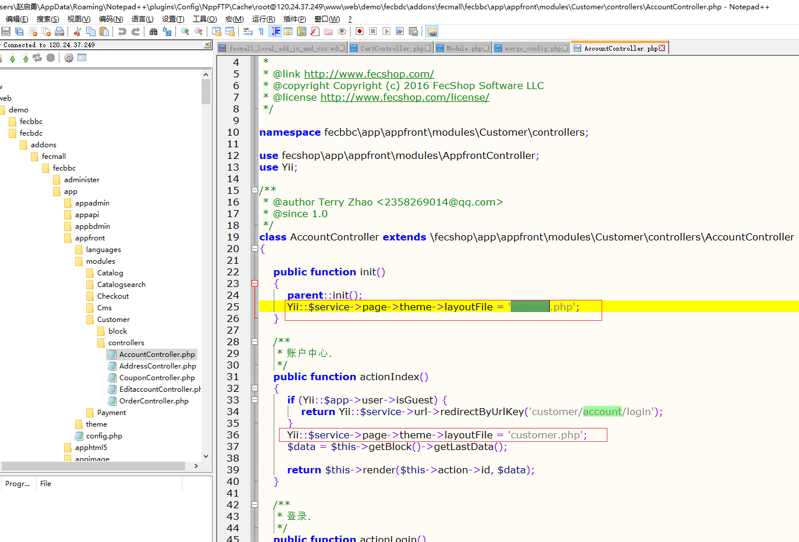
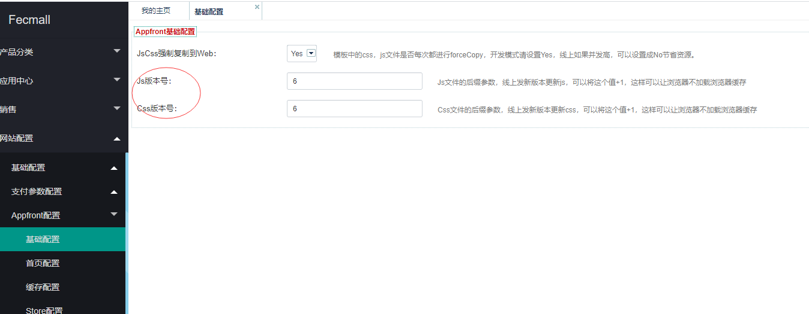

Fecmall 本地开发添加js和css文件
===================


### Fecmall 模板原理

1.Fecmall js 和 css遵从多模板机制，关于多模板机制，可以参看：
[fecmall模板](http://www.fecmall.com/doc/fecshop-guide/instructions/cn-2.0/guide-fecmall_theme.html)


2.模板分为三部分：`fecmall系统模板路径`，`fecmall第三方应用扩展模板路径`，`fecmall本地模板路径`，他们的优先级关系为：


`fecmall本地模板路径` > `fecmall第三方应用扩展模板路径` > `fecmall系统模板路径`

因此`fecmall本地模板路径`优先级最高，可以覆盖其他的任意模板路径


3.需要使用模板的入口，以及各个入口的本地开发模板路径

有2类入口需要使用theme

3.1appfront和apphtml5，前端商城的pc入口和手机h5入口，需要在后台store中设置`本地开发模板路径`和`第三方模板路径`,如图：


`本地开发模板路径`您可以使用默认的文件路径，也可以自己创建新的本地模板路径


3.2appadmin和appbdmin后台部分。

因为后台部分都没有store的概念，因此是在配置文件中配置，打开@appadmin/config/params.php可以看到本地的的模板路径
`'localThemeDir' => '@appadmin/theme/local/theme01',`


### 实例1：全局添加js和css文件

这种方式可以通过配置的方式，全局添加js和css文件，也就是添加后，所有的页面都会添加js

1.打开本地配置文件@appfront/config/fecshop_local_services/Page.php

您会看到这么一段配置代码注释了，将其复制出来

```
                'jsOptions'	=> [
                    # js config 1
                    [
                        'options' => [
                            'position' =>  'POS_END',
                          //	'condition'=> 'lt IE 9',
                        ],
                        'js'	=>[
                            'js/jstest2.js',
                        ],
                    ],
                ],
```

这里是添加js文件：`'js/jstest2.js'`, 然后新建js文件：`@appfront/theme/terry/theme01/assets/js/jstest2.js`

里面添加js代码

```
alert(2)
```

保存，刷新页面就可以看到js生效

2.如果你想添加css，同样的原理。


### 实例2：为某个layout文件单独添加本地js和css文件

> 如果你想对某个页面单独添加js或者css文件，可以参看该部分。

example:1 为某个layout单独添加js文件


layout文件，是通过`Yii::$service->page->theme->layoutFile = 'one_step_checkout.php';`来指定，
一般在模块的入口文件Module.php中设置，譬如：https://github.com/fecshop/yii2_fecshop/blob/master/app/appfront/modules/Customer/Module.php#L43

当然也可以在controller文件中调用`Yii::$service->page->theme->layoutFile = 'one_step_checkout.php';`来设置当前controller的layout文件。

因此，在做实例的时候，首先要清楚目前的访问路径，对应的是那个layout文件
，然后在到layout文件中设置css和js


1.登陆页面：/customer/account/login

通过fecmall系统文件：https://github.com/fecshop/yii2_fecshop/blob/master/app/appfront/modules/Customer/Module.php#L43 可以看到layout文件是`main.php`

如果您安装了一些第三方的应用扩展，可能被扩展进行了更改，譬如：



更改成了：`Yii::$service->page->theme->layoutFile = 'account.php';`

我这个情况是安装了fecbdc扩展，因此对于`/customer/account/login`的layout文件是`account.php`


2.在本地模板路径新建layout文件`@appfront/theme/terry/theme01/layouts/account.php`
,然后将其内容复制过来


```
<?php
/**
 * FecShop file.
 *
 * @link http://www.fecshop.com/
 * @copyright Copyright (c) 2016 FecShop Software LLC
 * @license http://www.fecshop.com/license/
 */
?>
<?php
$jsOptions = [
    [
        'options' => [
            'position' =>  'POS_END',
            //	'condition'=> 'lt IE 9',
        ],
        'js'	=>[
            'js/jquery-3.1.1.min.js',
            'js/js.js',
        ],
    ],
];

# css config
$cssOptions = [
    # css config 1.
    [
        'css'	=>[
            'css/base.css',
            'css/passport.css',
        ],
    ],
];

\Yii::$service->page->asset->jsOptions 	= \yii\helpers\ArrayHelper::merge($jsOptions, \Yii::$service->page->asset->jsOptions);
\Yii::$service->page->asset->cssOptions = \yii\helpers\ArrayHelper::merge($cssOptions, \Yii::$service->page->asset->cssOptions);
\Yii::$service->page->asset->register($this);
?>
<?php $this->beginPage() ?>
<!DOCTYPE html PUBLIC "-//W3C//DTD XHTML 1.0 Strict//EN" "http://www.w3.org/TR/xhtml1/DTD/xhtml1-strict.dtd">
<html class="no-js" xmlns="http://www.w3.org/1999/xhtml" xml:lang="<?= $currentLangCode = Yii::$service->store->currentLangCode; ?>" lang="<?= $currentLangCode ?>">
<head>
    <?= Yii::$service->page->widget->render('base/head',$this); ?>
</head>
<body>
<?= Yii::$service->page->widget->render('base/beforeContent',$this); ?>
<?php $this->beginBody() ?>
<?= Yii::$service->page->widget->render('base/header_mini',$this); ?>

<div class="main-container">
    <?= $content; ?>
</div>
<div class="footer-container">
    <?= Yii::$service->page->widget->render('base/footer',$this); ?>
</div>
<?= Yii::$service->page->widget->render('base/trace',$this); ?>
<?= Yii::$service->page->widget->render('base/scroll',$this); ?>
<?php $this->endBody() ?>
</body>
</html>
<?php $this->endPage() ?>
```

在里面添加js文件配置

```
'js'	=>[
    'js/jquery-3.1.1.min.js',
    'js/js.js',
    'js/jstest.js',
],

```

 
 3.新建js文件`@appfront/theme/terry/theme01/assets/js/jstest.js`,随便写个js代码
 
 ```
 alert(1);
 ```
 
 4.刷新登陆页面，你会发现输出了
 
 
 
### 关于js和css线上更新
 
 1.js和css更新后，线上发版，因为有浏览器缓存的原因导致用户的页面没有更新，可以在后台更新版本号
 
 
 

 
 
 2.js和css每次强制复制文件到web路径下，耗费资源（流量大的时候才需要关闭），因此线上可以将`JsCss强制复制到Web：`关闭掉，参看上面的图片
 

 
 
 
 
