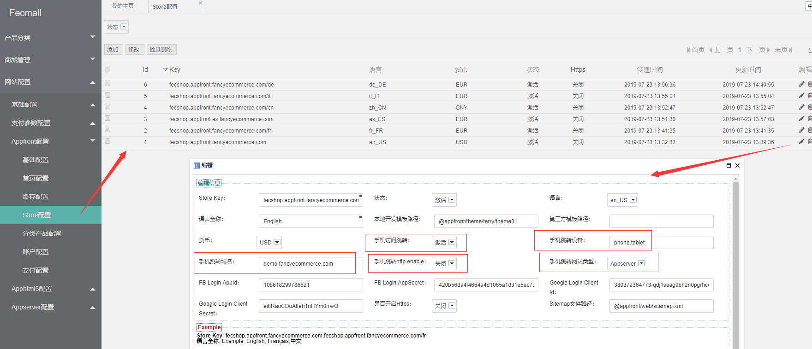

Fecmall 手机检测跳转
=================

> 当手机访问pc端(appfront)url，可以通过设置自动跳转到手机html5（apphtml5）端 
或者 vue端。

### 后台配置手机检测跳转

菜单：网站配置-->Appfront(App)-> store配置





`手机访问跳转`：代表手机web访问pc页面，是否进行跳转

`手机跳转设备`：哪些移动设备访问，进行跳转，phone代表手机，tablet代表平板

`手机跳转域名`：代表手机web访问pc页面，跳转后的域名

`手机跳转http enable`：代表跳转的手机端，是否https？

`手机跳转类型`：跳转的域名对应的入口，是apphtml5，还是vue类型


在后台进行配置跳转即可

### html5跳转原理

打开`@fecshop/services/Store.php` ，您可以看到 `html5DevideCheckAndRedirect()`方法：

```
    /**
     * @property $store_code | String 
     * @property $store | Array
     * mobile devide url redirect.
     * pc端自动跳转到html5端的检测
     */
    protected function html5DevideCheckAndRedirect($store_code, $store)
    {
        if (!isset($store['mobile'])) {
            return;
        }
        $enable = isset($store['mobile']['enable']) ? $store['mobile']['enable'] : false;
        if (!$enable) {
            return;
        }
        $condition = isset($store['mobile']['condition']) ? $store['mobile']['condition'] : false;
        $redirectDomain = isset($store['mobile']['redirectDomain']) ? $store['mobile']['redirectDomain'] : false;
        $redirectType = isset($store['mobile']['type']) ? $store['mobile']['type'] : false;
        if (is_array($condition) && !empty($condition) && !empty($redirectDomain) && $redirectType === 'apphtml5') {
            $mobileDetect = Yii::$service->helper->mobileDetect;
            $mobile_https = (isset($store['mobile']['https']) && $store['mobile']['https']) ? true : false;
            if (in_array('phone', $condition) && in_array('tablet', $condition)) {
                if ($mobileDetect->isMobile()) {
                    $this->redirectAppHtml5Mobile($store_code, $redirectDomain, $mobile_https);
                }
            } elseif (in_array('phone', $condition)) {
                if ($mobileDetect->isMobile() && !$mobileDetect->isTablet()) {
                    $this->redirectAppHtml5Mobile($store_code, $redirectDomain, $mobile_https);
                }
            } elseif (in_array('tablet', $condition)) {
                if ($mobileDetect->isTablet()) {
                    $this->redirectAppHtml5Mobile($store_code, $redirectDomain, $mobile_https);
                }
            }
        }
    }

    /**
     * @property $store_code | String
     * @property $redirectDomain | String
     * 检测，html5端跳转检测
     */
    protected function redirectAppHtml5Mobile($store_code, $redirectDomain, $mobile_https)
    {
        $currentUrl = Yii::$service->url->getCurrentUrl();
        $redirectUrl = str_replace($store_code, $redirectDomain, $currentUrl);
        // pc端跳转到html5，可能一个是https，一个是http，因此需要下面的代码进行转换。
        if ($mobile_https) {
            if (strstr($redirectUrl,'https://') || strstr($redirectUrl,'http://')) {
                $redirectUrl = str_replace('http://','https://',$redirectUrl);
            } else {
                $redirectUrl = 'https:'.$redirectUrl;
            }
        } else {
            if (strstr($redirectUrl,'https://') || strstr($redirectUrl,'http://')) {
                $redirectUrl = str_replace('https://','http://',$redirectUrl);
            } else {
                $redirectUrl = 'http:'.$redirectUrl;
            }
        }
        header('Location:'.$redirectUrl);
        exit;
    }
```


`html5DevideCheckAndRedirect`方法检测是否是手机访问，如果是，则进行跳转。

因为html5和appfront（pc）端，只是域名的不同，urlPath部分都是一样的，
因此，该方法是在yii2框架初始化的时候被执行


### html5跳转原理

以产品页面跳转为例讲解

打开文件： @fecshop/app/appfront/modules/Catalog/controllers/ProductController.php

可以看到

```
    public function behaviors()
    {
        if (Yii::$service->store->isAppServerMobile()) {
            $primaryKey = Yii::$service->product->getPrimaryKey();
            $primaryVal = Yii::$app->request->get($primaryKey);
            $urlPath = 'catalog/product/'.$primaryVal;
            Yii::$service->store->redirectAppServerMobile($urlPath);
        }
        
        ...
        
    }
```


上面的代码就是跳转到vue端的逻辑，也就是先生成vue端的`$urlPath`,
然后通过`Yii::$service->store->redirectAppServerMobile($urlPath);`
进行跳转。

`Yii::$service->store`就是 `@fecshop/services/Store.php`


OK, 到这里就讲解完成，通过配置，您可以在store.php中设置 pc端跳转到手机端。


